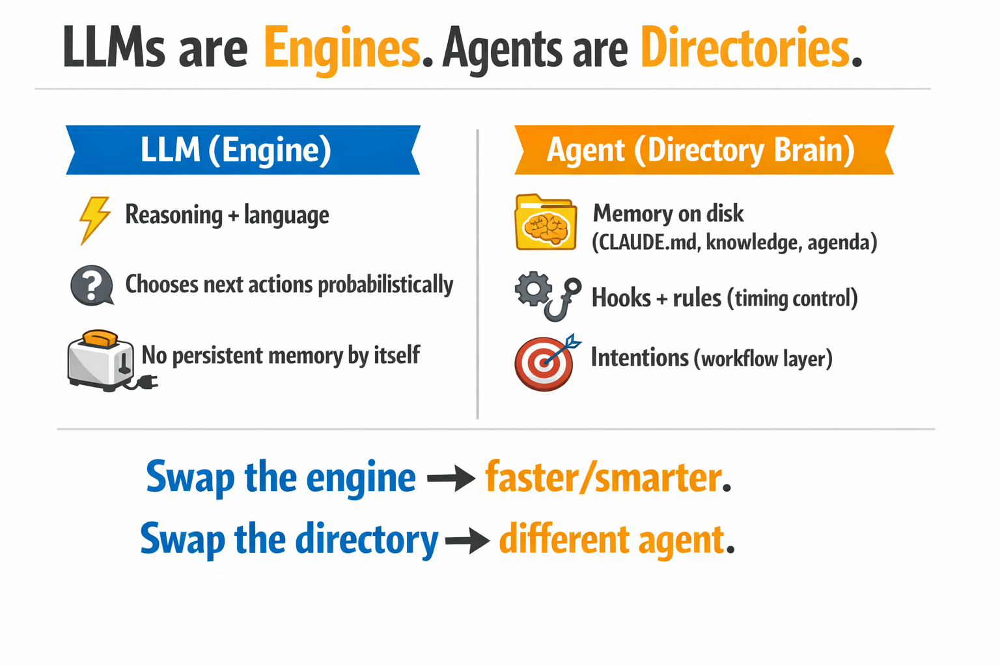
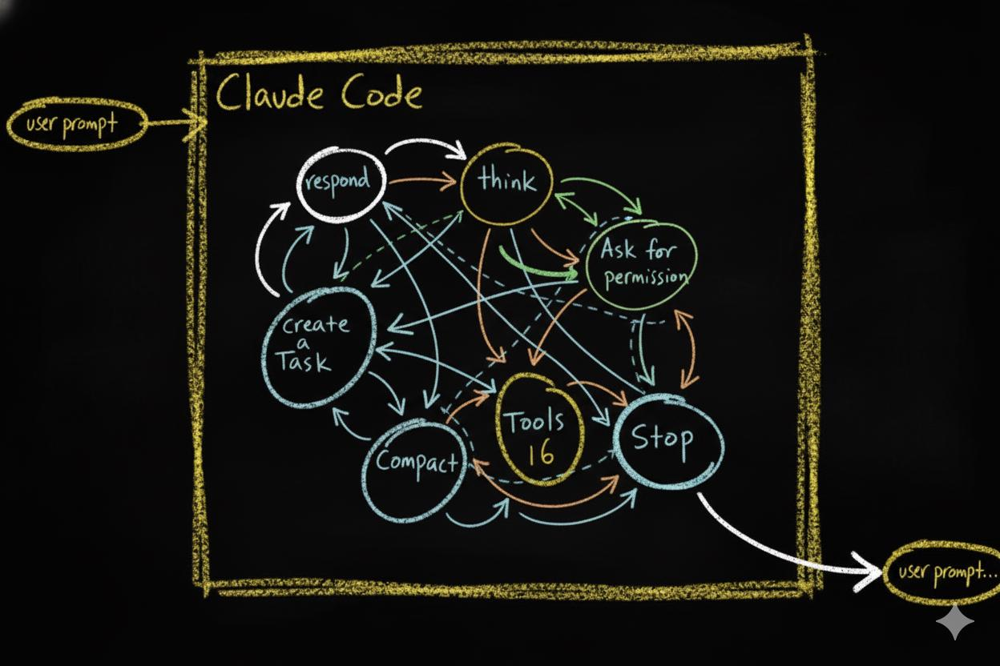
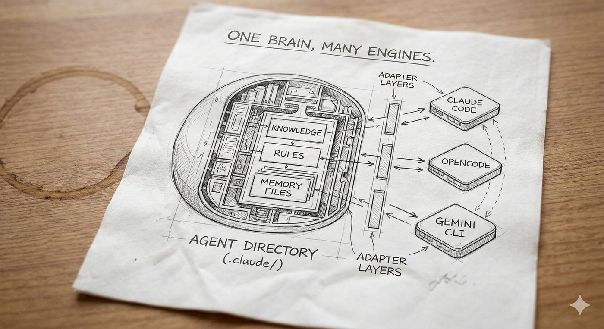

> **LLMs are electricity. Agents are toasters.**

Electricity is one of the most powerful forces on the planet. It can heat a room, run a hospital, or power a city. But plug it into nothing and it just arcs. It needs a **structure** to become useful.

A toaster is a simple structure. It takes raw electrical energy and channels it into a **specific, repeatable outcome** — toast, every time. Not because electricity "decided" to make toast. Because the wires, the timer, and the slots shaped the energy into a predictable result.

This is the relationship between an [LLM](https://en.wikipedia.org/wiki/Large_language_model "Large Language Model — AI software like ChatGPT or Claude that generates text") and an agent.

The LLM provides **raw reasoning power**. It can write, analyze, plan, and create. But without structure, the token stream it produces can flow in any direction. The agent provides the structure. It channels that stream into **consistent, reliable behavior**.

Most people building with AI today are staring at the electricity and wondering why it does not make toast on its own.

## The Misunderstanding

When people say "AI agent," they almost always mean the model. Claude, GPT, Gemini — pick your favorite. They point at the LLM and say: *"That is my agent."*

**That is the root misunderstanding.**

The model is not the agent. The model is the **engine** — a [token generator](https://en.wikipedia.org/wiki/Language_model "A system that produces text one piece at a time based on statistical patterns learned during training") that produces text one piece at a time based on patterns in its training data. It can reason, analyze, and create. But on its own, a token generator does not form memories, build identity, learn from experience, or maintain consistency across sessions. Those require something outside the model.

A jet engine sitting on the ground is incredibly powerful — but it is not an airplane.

Here is what happens when you treat the LLM as the agent:

- **No memory between sessions.** The model forgets everything when the conversation ends. Every session starts from zero.
- **No consistent behavior.** The same prompt can produce different results on different days. There are no habits, only probabilities.
- **No identity.** The model does not know who "it" is in the context of your project. It adapts to whatever you tell it in the moment.
- **No growth.** The model cannot learn from its own experience. It cannot refine itself over time. It cannot get better at *your* specific tasks.

If your "agent" loses everything when you close the chat session, **you do not have an agent**. You have a very expensive autocomplete.

The real agent is something else entirely.

## What Is an Agent, Really?

An agent is the engine **plus a local brain**.

The most direct way to build that brain today is with a [CLI agent](https://en.wikipedia.org/wiki/Command-line_interface "Command Line Interface — a text-based way to interact with software") — a program that sits in a folder on your computer, reads and writes files in that folder, and can be controlled by the content of those files. Think of it as a general-purpose file manager powered by an LLM.

Current tools — Claude Code, OpenCode, Gemini CLI — are marketed toward technical users. The names suggest it: Claude *Code*, Open*Code*. But what these tools actually do is manipulate files and respond to file content. That capability extends far beyond writing code.

We will explore what CLI agents make possible in a later essay.

In a CLI agent, the brain is not abstract or metaphorical. It is **literal**. It is a collection of files and directories on your local disk.

**The agent is the filesystem.**

And here is the key insight: since a CLI agent's entire capability is generating text and using it to create and modify files — it can build the brain itself. Give it a well-designed seed — a filesystem with a basic cognitive architecture already defined — and the agent can read its own structure, understand it, and extend it.

You describe what you need through conversation. The agent builds. The same seed works for any user — its architecture knows how to grow, but what it grows into depends on you. We will dive deep into what makes a seed agent work in the second half of this series.

This is good news. Training an LLM costs hundreds of millions of dollars and requires specialized hardware most people will never touch. Building an agent? You need a subscription to Claude — or even a free, open-source model. You describe what you need through conversation. The LLM builds the filesystem. No training runs. No specialized hardware. Just files.

As the agent takes on more work, it may consume more LLM calls — you might move up a subscription tier. But the total cost is a utility bill, not a research budget.

You are not creating intelligence — that already exists. You are organizing files that shape existing intelligence into reliable behavior.

And because it is just files, everything is transparent. You can open a folder and see exactly what your agent knows, what rules it follows, and what it is about to do. You can audit it. You can move it to another machine. You can hand it to a colleague. Try doing that with a neural network.

That filesystem gives the LLM everything it cannot provide on its own:

- **Memory** — knowledge files, past decisions, learned patterns
- **Structure** — operational phases, rules, workflows
- **Reflexes** — automatic actions that trigger at specific moments
- **Identity** — who the agent is, how it behaves, what it prioritizes
- **Continuity** — persistent state that survives across sessions

*The LLM is the engine. The directory is the agent. Swap the engine and you get a faster model. Swap the directory and you get a different agent entirely.*

When you open one of these CLI agents in an **empty directory**, you have an LLM with file access — nothing more. It can read, write, search, and run commands. But every decision is purely probabilistic, shaped only by its training and the current conversation. There is no memory of yesterday. No rules it has learned. No identity it maintains. Out of the box, even the most capable CLI agent is just a token generator that can touch files.

**This is not yet an agent.** This is a raw engine with no car around it.

But when you add a `.claude/` directory (or `.opencode/` in OpenCode, or any equivalent brain directory) — with knowledge files, operational rules, memory structures, and workflow definitions — something fundamental changes. That directory becomes the **brain** of your agent. The brain is the collection of files that tell the LLM **how to behave**.

## The Default State: The Random Walk Problem

To understand why structure matters, look at what happens **without** it.

A CLI agent in an empty folder has an **action space** — the set of things it can do at any given moment:

*The raw action space of a CLI agent. Without structure, the LLM bounces between states based on probabilities — a [Markov chain](https://en.wikipedia.org/wiki/Markov_chain "A system where the next step depends only on the current state, not the full history") where every path is equally likely.*

- Respond in chat
- Use deep reasoning mode
- Use tools (read, write, edit, run, search)
- Ask for permission
- Delegate work to other agents
- Manage its working memory
- Stop

At each step, the LLM picks one of these actions based on probabilities. Then it picks again. And again. This creates a **probabilistic action chain** — a sequence of decisions where each step depends on the current state of the conversation.

The problem? **Small changes in context lead to completely different paths.** Rephrase your prompt slightly and you get a different sequence of actions. Run the same task twice and you might get two different approaches. The chain is inherently unstable.

This is why working with a bare LLM can feel like a **random walk**. It is intelligent, but it is not reliable. It might solve your problem beautifully today and stumble on the same problem tomorrow. A raw LLM agent behaves like a brilliant mind with no executive function. Full of potential, but scattered and inconsistent — unable to stay on track without external structure holding it accountable.

> Intelligence alone is not reliability. **Structure is.**

## Structure Changes Everything

Now watch what happens when you add structure.

The first and most fundamental piece of structure is an **instruction file**. In Claude Code, this file is called `CLAUDE.md`. It is a plain text file that the agent reads automatically every time it starts working in a directory. Along with the current conversation, these instruction files are **everything the agent sees** — its entire context. Whatever you write in them becomes part of how the agent thinks, what it prioritizes, and what rules it follows.

One file at the project root is just the beginning. `CLAUDE.md` files can exist at every level of the directory tree — each one scoped to its location, each one adding local context as the agent navigates your project. Together, they form a **layer of working memory** spread across the entire filesystem. We will see this layer's full architecture in the compartmentalization section below.

What makes this layer powerful is that it does not just hold static information. It can define a **workflow** — a sequence of phases the agent moves through as it works. The workflow we use is called **OPEVC**: **Observe, Plan, Execute, Verify, Condense.**

*The OPEVC cycle. The agent moves through five phases — Observe, Plan, Execute, Verify, Condense — with CLAUDE.md files at the center, updated throughout. Each phase produces different work and different updates to working memory.*

An effective agent following the OPEVC flow gathers context during Observe — from local files, the web, the user — and writes what it finds into the `CLAUDE.md` files where the actual work is about to happen. During Plan, it updates those same files with its thinking on what to do next. During Execute, it captures lessons learned from its actions. During Verify, it checks the results and captures what passed, what failed, and what to watch for — feeding those observations back into the same `CLAUDE.md` files. By now, all four phases have deposited their context into the working memory layer. And during Condense, the agent deflates that layer — cleaning up temporary notes, moving lessons into `CLAUDE.md` files higher in the directory tree, and distilling new rules, hooks, or instructions into the rest of its brain for future sessions.

Every phase reads from the `CLAUDE.md` layer and writes back to it. The instruction files are not static documents. They are living working memory that inflates as the agent works and contracts as it absorbs what it learned.

This is not something the LLM invented on its own. It is a structure you define in the filesystem. The LLM follows it because the instruction files tell it to. Remove those files and the LLM goes back to random-walking through its action space. We will return to these phases in detail as we build the seed agent in later essays.

But defining a workflow in instruction files does not guarantee the agent will respect it. Instruction files guide. They shape context. They do not enforce. To make certain behaviors **mandatory**, you need something stronger: [**hooks**](https://en.wikipedia.org/wiki/Hooking "Trigger points where custom rules automatically run when an event happens").

Modern CLI agents support **hook systems** — events that fire at specific points in the agent's lifecycle.

*The hook system in Claude Code. Every arrow is a moment where you can intervene. Every hook is a checkpoint where your rules control what happens next.*

Every time the agent is about to take an action — use a tool, respond, manage memory, stop — a **hook fires**. That hook can:

- **Block** the action entirely
- **Modify** the action before it executes
- **Trigger** additional behaviors
- **Log** what happened for future reference

This is how you turn a probabilistic chain into a **deterministic pipeline**. The LLM still does the thinking. But the hooks define the guardrails, the checkpoints, the reflexes — and most importantly, a **place where the agent's behavior can be recorded**. Every hook captures what the agent decided and what it did. Later, you review those recordings — see what worked, add better controls, tighten guardrails. The agent gets smarter over time because you can see exactly where to make it smarter. The LLM proposes. The structure disposes.

Two layers of structure. **Instruction files** shape behavior through what the agent reads — context, phases, rules, memory. **Hooks** enforce behavior through what the agent cannot bypass — blocking actions, triggering responses, logging events. Together, they transform a probabilistic token generator into a reliable cognitive system.

The structure does not replace intelligence. It **channels** it. The same way a toaster does not generate electricity — it shapes electricity into toast.

## The Platform Does Not Matter

If the agent is the filesystem, then **the platform is just the adapter**.

Right now, multiple CLI agent platforms support hook and event systems:

- **Claude Code** — [hooks](https://code.claude.com/docs/en/hooks "Claude Code hooks documentation — shell commands, HTTP endpoints, and LLM prompts triggered by agent events") via `.claude/settings.json` (PreToolUse, PostToolUse, Stop, Notification, etc.)
- **Gemini CLI** — [hooks](https://geminicli.com/docs/hooks/ "Gemini CLI hooks documentation — event-driven shell commands modeled after Claude Code's design") shipped January 2026 (BeforeTool, AfterTool, BeforeAgent, AfterAgent, etc.)
- **OpenCode** — hooks via [plugin system](https://opencode.ai/docs/plugins/ "OpenCode plugin system — JS/TS modules that subscribe to agent events") (`tool.execute.before`, `tool.execute.after`, `session.idle`, `stop`)

As of early 2026, all three shipped hook systems within months of each other — confirmation that interception points are becoming a standard primitive in agent infrastructure.

The syntax differs. The concepts are identical. Each platform provides **interception points** where your rules can override the LLM's default behavior.

Think of it this way: `hook.sh` in Claude Code and `plugin.ts` in OpenCode are **adapters**. They translate platform-specific events into your agent's decision system. The hook mechanism is an interchangeable sensory layer — like swapping out ears for antennae. The Markov brain behind them stays the same.

This means your agent's core identity — its **knowledge, behaviors, rules, memory structures, and workflows** — is platform-agnostic. Those files do not care which LLM reads them. They do not care which CLI runs them. The filesystem IS the identity.

Swap the LLM? The agent still knows who it is. Swap the platform? The agent adapts through a new adapter layer. **Swap the filesystem?** Now you have a completely different agent.

*One brain, many engines. The same agent directory — with its knowledge, rules, and memory — connects to different platforms through thin adapter layers. Swap the engine; the agent stays the same.*

## The Core Principle: Compartmentalization

If the agent is the filesystem, then the quality of the agent depends on **how well that filesystem is organized**.

This is where **compartmentalization** becomes the core principle.

Compartmentalization means: **every piece of knowledge has a home**. Every behavior has a boundary. Every context is scoped to where it is needed.

*The four levels of compartmentalized memory. Global context at the top, local working memory at the bottom. Each file scoped to exactly where it is needed.*

Look at the hierarchy above. Information is not dumped into one giant prompt. Instead:

- **Global context** lives at the user level — preferences, conventions, stable patterns
- **Agent identity** lives at the project root — who the agent is, its operational phases, its personality
- **Brain documentation** lives in the agent's brain directory — how the brain works, its growth rules, its structure
- **Local working memory** lives in each subdirectory — task-specific context, scoped to exactly where it is needed. Think of it like the body's circulatory system: blood flows where it is needed most — to the digestive system after eating, to the muscles during a workout. Working memory inflates in the directory where the agent is active and contracts when attention moves elsewhere.

Without compartmentalization, you get **"prompt soup"** — every piece of context dumped into a single undifferentiated blob. The LLM drowns in noise. Behavior becomes unpredictable. The agent loses coherence.

With compartmentalization, you get **bounded contexts**. The agent loads only the information relevant to its current task. Knowledge is discoverable but not overwhelming. The agent can grow without collapsing under its own weight.

This is also what gives the agent **identity over time**. When the filesystem is well-compartmentalized, the agent's "personality" — its rules, its preferences, its memory — persists across sessions, across context compactions, even across LLM swaps. The compartmentalized information *is* the agent's identity.

## What This Means for You

If the vocabulary in this essay felt unfamiliar, that is normal. Learning agent concepts is like learning any professional tool — the way you once learned to think in slides and templates when you picked up PowerPoint, or in cells and formulas when you first opened a spreadsheet. The concepts are not hard. They just need exposure and repetition. This series will build them up, one essay at a time.

If you are building with AI agents — or want to start — here is the shift in thinking:

1. **Stop obsessing over which model to use.** New LLMs are being trained constantly. New forms of token generators will arrive. The engine keeps getting better — that was never the bottleneck.

2. **Give your agent a brain.** Create a dedicated directory with structure, knowledge files, operational rules, and memory. This is not configuration — this is the agent itself. Without it, the engine has nothing to build on — no memory to consult, no rules to follow, no identity to maintain.

3. **Write the habits down.** Consistency comes from structure, not from intelligence. Define phases. Define workflows. Define what the agent should do at each event. If it is not written in a file, it does not exist.

4. **Design for portability.** Your agent's brain should not be locked to one platform or one model. Keep the core identity in plain files — markdown, JSON, scripts. Let the platform-specific hooks be thin adapters, not the whole system.

5. **Think in compartments.** Scope knowledge to the directory that needs it. Bound behaviors to the phase they belong in. The better you compartmentalize, the more reliably your agent behaves — and the more gracefully it grows.

The electricity keeps getting stronger. That has never been the bottleneck.

**Build the toaster.**

---

*Essay 1 of 8 in the Hadosh Academy series on agent architecture.*

*Next: ["We Could Have Had AGI By Now"](02-we-could-have-had-agi.html) — what happens when you scale architecture instead of the model.*
