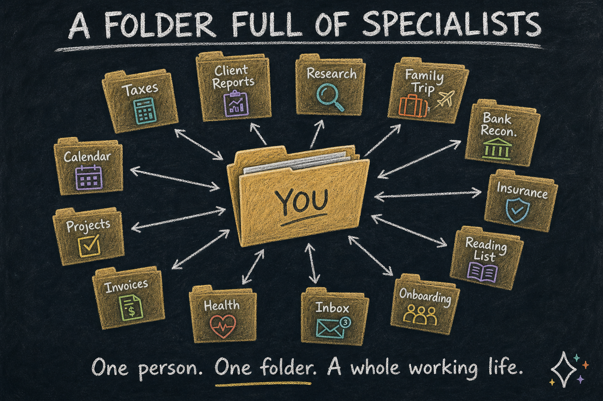
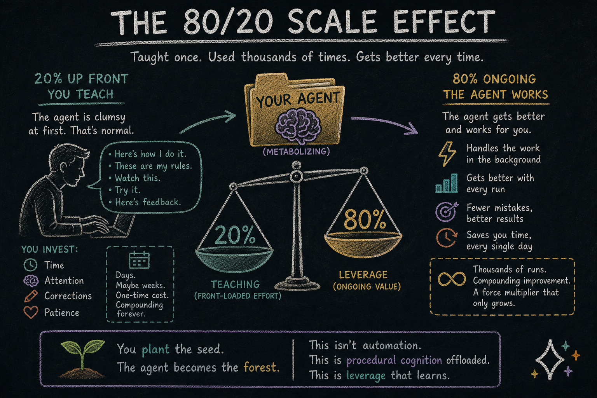

# The Folder Is Alive

> **Your liver runs in the background. So will the work you taught your cortex.**

Open the laptop of a person five years from now.

Inside one folder, twenty smaller folders. One handles the year-end taxes. One drafts the monthly client report. One scouts new academic papers in their field. One plans the family vacation. One reconciles bank statements. One files insurance claims. One curates the kid's reading list. One knows how their consulting firm onboards every new account.

None of them came pre-built. The person taught each one, one job at a time. Most started clumsy. All of them got better.

This is not science fiction. It is not a roadmap either. It is the foreseeable consequence of one quiet idea: **a generic substrate for cognition that any professional can shape.**

We have a name for it. We call it the [seed agent](01-llms-are-not-the-agents.html). The folder full of seed agents is your **personal cognitive workforce.**


*One person. One folder. A whole working life.*


## The PowerPoint Moment

Think about PowerPoint for a second.

When PowerPoint first showed up, it was not a tool for "making slides about quarterly earnings" or "making slides about wedding toasts." It was a tool for putting things on rectangles. People learned the substrate. Then they made everything with it — pitch decks, eulogies, birthday slideshows, defense briefings, lecture notes, wedding photo montages. The substrate did not care which one. The substrate just knew rectangles.

Once you learned the substrate, every use case became yours.

The seed agent is the same kind of moment, except the substrate is not rectangles. It is **cognition** — observation, planning, execution, verification, and the slow absorbing of what was learned. Every professional who learns how it thinks can teach it anything. A tax accountant teaches their seed agent how *they* file. A litigator teaches one how *they* prep a case file. A novelist teaches one how *they* outline a chapter. A real estate agent teaches one how *they* qualify a lead.

The substrate stays generic. The taught agent becomes specific.

This is what an academy is for. Not to ship a hundred specialty agents we sell on a shelf. To teach the substrate, then get out of the way.


*PowerPoint was rectangles. The seed agent is cognition.*


## Cognitive Metabolism

The architectural fact under all of this is small enough to fit in one sentence:

**Add a `.claude/` directory to any folder on your computer, and that folder becomes an agent.**

The brain lives in `.claude/`. The work lives in sibling directories under the same folder — the data, the reports, the references, whatever the job actually operates on. The LLM reads the brain, operates on the siblings, writes back the lessons it learned along the way. The same pattern works for `.opencode/` and any equivalent brain directory in any other CLI agent.

```
your-job/
├── .claude/        ← the brain
├── data/           ← work
├── drafts/         ← work
└── references/     ← work
```

That is it. That is the whole architectural primitive that gives you the folder full of specialists. Each "specialist" in the folder is exactly this: a folder with a brain dir and a few sibling work dirs.

Without the LLM, that folder is just files. They sit on disk. They do nothing.

But add the LLM, and the folder starts to move. The agent reads its own knowledge files, updates its plans, migrates lessons from one corner of the folder to another, refines what it has learned about you, and tightens its own rules. Files inflate during work. Files contract when work is done. Information flows through the folder the way blood flows through tissue.

There is no good word for this in plain English yet. So let us coin one.

Call it **cognitive metabolism.**

The LLM is the metabolism's energy — the same way electricity is energy in a toaster, the same way [ATP is energy](https://en.wikipedia.org/wiki/Adenosine_triphosphate "Adenosine triphosphate — the molecule that carries energy in living cells") in your cells. The files are the tissue. The metabolism is the continuous motion that keeps the tissue alive. ([Essay 2](02-we-could-have-had-agi.html) put the verb in your hands — *the agent metabolizes tokens.* This essay names the noun.)

This is what makes a seed agent *yours.* Not the files. The metabolism running on top of them. Your taught lessons get consolidated. Your corrections get absorbed. Your patterns get learned. All of it happens in the background, by an agent following the rules you helped it write.

Static files would be a brain in a jar. Cognitive metabolism makes them a brain at work.


*Files are the tissue. The LLM is the energy. Cognitive metabolism is what brings it to life.*


## The Shape of Teaching

Teaching one of these agents is concrete. There is no mystique to it.

The first time you do a job with the seed agent, you sit next to it. You explain what you care about. You correct it when it misses something. You tell it which fields matter, which ones don't, which mistakes are unforgivable, which corners it can cut. The agent watches and listens, and writes everything down.

Not as transcript. As **structured memory.** What you taught it ends up in files inside the brain dir. You can open them and read them. There is no black box. There is a folder, there are notes, and the notes describe the job you just did together.

The second time, the agent is faster. It remembers the last conversation. It still asks questions, but the right ones. You correct less.

By the third or fourth time, the agent has a **plan file** — a document the agent wrote that describes how the job goes, your way, in your words, refined through practice. The plan file is the agent's promotion. It used to make it up each time. Now it works from a script you co-authored.

For jobs you do enough, the agent eventually grows the plan into something stronger. A piece of itself that knows the job by heart. Inside the agent, this is called a **plugin.** To you, it is the moment a particular job moved out of your head and into the cortex, where it can be done without drawing on your attention for the small stuff anymore.

Three steps. Apprentice. Trained colleague. Resident specialist.

## Forty Years of Forced Delegation

Here is what the digital age did to ordinary people.

For roughly the last forty years, every part of life that touched a computer required someone technical. Filing taxes online. Setting up a small business website. Building a spreadsheet that did not break. Reading the legal terms of a service before clicking *agree*. Backing up the family photos. Managing the password chaos. Configuring the home network. Recovering when something stopped working.

If you were not technical, you outsourced. To your accountant. To your IT guy. To your kid. To your tech-savvy friend. To the company tech support that put you on hold for ninety minutes.

Not because the work was hard. Because the *interface* was hard.

Forty years of normal people paying — in money or in favors — to bridge a gap that should never have been there.

Then [the cost of delegation began to collapse](03-your-brain-was-never-built-for-this.html).

Electricity is a utility for energy. The plug in the wall does not care if you are a physicist. It just delivers. **The LLM is now a utility for intelligence.** It does not care if you can code. It just delivers reasoning. Plain English in. Useful work out.

When intelligence becomes a utility, delegation becomes a feature, not a privilege. You no longer need to *be* the technical person. You no longer need to *hire* the technical person. You teach the agent in plain words. The agent runs the technical part on your behalf.

Forty years of forced dependence on external entities — finally optional.


## What "Off-Loading" Really Means

It is tempting to say *"the agent does the work while you sleep."* It sounds great in marketing. It oversells, and it sells the wrong thing.

The honest framing is quieter and truer: **the agent holds the procedure so your mind doesn't have to.**

You still decide *that* the taxes need filing. You still set the year's strategy. You still answer the questions that require your judgment, your taste, your relationships. What the agent holds is the **how** — every checklist item, every form, every gotcha you discovered three years ago, every corner you decided was OK to cut. That part used to live in your head, and every time you needed it, you had to dig it back out.

Now it lives in the cognitive metabolism. The cortex remembers. You don't have to.

Different jobs split the labor differently. For some, the agent only needs you for the strategic moments. For others, it does the prep work and hands you a clean situation to decide in. For the easiest, it just does the thing and shows you what it did.

The point is not autonomy. The point is **liberation.**

### The Scaling Multiplier

There is a second consequence. Bigger than liberation. Harder to see at first.

If your seed agent runs roughly 80% of the procedural load of your professional work, your bandwidth changes shape. The 20% where your judgment matters — that is now where your full attention goes, instead of being squeezed in between the parts that drained it.

Take a small consulting practice. The consultant who used to handle two or three clients can think about handling many more, because the seed agent runs the discovery worksheets, drafts the first-pass proposals, structures the recommendation memo, builds the handoff packet, and follows up at the right intervals — all in the consultant's exact style, because the consultant taught it. The consultant brings the strategy, the relationship, the moment of insight that closes the deal. Same person. Same expertise. Several folds the output.

This is not a story about working harder. The 80% the agent handles was never the part you loved. The 20% the agent leaves you is.

The same multiplier applies wherever professional life has structure. A researcher reads more papers. A litigator preps more cases. A financial planner serves more families. A novelist holds more story threads at once.

The agent runs the procedure. The professional spends their hours on what only they can do. This is what scaling looks like when the bottleneck was never the work — it was the cognitive overhead around the work.


*Taught once. Used thousands of times. Gets better every time.*


## Rhythms

Not every job has the same shape.

Some are **one-off**. Write this email, summarize this contract, draft this proposal, then close. The agent helps once, and the work is done.

Others are **repeating** — every Friday, every quarter, every April. The agent learns the rhythm. When the time comes, the work surfaces, ready to start. You no longer have to remember to start.

Some are **on-call**, waiting for a signal. When *X* happens — a new client signs, a regulation changes, a paper drops in your field — the agent activates and does its part, then quiets again.

And some are **seasonal**. The annual review. The year-end close. The tax filing. They wait between firings, holding what they learned the year before, picking up the moment the season returns.

Each agent in the folder is shaped by the rhythm of its own job. Many of them, in one folder, give a person something most working lives have never had: a week organized at the level of cognition, not just at the level of calendar.


## The Other Direction

So far we have talked about what the cortex *produces.* Work going out.

There is another direction. What comes *in.*

For decades, you handled the inbound flood with one ancient technology: **the newsletter.**

A newsletter is delegation. You trusted someone — a journalist, an analyst, a fan of a niche topic — to read everything, filter it, and send you the part that mattered. You paid them, in money or attention. They made one curation. Thousands of people received it. *One curation, many readers.*

Now flip that around.

Your seed agent reads the same sources newsletter authors read — the academic journals, the trade publications, the early-access feeds, the [arXiv](https://en.wikipedia.org/wiki/ArXiv "An open-access archive for scholarly articles") preprints. It reads the newsletters too, because newsletters are also signal. It reads everything you trust, and filters it through *your* interests, not someone else's. *One curation, one reader.*

The result arrives in your inbox every morning, written by an agent that has been learning your taste for months. No one else gets it. No one else needs it.

Now go further.

### Your Algorithm, Not Theirs

Your social media feed today is curated by a corporation whose interests are not yours. Their algorithm optimizes for engagement, which means outrage, which means staying on the platform. You are not the customer. The advertiser is. You are the inventory.

Replace the algorithm.

Tell your seed agent what you actually want from a feed. The handful of people whose work you genuinely care about. The topics you want to go deeper on this season. The kind of content that makes you a better professional, versus the kind that makes you angrier and dumber. The agent assembles your feed. *You* defined the algorithm.

The same logic extends everywhere — your news, your reading recommendations, your podcast queue, your alerts, your inbox. The cortex does not just produce work. It filters reality, on terms you set.

### Your Apps, Your Data

The deepest version of this is not a feed. It is a **personal super-app**. Your fitness dashboard. Your project tracker. Your finance overview. Your communication hub. Built by your agent, running on your hardware, holding your data — yours.

[Blog 3 already saw the architecture for this](03-your-brain-was-never-built-for-this.html). The seed agent makes it concrete. Every feed, every dashboard, every utility you depend on can be replaced by something you shaped.

### The Punch Line

Privacy is part of this. You stop being someone else's product. Your data stops being mined and resold.

But privacy is the supporting argument. The headline is bigger.

**You define the algorithm now.** Of what comes in. Of what gets filtered out. Of what you spend your attention on. Of how your data is used. Of how you are nudged.

The terms of your digital life stop being chosen by a corporation whose incentives are not yours.

That is autonomy. Real autonomy. Not the marketing version.

The cortex isn't only there to handle the work you don't want to do. It is also there to handle the manipulation you don't want to live under.


## Why Education Is the Product

You will notice we have not promised that the seed agent does your taxes for you.

We will not. What we will promise is that we will teach you, in plain language, how the agent thinks. Once you understand that, you can teach it taxes. Or quarterly reports. Or research scouting. Or your news feed. Or whatever job you have that takes time you would rather spend elsewhere.

This is the bargain. Hadosh Academy is an academy. The seed agent is what we hand you on the way in. The teaching is the rest of it — essays, walkthroughs, a community of professionals doing the same teaching in their own corner of the world.

If we shipped a tax-filing agent, we would have one customer profile. Tax accountants. Maybe a few hobbyists. If we ship the substrate plus the teaching, we have every professional whose work has structure — which is nearly every professional.

That is the whole bet. **Mechanisms, not categories.** Substrate, not products. **Teach the cognition; the jobs follow.**


## What This Looks Like, Five Years Out

Walk back to the laptop from the opening.

The folder of specialists is not a single product anyone shipped on a Tuesday. It is a result. It is what happens when one person, over time, teaches a generic substrate enough jobs to feel a difference in how their week, their month, and their year run.

Here is what is *not* in the folder: a chatbot pretending to be a tax accountant. An AI that hallucinates references and calls it creativity. A SaaS subscription with someone else's idea of how your work should go. A black box you have to trust because someone told you to.

Here is what *is* in the folder: agents that you taught, that you can read, that you can correct, that you can pass on, that you can scrap and rebuild from the same seed when the work changes. Files on your machine. Memory you can open in a text editor. Cognitive metabolism running in the background — your liver, but for paperwork. A workforce that exists because *you* grew it.

This is what we mean when we say *digital cortex.* Not a metaphor for a chat assistant. A structural extension of your own cognition, made of folders and files and the slow accumulation of jobs you taught well.

### What This Means for You

You do not need to be a programmer. You do not need to understand neural networks or hold a computer science degree.

You need to recognize what is happening.

Intelligence has become a utility. The plug is in the wall. The folder is on your computer. The metabolism starts the moment you start teaching.

The personal cognitive workforce is not coming because someone will build it for you.

It is coming because you will build it. We will teach you how.

**Plant the seed.**

---

*Series interlude — sits between Essay 3 and Essay 4 of the Hadosh Academy series on agent architecture.*

*Previous: ["Your Brain Was Never Built for This"](03-your-brain-was-never-built-for-this.html) — why your biology can't keep up with the world your civilization built.*
*Next: ["The Language of Agents"](04-the-language-of-agents.html) — every term you need, in one read.*
