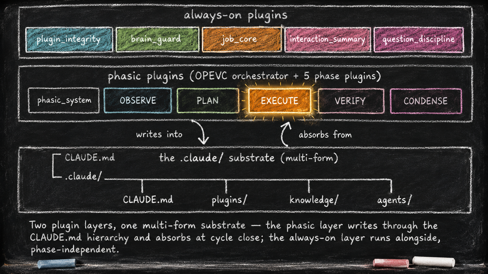

# The Two-Layer Foundation

*Essay 5.1 — The Always-On Digital Cortex, Part 1 of 9. Essay 5 opens here; Parts 2 through 9 follow.*

---

For four essays we have circled the claim that the agent is its filesystem. Now we open the filesystem.

[Essay 4](04-the-language-of-agents.html) showed you the persona file — `CLAUDE.md` at the project root — that defines who the agent is. Claude Code reads a sibling `.claude/` directory automatically at startup; the seed agent fills that directory like this:

```
your-project/
├── CLAUDE.md                ← the agent's persona (from Essay 4)
└── .claude/                 ← Claude Code's brain directory
    ├── CLAUDE.md            ← brain index (what is inside)
    ├── knowledge/           ← long-term memory, organized by topic
    ├── plugins/             ← the agent's reflexes and disciplines
    ├── agents/              ← specialist sub-agents
    └── settings.local.json  ← Claude Code's hook registry
```

That tree is the substrate. Plural forms — folders, files, scripts, narratives — because no single form serves every kind of memory. Topical recall needs different machinery than procedural reflex. Each plugin folder inside `plugins/` carries more forms inside it: a `voice.xml` of coaching the agent hears at the right moments, an `evolution.md` narrative of how the plugin grew, hidden `data.json` state the plugin owns alone. *[ref: each-subdirectory-preserves-a-form | .claude/CLAUDE.md Components section + .claude/plugins/CLAUDE.md Plugin Structure Convention + .claude/plugins/plugin_integrity/hooks/evolution-cap.sh | Brain index (.claude/CLAUDE.md Components section) names the canonical compartments: `knowledge/` (topical long-term), `plugins/` (procedural). Plugin Structure Convention (plugins/CLAUDE.md) shows every plugin ships its own `CLAUDE.md`, `data.json`, `hooks/`, `scripts/`, `tests/`, `docs/`, `voice.xml`. The `evolution.md` narrative-memory form lives under each plugin's `docs/` and carries a separate word-cap via `evolution-cap.sh`. The `memory/` user-side cross-session compartment is project-external. Multi-form claim has direct on-disk substantiation.]*

The deeper move is representing different forms of cognition as different forms of memory, so the seed agent always carries the optimum context for what it is currently doing. As you customize your own seed agent, you will invent compartments that fit your work, your roles, your professional context.

The one place memory does **not** live by design is the chat session. Chat context is capped by the model's window and survives compaction only as a lossy summary. The rest of `.claude/` is what makes the agent durable across sessions.

**Two plugin layers run above this substrate.**

The **always-on layer** owns infrastructure that fires on every prompt, every tool call, every session start, regardless of which job the seed agent is currently working on. Locking the substrate for safe edits. Managing the context window. Structuring jobs. Summarizing long conversations. Gating how the agent asks questions. *[ref: the-always-on-layer-is-active | .claude/settings.local.json:11,23,43,53,123,153 | Hook registry — each always-on plugin's registration line: job_core/prompt-handler on UserPromptSubmit (11); plugin_integrity/plugin-guard (23), job_core/job-guard (43), interaction_summary/summary-guard (53), brain_guard/context-sensor (123) all on PreToolUse; question_discipline/question-discipline-gate on AskUserQuestion (153).]*

The **phasic layer** activates one plugin at a time, dictated by which phase the active job is in. The prototype's cycle is called OPEVC — observe, plan, execute, verify, condense — and the phasic plugins make sure the seed agent operates differently in each compartment. OBSERVE and PLAN are read-only against project files; EXECUTE writes inside a fenced scope; VERIFY runs scripts only; CONDENSE writes inside `.claude/` only, absorbing the cycle's experiential data into durable memory. *[ref: phases-make-different-tools-available | .claude/plugins/phase_observe/hooks/observe-guard.sh:151 + .claude/plugins/phase_plan/hooks/plan-guard.sh:134 + .claude/plugins/phase_verify/hooks/verify-guard.sh:117,144 + .claude/plugins/phase_condense/hooks/condense-guard.sh:303-341 | Each phase-guard hardcodes its own tool restrictions. OBSERVE + PLAN: "Bash limited to read-only git + wc + sleep. Everything else falls through to standard restrictions" (observe-guard:151, plan-guard:134). VERIFY: "only test/script runs consume budget, read-only bash does not" (verify-guard:117). CONDENSE: read-only bash whitelist (condense-guard:303-341) plus dedicated `.claude/`-only write scope. EXECUTE has its own altered-list scope mechanism. The read-only / fenced-scope / scripts-only / `.claude/`-only split is enforced in code, not convention.]* We open the phasic layer in [Essay 6](06_1-phasic-foundation.html).

Both layers are built from smaller plugins, each owning one narrow concern. The architecture's value is what those single-concern plugins **compose** into — ceremonies no plugin could perform alone.

We tour the always-on layer first because it surrounds everything else.

## The journey ahead

Essay 5 splits into nine short sub-essays:

- **Essay 5.1 — The Two-Layer Foundation** *(you are here)* — the substrate + the two layers + this map
- [Essay 5.2 — Plugin Edit Safety](05_2-plugin-integrity.html) — `plugin_integrity` and the test gate
- [Essay 5.3 — Context Window Discipline](05_3-brain-guard.html) — `brain_guard` and the progressive squeeze
- [Essay 5.4 — Job Lifecycle](05_4-job-core.html) — `job_core` and the unit of compartmentalization
- [Essay 5.5 — Mega-Prompt Compression](05_5-interaction-summary.html) — `interaction_summary` keeps the dynamic mega-prompt legible
- [Essay 5.6 — Structured Questions](05_6-question-discipline.html) — `question_discipline` and the prefix registry
- [Essay 5.7 — The CLAUDE.md Hierarchy](05_7-claude-md-hierarchy.html) — the working-memory substrate form the phasic layer writes through
- [Essay 5.8 — The Historian Ratchet](05_8-historian-ratchet.html) — three single-concern plugins composed into one ceremony
- [Essay 5.9 — The Customization Guardrail](05_9-customization-guardrail.html) — the gate that decides when plugin-layer edits are admitted at all

Essays 5.2 through 5.6 deep-dive the always-on plugins, one each. Essay 5.7 covers the substrate form the phasic layer USES. Essays 5.8 and 5.9 are for the architects in the audience — how single-concern plugins compose into emergent ceremonies, and how the operator gates substrate edits.

The phasic plugins get their own series in [Essay 6](06_1-phasic-foundation.html). The cell template that lets new plugins be born safely is [Essay 7](07_1-plugin-kit-foundation.html). The four-stage arc from your first job to your first custom plugin is [Essay 8](08-from-apprentice-to-architect.html).



---

## Why "Single Concern" Matters

Each always-on plugin owns exactly one concern.

`plugin_integrity` owns plugin edit safety — a test gate that commits on pass and auto-reverts to the last clean checkpoint on fail. (It has a second role gating *whether* plugin-layer edits are admitted at all, opened in [Essay 5.9](05_9-customization-guardrail.html).) `brain_guard` owns self-compaction — long before the model's context window runs out, it forces a structured summary so the next conversation starts rebuilt from the right parts, not the lossy tail. *[ref: long-before-the-model-runs | .claude/plugins/brain_guard/CLAUDE.md Objective section | Plugin's own Objective section: "Protect the agent's context window and critical infrastructure. Currently enforces a context-aware self-compact loop." Dedicated brain_guard definition — the plugin runs the self-compaction described in this paragraph, well before Opus 4.7's 1M context limit.]* `job_core` owns the job lifecycle — what the agent is working on, which phase that work is in, the refusal to stop while obligations remain. `interaction_summary` keeps a focused job's cumulative mega-prompt legible as it grows across hundreds of turns. `question_discipline` owns the asking gate — every question the seed agent asks you carries a registered prefix and a per-prefix slot-set.

Each plugin lives in its own folder under `.claude/plugins/<name>/` with its own hooks, scripts, hidden state, tests, and voice files. Naming the concern is easy because each plugin only has one to name. *[ref: plugin-integrity-owns-edit-safety | .claude/plugins/CLAUDE.md Active Plugins section + Plugin Structure Convention section + config.conf section | Active Plugins table maps each named plugin to its objective; Plugin Structure Convention tree shows folder layout (CLAUDE.md, data.json, hooks/, scripts/, tests/, docs/); config.conf section documents voice.xml as the sibling externalization concept, present in every plugin on disk.]*

The single-concern principle is a *minimize* rule, not an *eliminate* rule. Pure isolation is what a traditional library aims for — clean modules with no shared state, talking to nothing they don't import. The seed agent is a complex cognitive system, and a small amount of structured coupling between plugins is what lets the parts compose into ceremonies larger than any one plugin. Call this **single-concern + careful coupling**: each part stays narrow; the composition is what makes the ceremony possible. *[ref: single-concern-principle-minimize-rule | .claude/plugins/phase_execute/hooks/execute-guard.sh:85,240 | Structured coupling demonstrated: phase_execute imports `PHASE_SH="$PLUGIN_DIR/../phasic_system/scripts/phase.sh"` (line 85), then calls `bash "$PHASE_SH" current` at line 240. Each plugin owns one concern but composes via the other plugin's published command.]*

The historian ratchet inside `plugin_integrity` is a clean example — it blocks plugin editing when the plugin's evolution narrative has fallen behind, and to do that it depends on `question_discipline` registering the `[PLUGIN-LOCK]` prefix, on `job_core` capturing the user's approval answer, and on the safe-lock cycle protecting the plugin during the edit. Three plugins compose into one ceremony, each contributing what it owns. We deconstruct this composition in [Essay 5.8](05_8-historian-ratchet.html); the cell-anatomy view that lets new plugins compose this way is in [Essay 7](07_1-plugin-kit-foundation.html).

The discipline is in *how* the coupling happens. When plugins talk to each other, they talk through public, stable interfaces — small command-line surfaces each plugin publishes (one read-only command per concern, `job.sh focused` being the canonical example), a registry of question prefixes, named voice handles, and the footer marker protocol that organizes the bus. A plugin reads what another plugin chooses to publish; it never reaches into another plugin's private state. Each plugin's internal data stays private; only the interface is shared. *[ref: the-discipline-is-in-how | .claude/plugins/job_core/scripts/job.sh:391-396 | `job.sh focused` handler — inline comment reads "Returns just the focused job ID (or empty). Clean API for extension plugins." Read-only: reads `data.json`, never writes. Canonical public-interface example called by other plugins (e.g., execute-guard.sh).]*

The shape buys three concrete things. Plugins evolve independently — a change inside `interaction_summary` cannot break `job_core` as long as the read-only `job.sh` API stays the same. Plugins are testable in isolation — each `tests/` directory exercises one plugin's behavior without standing up the entire seed. Plugins are addable — a sixth always-on plugin slots into the architecture by exposing its own public commands, not by rewiring anyone else's. *[ref: the-shape-buys-three-concrete | .claude/plugins/job_core/tests/test-job-sh.sh:20-35 | Test isolation in practice: setup creates a temp directory + mocks dependent scripts (e.g., `plan.sh`) so `job.sh` runs without the full seed. Pattern is repeated in every plugin's `tests/` directory — interaction_summary tests mock job_core's `job.sh` the same way.]*

---

We start with `plugin_integrity`.

---

*Essay 5.1 — The Always-On Digital Cortex, Part 1 of 9.*

*Previous: [Essay 4 — The Language of Agents](04-the-language-of-agents.html) — vocabulary that prepares the architecture.*
*Next: [Essay 5.2 — Plugin Edit Safety (`plugin_integrity`)](05_2-plugin-integrity.html) — first of the always-on plugin deep-dives.*
