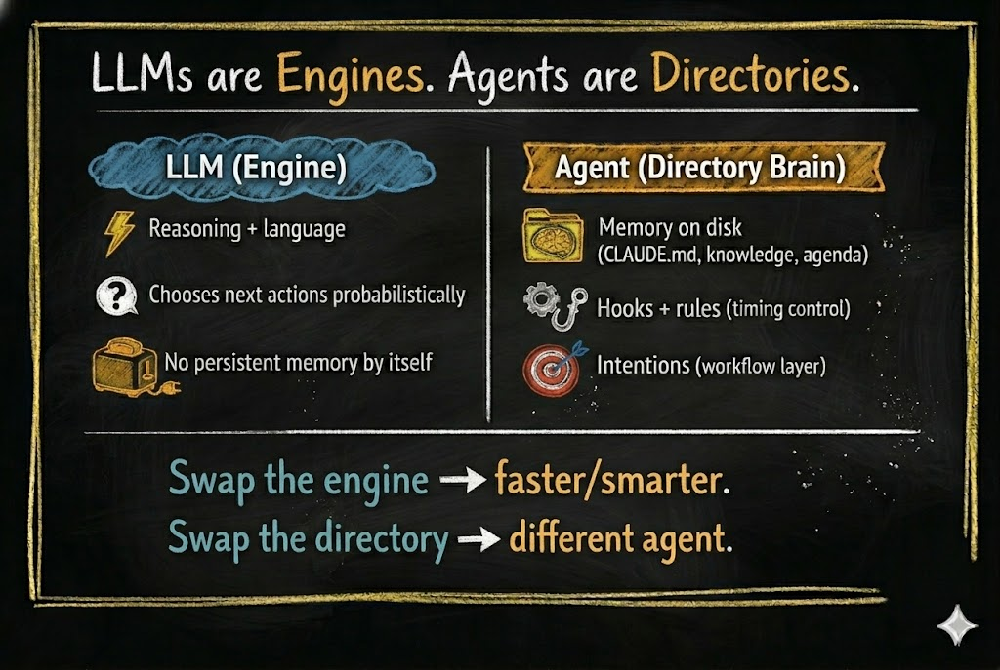
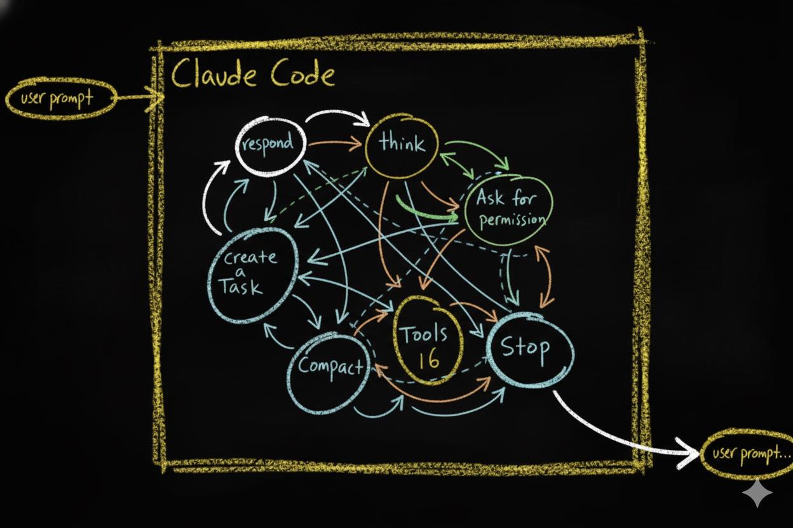
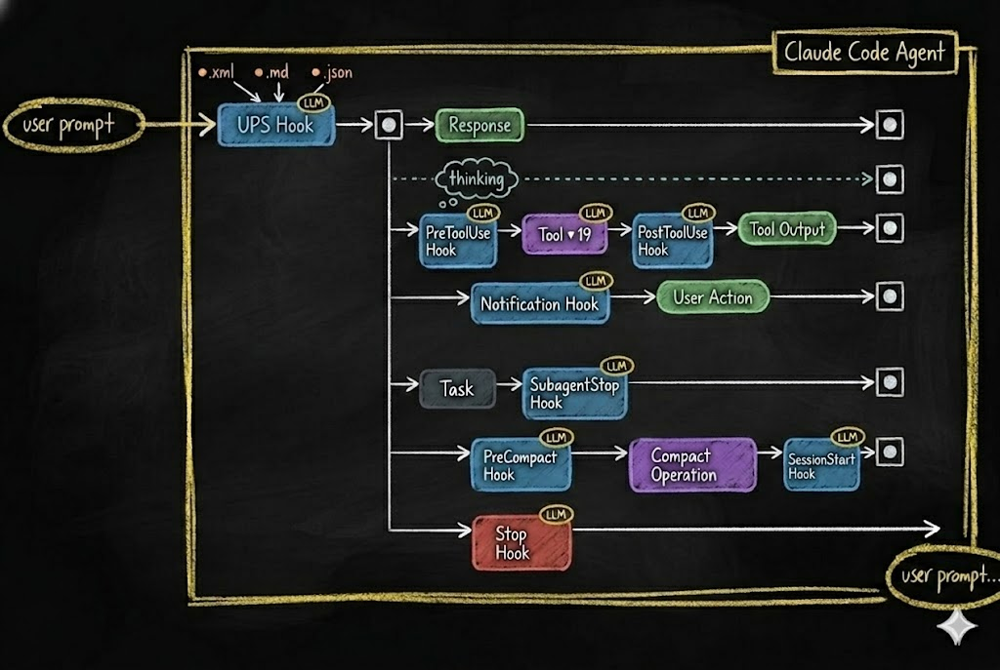

# LLMs Are Not the Agents

<!-- RAW_HTML -->

Abstract
We keep pointing at the language model and calling it the agent. This essay separates the model from the harness around it. The model supplies parametric capability; the harness composes active context, connects tools and controls, and carries user-specific durable context across sessions. In the architecture developed here, much of that durable identity lives in an inspectable filesystem shaped by its user. The distinction matters because personalization, memory, rules, jobs, and corrections accumulate primarily in the harness—not in one model response.

<!-- /RAW_HTML -->

> **LLMs are electricity. Agents are toasters.**

Electricity is raw power. It can heat a room, run a hospital, or power a city. But plug it into nothing and it just arcs. It needs a **structure** to become useful.

A toaster is a simple structure. It takes raw electrical energy and channels it into a **specific, repeatable outcome** — toast, every time. Not because electricity decided to make toast. Because the wires, the timer, and the slots shaped the energy into a predictable result.

This is the relationship between an LLM and an agent. The model can reason through language, write, analyze, plan, and propose actions. But the token stream it produces needs a structure around it before those capabilities become continuing, reliable work.

Much of the industry's attention is still fixed on the electricity, wondering why it does not make toast on its own.

## The relationship we were taught

We met this technology through a conversation box. We called it a chatbot, then an assistant. Those names made the first interaction easy: ask a question, hand over a task, wait for an answer.

They also taught us where to look. If the assistant is the one doing the work, we point at the intelligence speaking back and say, *That is my agent.* We delegate to *it*. When it forgets a decision, we ask why *it* did not remember. When it repeats a mistake, we write a longer prompt and try again.

But the conversation is only the visible part. Something assembled the context the model received. Something offered it tools. Something will decide what remains available when you return. A better prompt today does not tell you what the system will keep for tomorrow.

Imagine that the same interface had first been introduced as a **working memory**. You would still talk to it. But you might ask different questions: *What did I put into this context? What from our work should stay? What needs correcting before the next task?* You would see yourself as a collaborator in creating the conditions for its work, rather than only the person delegating the work.

“Assistant” was easier to explain and easier to adopt. “Working memory” would have required more explanation. That choice helped people start using the technology, but it also made it easy to overlook the skill of forming and managing context.

That oversight matters because people do not all mean the same thing by the same job. Ask a lawyer, a writer, and a project manager to “review this proposal.” One may need claims and obligations traced. Another may need the argument clarified without losing its voice. Another may need owners, deadlines, and dependencies. A capable model can help with all three. What makes the work *theirs* is the context, rules, and method that guide how it helps.

## What the model does

A language model receives a context and continues from it. The context may contain your request, earlier conversation, project instructions, retrieved files, and tool results supplied by the surrounding system. The output may be prose, code, a plan, or a proposed tool call. In every case, the model generates tokens. It does not reach into your filesystem with its own hands.

Think of it as a **text calculator**. You give it a working context; it continues from that context using capabilities learned in training. The input matters. Change the context and you can change what the model notices, proposes, and explains.

The material available to one model call is the **active context**. It can be rich, but it is temporary. Anything that must reliably survive that call needs **durable context** outside the model's temporary window: files, decisions, jobs, rules, memory, evaluations, and other persistent structures.

The harness connects the two. It composes active context from durable context, lets the model calculate over it, and can route selected consequences of the current work back into durable context so they can shape later work.

The model has knowledge, capability, and tendencies in its weights — its **parametric** side. A model could even be trained toward a particular agenda. That is a design choice about the model. For the agentic system we are building here, the **canonical, user-governed form** of the project's memory, current jobs, rules, permissions, and decisions must remain outside those weights, in inspectable, non-parametric structures. Some behavior may later be compiled into an adapter or specialized model, but the user should still be able to trace, correct, and rebuild the source that governs the work.

A useful plan is still output until something acts on it. A proposed tool call is still output until something interprets it, checks its permissions, and executes it. To find the agent, we have to look at that surrounding machinery.

## The layer around the model

The most direct place to see it is a **CLI agent**: a command-line program that works in a folder on your computer, reads and writes files, and connects a model to tools. Think of it as a general-purpose file manager powered by an LLM. Its name may suggest coding, but its ability to work with files extends to research, writing, project management, and any work whose state can be represented there.

The program's **runtime** supplies context, presents available tools, reads the model's proposed calls, and carries out the permitted ones. The **harness** is the wider non-parametric software layer around the model: runtime behavior, files, memory, tools, instructions, hooks, permissions, controls, and persistent state. Together, **model + harness form the working agentic system**.

Here is the choice that the conversation box tends to hide. A product can keep improving a general assistant, place more responsibility on the model, and make its surrounding machinery less visible to the person using it. The user supplies requests; the product decides much of the context, memory, and method. More model capability can make that assistant more autonomous. It does not, by itself, make the assistant more specific to how *you* work. A product can become more capable and more generic at the same time.

Or we can make the harness a layer the user helps shape. The person and agent can decide what knowledge to keep, which decisions govern later work, how a job proceeds, what requires approval, and what a correction should change. The same model can then work differently for different people because their accumulated contexts and methods are different.

The further that layer can change with the user, the less it looks like one fixed application shared by everyone and the more it starts to look like personal software.

<!-- RAW_HTML -->

<strong>Same model. Different project brains. Different agents.</strong>

<!-- /RAW_HTML -->

The difference is not whether a harness exists. It is what responsibility we give that layer, whether we can inspect it, and how much of its growth belongs to the user.

## What is an agent, really?

In this series, the agent's durable brain is literal: a collection of files and directories that holds the project memory, rules, jobs, and working state we choose to preserve.

**The agent is the filesystem.**

That is deliberate shorthand for the agent's **durable identity**. The complete working system is larger: the model supplies intelligence, the runtime animates the work, and the harness connects files, tools, instructions, hooks, permissions, and state. But the filesystem is where much of the user-specific structure can survive when a model call ends.

*The model supplies intelligence. The filesystem carries the user-specific structure that makes one agent different from another.*

Without a model and runtime, the brain is sleeping. Connect them, and the system can read its instructions, act within its boundaries, and write back what it learns. The files carry its history and rules beyond the current conversation.

Open a CLI agent in an **empty directory**. You still have the platform's conversation loop and tools. The model may already be brilliant. But where is *your project's* last decision? Its active job? The rule it learned after yesterday's mistake? By the definition used in this series, the durable project agent has not been built yet.

If your project loses every correction when you close the chat, you do not yet have a growing agent. You have a very expensive autocomplete with tools.

You do not need to train a frontier model to build it. Start with a well-designed **seed**: a directory containing basic instructions, places for knowledge and working memory, and rules for how it may grow. Describe what you need through conversation. The model can help create and reorganize those files; you inspect and authorize what becomes durable. As the agent takes on more work, you may pay for more model calls. That is a utility bill, not a research budget. No training run. Just files you can open, audit, and move.

You are not creating intelligence from scratch. You are organizing how existing intelligence works for you.

But a place to remember does not guarantee that the next action will follow the right path.

## The random walk problem

A CLI agent has an **action space** — the things it can do at any moment. It may respond in chat, reason through a plan, read or edit a file, call a tool, ask a question, or stop. Then the context changes and it chooses again.

*A prompt enters the action space. Each move changes the state from which the next move is chosen.*

Think of this as a **probabilistic Markov brain**. The model proposes one move, receives a changed context, and proposes another. The prompt, previous actions, files it reads, and tool results all shape what happens next. Rephrase a request, leave out a project decision, or return a different tool result, and the same task can take a different path.

That is the **random walk problem**. A model can solve a task beautifully today and miss the same project's rule tomorrow. Intelligence alone is not reliability. If yesterday's decision never reaches today's context, the model cannot follow it.

This brings us back to the context we separated from the model earlier. A saved decision can enter the next context. An instruction can guide the next proposal. A runtime control can stop an action where a boundary matters. These do different jobs.

The easiest way to see the difference is to follow one correction after the conversation ends.

## A correction that survives

Suppose an agent writes that a proposed feature already exists. You correct the paragraph. Now close the conversation and start another article. Will it make the same claim again?

If the correction stays in chat, you repaired one paragraph. Put the distinction between demonstrated and proposed work in a project writing rule, and keep the article's status with its job. The next run receives that context; a check can catch the same mistake before publication.

The correction now has a home and a path into future work. A finding becomes knowledge. A repeated decision becomes a rule. A recurring mistake can become a checkpoint.

<!-- RAW_HTML -->

<strong>The model's weights did not change. The system grew.</strong>

<!-- /RAW_HTML -->

In this broader sense, the harness stores more than factual memory. A note can remember *what is true*. An instruction can remember *how we decided to work*. A hook can embody **procedural memory**: *when this event happens again, remember to check, inject, block, or record this*. Different mechanisms carry different kinds of memory, but all of them let lessons from earlier work shape later behavior without changing the model's weights.

Persistence solves one problem: the correction can survive. It does not yet guarantee that the next run will use it at the right moment.

To make durable context operational, the agent needs a rhythm for work and controls at critical moments.

## Structure changes everything

A plain **project-instruction file** is one starting point. It can describe the objective, boundaries, and where to find relevant knowledge. Instruction files can also be scoped to parts of a directory tree, so a rule for one kind of work does not have to appear in every task. Other files hold active jobs, decisions, checked facts, and working memory. The runtime brings the relevant parts into context.

One way to give the work a rhythm is **Observe, Plan, Execute, Verify, Condense**. Observe gathers what is true now. Plan uses it to choose a path. Execute acts and records what happened. Verify checks the result against the objective. Condense routes durable lessons to the right files and leaves a clear state for the next run. The phases matter because each one should improve the next. Otherwise they are just names on a diagram.

Instructions shape what the model sees and proposes. They do not enforce themselves. Where a runtime supports them, **hooks** are responses to events in the agent's work. A hook can supply context when a session begins, check an edit before it executes, block an action that requires your decision, trigger another check, or record an outcome afterward. These are **reflexes** you define at particular moments.

The action space is still there. Now the project can place context and checkpoints along its paths.

*Hooks organize the action space. They can supply context, check a proposed action, block it, or record what happened.*

Now the two layers are visible. **Instructions and memory** guide behavior through context. **Hooks** respond to events and enforce supported boundaries at the point of action. The model still reasons and creates; the runtime carries out permitted work. A later review can use the record of what happened to improve a rule or control.

<!-- RAW_HTML -->

<strong>The LLM proposes. The structure disposes.</strong>

<!-- /RAW_HTML -->

Together, these parts give the agent memory of decisions, structure for work, reflexes at critical events, identity across tasks, and continuity across sessions. Intelligence now has a structure that carries its work forward.

But structure creates its own problem. Each job leaves observations. Each review may suggest a rule. Each rule needs a scope. Put everything into one enormous prompt and you do not have a brain. You have **prompt soup**.

That is why the next principle matters.

## The core principle: compartmentalization

**Compartmentalization** gives the growing agent a shape. Every piece of knowledge has a home. Every behavior has a boundary. Every context is supplied where it is needed.

A preference about your voice may apply across all your writing. A publishing rule belongs with publishing work. One article's status belongs with that article's job. A source note may belong to one claim. These are **bounded contexts**: information can be found and used without being poured into every task.

The filesystem gives those distinctions visible form. Files sit within directories. A local rule can live within a broader project rule. A job can hold working memory while drawing on shared knowledge. The same question repeats at each scale: **what belongs here, what can this part do, and what should it pass to the next part?**

Working memory can expand in the directory where a job is active and contract when its durable lessons are routed to the right files. That is how the agent can accumulate experience without carrying its entire history into every context window. An instruction that never reaches the relevant context cannot guide anything. A hook that never sees the event cannot enforce anything. The paths between files, context, and actions make the brain work.

The platform serves as an adapter to that brain. Runtimes differ in how they load context and enforce controls; the adapters will differ too. But the project's knowledge, jobs, rules, and memory can remain in files you own. Swap the model and the intelligence engine changes. Change the runtime or adapter and the system may gain different ways to act. Change the durable filesystem—the accumulated memory, rules, jobs, and methods—and you have changed the part that makes this agent specifically **yours**.

## What this means for you

The next time an agent gives you a useful answer, look beyond the answer. What came from the model's general capability? What did the harness supply from your earlier work? Who decided what context arrived? If you correct the result, where will that correction live when the conversation is gone?

Start with one directory and one kind of work. Give its decisions a home. Write down the rule you keep repeating. Let the agent help build the structure, then inspect what it proposes to keep. Add a checkpoint where a mistake would matter. The more of your method you can see and shape, the less you have to rely on a generic assistant guessing how you work.

This is where Hadosh Academy begins: **understanding the anatomy of Agentic AI well enough to see where your own cognition is accumulating**. The Academy's first role is literacy — helping people distinguish the model from the harness, recognize where memory, rules, permissions, tools, and working state live, and understand which parts can become durable personal assets. You do not need to implement every component yourself. But if this layer is going to grow around your work, you should be able to see what it is becoming.

The electricity keeps getting stronger. More power alone will not decide what it is for.

**Build the toaster.**

Give intelligence a body.

But a fixed appliance is only the beginning. If the harness is the part that changes with its user, what kind of software should that body become?

That is where the next essay begins.

---

*Next: [“We Could Have Had AGI By Now”](../b2/02-we-could-have-had-agi.html) asks what kind of software the harness should become.*

*Continue deeper: [“The Language of Agents”](../b4/04-the-language-of-agents.html) provides the working vocabulary; [“The Two-Layer Foundation”](../b5/05_1-the-two-layer-foundation.html) opens one concrete technical architecture.*

*Original version: [Read the first essay in Markdown](original-llms-are-not-the-agents-v1.3.0.md).*
