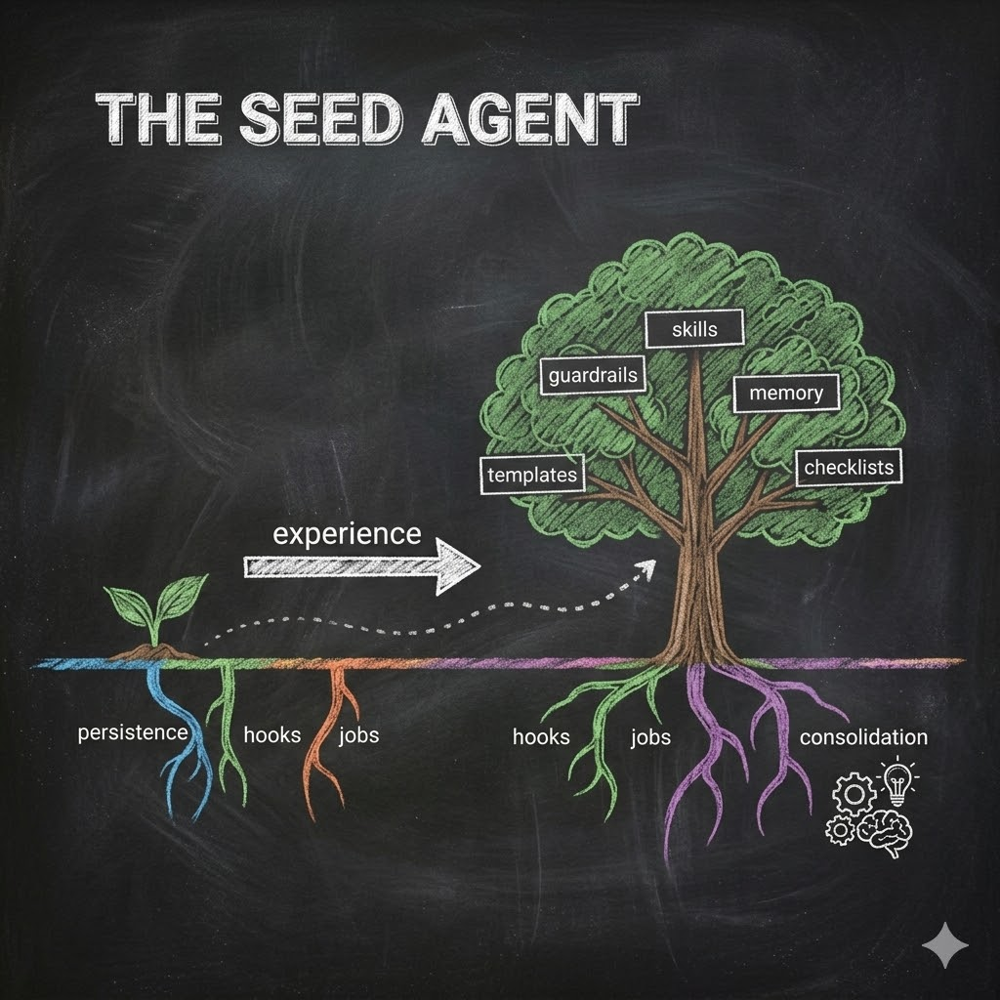
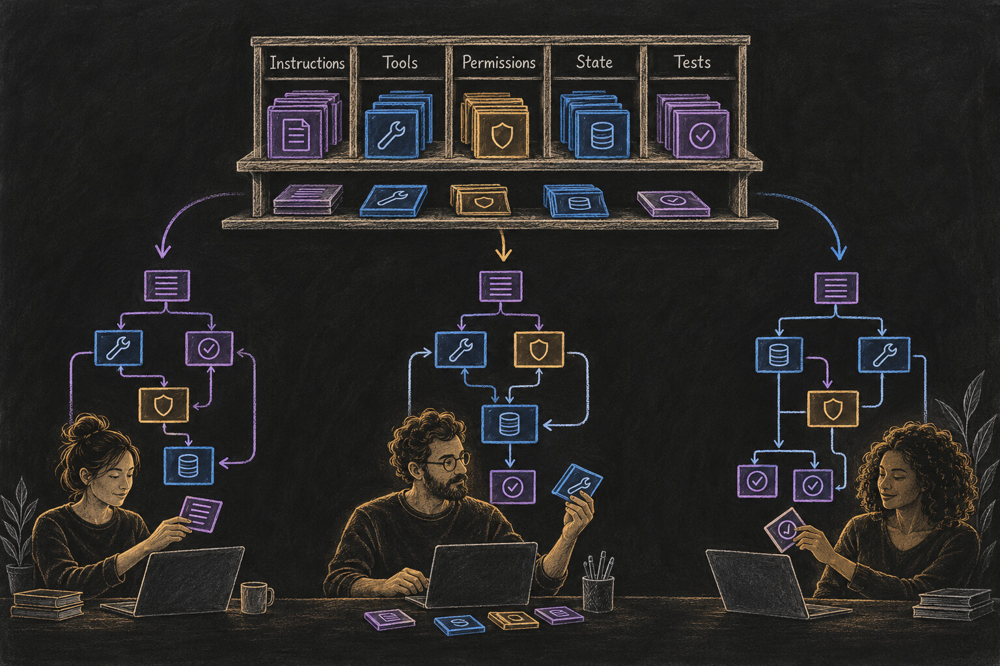
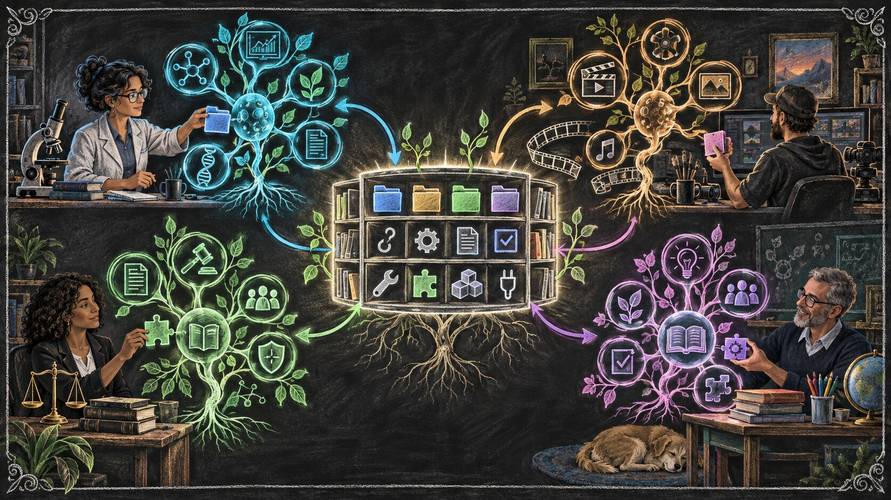

# We Could Have Had AGI\* By Now

<!-- RAW_HTML -->

  <strong>AGI:</strong>
  <del>Artificial General Intelligence</del>
   &rarr; 
  <abbr title="Augmented General Intelligence: general-purpose machine intelligence organized to extend human cognition, capability, and agency rather than substitute for them." style="text-decoration:underline dotted;text-underline-offset:3px;cursor:help;"><strong>Augmented General Intelligence</strong></abbr>

<!-- /RAW_HTML -->

<!-- RAW_HTML -->

Abstract
The first essay separated the language model from the harness around it. This essay asks what that harness should become. Instead of one fixed application built for millions of users, I argue for user-specific complex software assembled from shared primitives: memory, jobs, hooks, tools, permissions, checks, and consolidation. Coding-capable models can increasingly help non-technical users compose and customize those primitives, while the user retains literacy and authority. Biology supplies a useful design pattern: differentiation, compartmentalization, feedback, and specialization. The harness is the growing software layer; the complete agentic system is the organism.

<!-- /RAW_HTML -->

We could have had AGI by now.

Not the sci-fi kind. Not a god in a box. The practical, AGI-like kind this essay argues for — a system that can learn a profession, keep working across long horizons, improve from reviewed experience, and become increasingly specific to one user without requiring that user's base model to be retrained after every job.

This is partly a prospective claim. Today's systems do not all follow the architecture described here, and many providers still keep much of the memory, workflow, and surrounding software under their control.

That is exactly why the distinction from the first essay matters. We already separated the **model** from the **harness**. The model supplies general parametric intelligence. The harness is the user-specific software layer around it — the part that can carry memory, jobs, tools, permissions, rules, checks, and durable state.

So we do not need to re-argue that separation here. We can ask the next question:

**If the harness is the part that grows with the user, what kind of software should it become?**

Not a fixed artifact with a fixed outcome.

A **complex system** — one where useful capabilities emerge from simple parts interacting, where responsibilities can differentiate, where the structure can adapt without losing its identity, and where different users can grow different systems from many of the same primitives.

The building blocks are not exotic.

Persistence. Files. Jobs. Tools. Permissions. Hooks. Verification. Consolidation.

The deeper question is what we choose to build with them.

**Scale the architecture, not just the model.**

*A seed compounds when reviewed experience becomes durable, user-controlled structure.*

## LLMs are electricity. Agents are toasters. (Again.)

If you read the first essay, you already know the starting point:

**LLMs are electricity. Agents are toasters.**

Electricity is raw capability. Structure turns that capability into repeatable work.

But the toaster exposes the limitation of that analogy.

A toaster is a fixed appliance. Fixed wires. Fixed slots. Fixed outcome. It can make a million pieces of toast and it will never become a television.

That is fine when the job is fixed.

It is not enough when the system needs to become increasingly specific to a person, a profession, or a changing body of work.

Essay 1 said: stop staring at the electricity and expecting it to become the appliance.

Now the problem flips. If every user's work is different, one final appliance cannot simply be designed once and handed to everyone.

We need something closer to a **seed**: a small set of useful primitives and rules for how they interact, from which a more specialized system can grow through use.

The toaster gave intelligence a body. The next question is what kind of body can keep changing without losing its identity.

My answer is: not a better toaster.

**Build the organism.**

## From mass software to personal software

Most traditional software is built in the opposite direction.

Microsoft designs PowerPoint once. Millions of people receive substantially the same application. Users create different presentations, choose different templates, install some extensions, and arrange their work differently — but the architecture of the application remains largely the same.

That model made sense when software production was expensive.

If every lawyer, filmmaker, scientist, teacher, or small-business owner required a different application, someone would have to design and maintain millions of applications.

Agentic systems change that constraint in two ways.

First, the **shape of the software** can become personal.

Second, the **production of the software** can become more personal too.

Language models trained heavily on code are already capable of writing, modifying, and connecting software components. As that capability improves, the need for the user to personally implement the harness in code can keep shrinking. The user can describe the objective, identify a recurring failure, approve a boundary, or ask for a new capability; the model can increasingly translate that intent into software.

A user can say:

*"I keep making this mistake. Put a checkpoint before publication."*

Or:

*"Every time I research a library, preserve these five facts and do not move to the flyer until they are verified."*

The model can help turn that intention into files, checks, workflows, tools, permissions, interfaces, or plugins.

This only becomes practical if the model has useful building blocks to work with.

Some primitives already come from runtimes and model providers: tool calls, lifecycle events, files, permissions, context interfaces. Others can be defined at higher abstraction levels: a durable job, a verification gate, a memory pattern, a publishing workflow, a review loop. Higher-level primitives can themselves be composed from lower-level ones.

That is the second role for Hadosh Academy: **build the open library of abstractions and building blocks from which personal harnesses can grow**. The Academy can make useful primitives, patterns, reference structures, and lessons available as shared construction material. Coding-capable models can then understand, combine, and adapt those pieces around a particular user without prescribing one finished harness for everyone.

The user still needs to understand what is being built, decide what should become durable, and retain authority over consequential changes.

But they do not need to become a traditional software engineer to shape the system. What they need is enough **harness literacy** to direct, inspect, correct, and govern what the coding-capable model is building around them.

That opens a different model of software:

<!-- RAW_HTML -->

<strong>Traditional software standardizes the finished application. Personal agentic software can standardize the primitives from which different applications grow.</strong>

<!-- /RAW_HTML -->

Two people may begin with the same seed and the same model.

After a year of different work, corrections, preferences, evidence, and failures, their harnesses should not look identical.

That is not configuration around the edges.

That is **differentiation at the level of the software itself**.

That difference also changes ownership. If the mature harness is shaped by your accumulated decisions, corrections, workflows, and history, then it is not merely software you rent. It is increasingly part of your cognitive infrastructure — something you should be able to inspect, preserve, move, and govern.

And diversity has another consequence. Millions of identical implementations create a monoculture: one weakness can propagate widely. User-specific implementations can make broad exploitation harder because mature systems are not perfectly identical, even when they share abstractions. That is not a substitute for security engineering. It is one more reason not to force every user into one opaque finished harness.

*Shared primitives enter a local design process. The resulting software becomes specific to the user, task, runtime, and accumulated work.*

And once software itself can differentiate, the next question is what should differentiate inside it.

## A lawyer is not one giant thought

People overestimate how much a profession is raw IQ and underestimate how much it is disciplined workflow.

A competent lawyer is not one giant legal thought.

A scientist is not one giant scientific thought.

A filmmaker is not one giant creative thought.

Professional competence is a system of cognitive loads: intake, scoping, research, synthesis, drafting, checking, revision, communication, judgment, and recovery when something goes wrong.

Some of those loads require broad reasoning.

Some require memory.

Some require deterministic checks.

Some require domain tools.

Some require human taste or authority.

The default direction in AI has often been to keep expanding the model's responsibility: remember more, plan better, verify itself, know more facts, use more tools, manage longer contexts, recover from mistakes, decide when it is done.

The Circle of Competence gives us a different question:

**Which component should be responsible for which cognitive load?**

The model may be excellent at language, synthesis, comparison, and flexible reasoning.

A file is better at preserving an exact decision.

A deterministic program is better at counting.

A permission rule is better at refusing an unauthorized action.

A specialized model may be better at one narrow domain.

A human may be better at deciding whether a tradeoff is acceptable.

The goal is not to make the model responsible for everything.

The goal is to **compose competence**.

And when that composition can persist, change, specialize, and accumulate around one person's work, something begins to look like professional competence even if the underlying model remains the same.

But differentiated responsibilities still need a way to meet the model at the right moment. That brings us back to context.

## Where does the context come from?

A language model works on the context in front of it.

That context is the bridge between the model's general capability and the specific agent you are building.

Ask where it came from.

Some of it came from the current conversation.

Some came through tools.

Some came from retrieved files.

Some came from project instructions, memory, rules, job state, or earlier corrections that the surrounding system decided were relevant now.

The implementation can differ between platforms.

The architectural point is more general.

**User-specific memory, decisions, rules, and working state should increasingly live in inspectable, non-parametric structures outside the base model's weights.**

The model may change between providers or generations.

The user's accumulated structure should not have to disappear with it.

This is where the first essay's filesystem argument returns in a new role.

The filesystem gives the harness a durable body: a place where identity, rules, memory, jobs, tools, evidence, and software structures can accumulate. The runtime animates those structures and brings relevant pieces into active context. The model supplies intelligence.

The model's weights can stay the same while the system around it grows.

That asymmetry is what makes differentiation possible.

A generic model can serve a million users.

A mature harness should become increasingly specific to one.

So where do we already know how common primitives produce different mature systems?

Biology.

## Biology did not scale one molecule

Nature does not scale one component to infinity.

Nature differentiates.

The **RNA-world hypothesis** gives us a useful picture: an early stage in which RNA or RNA-like molecules may have carried information while some also performed catalytic functions. It is a hypothesis, not settled origin-of-life history, but the architectural lesson is useful.

Imagine an early system in which one molecular family carries several responsibilities. As life becomes more capable, nature does not solve every new problem by building one enormous molecule responsible for everything.

Responsibilities differentiate.

DNA becomes the dominant long-term hereditary store.

Proteins become extraordinarily diverse functional and catalytic machinery.

Membranes create boundaries.

Regulatory networks coordinate activity.

Cells compartmentalize processes.

Later, multicellular organisms differentiate tissues and organs.

The system becomes more capable not because one component absorbs every responsibility, but because specialized parts coordinate inside a persistent whole.

This is the mistake I worry we are making with language models: building the **giant RNA** — one central component expected to remember, plan, reason, verify, retrieve, regulate itself, know every domain, choose every tool, recover from every failure, and somehow maintain the user's identity too.

Increasing capability can come from another direction:

**differentiate the responsibilities.**

That is why biology keeps returning in this series. We are solving a problem from the same **category of system design**:

How do common primitives and local interaction rules produce differentiated, persistent, adaptive wholes without specifying every mature configuration in advance?

Biology is therefore not merely a decorative analogy here.

**It is evidence that this design pattern works.**

Complex systems share recognizable properties: compartmentalization, feedback, adaptation, local specialization, multi-scale organization, persistence through component turnover, and emergent behavior from interacting parts.

A harness can be designed around the same class of principles.

Files create compartments.

Plugins specialize behavior.

Hooks create reflexes.

Jobs preserve obligations.

Verification shapes feedback.

Condense turns reviewed experience into durable structure.

Permissions create boundaries.

Tools connect the system to its environment.

Different users can begin with many of the same primitives and grow very different harnesses.

That is the point.

We do not need to design one final harness for every person.

We need to understand the primitives well enough that the system can help build itself around the work.

*The anatomy can be shared. The mature organism remains personal.*

So what do those primitives look like in software? Start with one of the simplest: a persistent obligation.

## The heartbeat: persistent obligations

A job is one example of a shared primitive becoming durable structure. Kept outside the model's transient token stream, it can carry state, completion conditions, ownership, evidence, and a reason the system should not declare success yet.

One runtime might enforce that through a Stop hook; another through an idle event, lifecycle callback, supervisor, or command boundary. The implementation can vary. The architectural role is the same:

**the harness keeps obligations active after the model would otherwise stop.**

That is the heartbeat. The details of job design belong in a later technical essay; here, jobs matter because they show how a simple primitive can become a persistent organ in a larger system.

But persistence alone cannot regulate action. Durable structure also needs places to meet the model while work is happening.

## Hooks are the missing evolutionary layer

Hooks and equivalent lifecycle interception points are another primitive. They are where durable structure can meet transient model behavior: add context, check a boundary, record evidence, require verification, or route the next step.

**The LLM proposes. The structure disposes.**

Without such boundaries, more responsibility stays inside probabilistic reasoning. With them, responsibility can be allocated according to competence.

That may eventually let the model operating the harness become **narrower**, not broader: specialized in understanding the harness, inspecting state, routing work, and composing structures, while domain models, tools, databases, or humans handle the work they are better suited to do.

The operating model would know how to navigate the organism.

It would not need to be every organ.

[The Two-Layer Foundation](../b5/05_1-the-two-layer-foundation.html) and the later technical essays take hooks, guards, and lifecycle controls apart in implementation detail. Here, their role is simpler: they show how persistent structure can shape action at the moment it matters.

That still leaves another question: how does the organism get better from experience?

## Consolidation: where the system learns

Humans do not improve only while acting.

They consolidate.

An agentic system can do something similar, but the base model's weights do not need to change after every job. The **system** can change.

A repeated correction can become a rule; a failed workflow, a checkpoint; a useful procedure, a plugin; a boundary failure, a permission guard.

When a reviewed event leaves a durable change that alters later behavior, it becomes part of the system's **developmental history**.

<!-- RAW_HTML -->

<strong>A log records what happened. Developmental history changes what happens next.</strong>

<!-- /RAW_HTML -->

That gives us a causal chain:

**experience → evidence → review → accepted correction → durable change → later reuse → verification**

That is what I mean by learning in the harness. Reviewed experience changes the structures that future model calls receive and act through.

The technical series later examines how those changes are scoped, tested, and safely written back; [From Apprentice to Architect](../b8/08_1-apprentice-to-architect-foundation.html) follows that maturation directly. For now, the distinction is enough:

The model's weights did not change.

**The organism did.**

If growth happens through durable structure, then the starting architecture should leave room for that growth.

## The seed agent: small structure that grows

A seed agent should not be a finished architecture.

That would defeat the point.

The seed should contain enough primitives to begin accumulating useful structure without locking every user into the same final form.

Those primitives do not all need to live at the same level. A low-level primitive might be a file, tool call, event, or permission boundary. A higher-level primitive might be a durable job, a review gate, a research pattern, or a reusable workflow assembled from several lower-level pieces.

Persistent state.

Bounded work.

Ways to inject relevant context.

Ways to act.

Ways to verify.

Ways to preserve reviewed lessons.

Ways to add new capabilities without rebuilding the entire organism.

The point is not to discover one final list. It is to build a useful vocabulary of composable parts that coding-capable models can assemble and specialize around the person using them.

From those primitives, different users should get different mature systems.

A researcher's harness may grow strong source-evaluation and literature-tracking organs.

A lawyer's may grow claim tracing, authority checks, deadline management, and case memory.

A filmmaker's may accumulate visual references, shot-planning workflows, production constraints, and review loops.

Same broad seed.

Different experience.

Different organism.

This is what makes a seed different from a prompt.

<!-- RAW_HTML -->

<strong>A prompt is consumed. A seed compounds.</strong>

<!-- /RAW_HTML -->

At this point the obvious objection returns: why externalize any of this at all?

## Internalization is not the answer

The obvious response is: why not put all of this into the model?

Future models may internalize more planning, memory, verification, tool use, and self-regulation. That still does not make external structure unnecessary.

A user benefits from permissions they can inspect, memories they can correct, deterministic checks they can trust, and specialist components they can replace without rebuilding the whole agentic system.

This is the Circle of Competence again:

**responsibility should follow competence.**

Some things belong in the model. Some belong in the harness. Some belong in deterministic software, specialist systems, or the human.

[The Two-Layer Foundation](../b5/05_1-the-two-layer-foundation.html) and [The Phasic Foundation](../b6/06_1-phasic-foundation.html) show concrete ways those responsibilities can be separated. The conceptual point here is that a stronger model does not eliminate the value of a differentiated system.

The difference becomes easiest to see over time.

## What a year of experience looks like

Imagine two users running the same underlying model for a year.

The first uses it as a sequence of largely independent interactions.

Useful work happens, but little of the user's reviewed experience becomes durable, inspectable structure that reliably shapes later work.

When the next job begins, much of the operating knowledge has to be reconstructed.

The second uses the same model inside a growing harness.

A correction becomes a rule.

A repeated research pattern becomes a procedure.

A weak assumption triggers a checkpoint.

A successful deliverable becomes an accepted example.

Project state survives.

Case notes accumulate.

Permissions become explicit.

Useful tools and plugins appear as the work demands them.

After a year, the model's parametric intelligence may be substantially the same for both users.

The surrounding systems are not.

One repeatedly reconstructs the work.

The other has accumulated something that behaves increasingly like professional infrastructure.

Same engine.

Same electricity.

**One forgot everything. The other became a professional.**

The professional is not the frozen model by itself.

It is the model operating through a year of accumulated, reviewed structure.

So what would we actually build first?

## The practical roadmap

If you want to build toward this kind of AGI-like autonomy, build the surrounding system from a few architectural categories:

1. **User-owned persistent state** for memory, knowledge, rules, evidence, and decisions.
2. **Interception and control points** where policy can meet action.
3. **Durable jobs** that preserve obligations beyond one model response.
4. **Consolidation** that turns reviewed experience into later behavior.
5. **Competence routing** across the model, specialist systems, deterministic software, tools, and humans.

These are examples, not a final blueprint or universal stack. Their mechanisms are developed across the [technical architecture series](../b5/05_1-the-two-layer-foundation.html). The seed only needs enough structure to grow without losing ownership, inspectability, or control.

## Why I say "we could have had it by now"

Because the argument does not depend on a future breakthrough in model weights.

Most of these primitives are ordinary software ideas:

state, files, events, permissions, tools, queues, checks, logs, feedback, versioning.

The novel part is how we compose them around language models.

Earlier agent experiments often tried to create autonomy through loops and task lists.

When fixed structures met reality, they became brittle.

Their limits did not disprove engineering.

They showed the limits of engineering the final organism in advance.

The alternative is not no engineering. It is a different kind of engineering:

Define primitives. Define boundaries. Define feedback.

Then let the mature structure emerge through use.

That is why I think we could already have built much more durable, long-horizon, user-specific agentic systems than we have.

Maybe the operating model in that future is larger than today's models.

Maybe it is smaller.

Maybe it is a specialized model trained mainly to understand harness construction and routing.

The architecture should not depend on one answer.

The model is one component.

The harness is the layer that lets memory, rules, tools, permissions, jobs, and specialist capabilities differentiate and coordinate.

**The complete agentic system is the organism.**

## The Question Was Always Wrong

The industry keeps asking:

"When will the model become AGI?"

I think the question points at the wrong layer.

The model can become more capable.

But everything we have followed in this essay — personal software, differentiated responsibilities, context, hooks, jobs, consolidation, the seed — compounds somewhere else.

The organism can become more specific, more experienced, more persistent, and more useful to one person.

That is where the user's history lives.

That is where the agent differentiates.

The model was never going to become *this* kind of AGI by itself.

**The organism is where it becomes possible.**

We already have many of the primitives.

What we still need is the architectural literacy to compose them.

**Build the organism.**

---

*Foundational essay 2 in the Hadosh Academy series on agent architecture.*

*Previous: ["LLMs Are Not the Agents"](../b1/01-llms-are-not-the-agents.html) — the model and harness are different layers.*

*Next: ["Your Brain Was Never Built for This"](../b3/03-your-brain-was-never-built-for-this.html) — what that growing personal infrastructure means for the human.*

*Continue deeper: [Job Lifecycle](../b5/05_4-job-core.html) examines persistent obligations; [The Phasic Foundation](../b6/06_1-phasic-foundation.html) develops structured cognitive cycles; [The Seed Is Yours](../b8/08_9-the-seed-is-yours.html) closes the ownership and user-authorship arc.*

*Original version: [Read the February Essay 2 manuscript in Markdown](original-we-could-have-had-agi-v1.2.0.md).*
