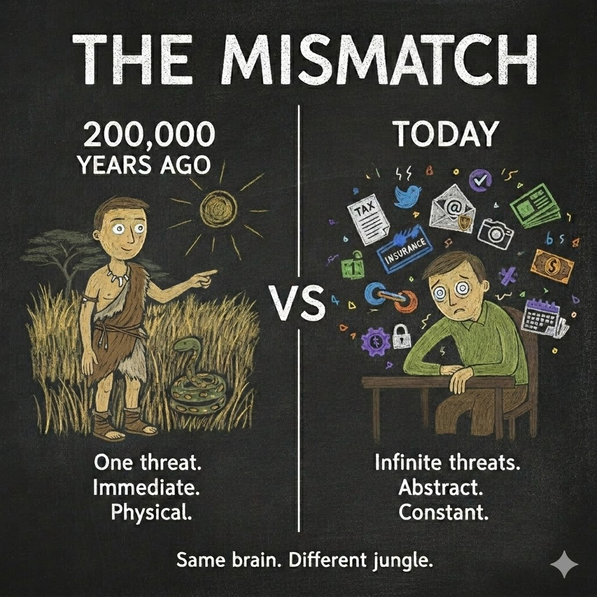

# Your Brain Was Never Built for This

> **Your skull holds a brain optimized for spotting snakes in tall grass. You are asking it to run a business in a civilization of eight billion people connected by fiber optic cables.**

That mismatch is the central design flaw of modern human life.

For roughly three hundred thousand years, the human brain was an extraordinary piece of engineering — tuned to the natural world. Small groups. Physical threats. Immediate feedback.

The most complex decisions still moved at the speed of bodies, speech, and material objects rather than global networks.

That brain still lives inside your head. Not literally unchanged, but changing far more slowly than culture and technology.

*The same biological inheritance now operates in a radically different information environment.*

## Twelve Thousand Years of Drift

About twelve thousand years ago, humans started settling. Agriculture. Villages. Then cities, governments, writing systems, legal codes, trade routes. The environment changed — fast by evolutionary standards, slow by human experience.

The organic brain adapted culturally far faster than it could biologically. We invented tools for the mind. Writing extended memory. Mathematics extended reasoning. Institutions extended trust beyond the tribe.

And then the most powerful adaptation of all: **specialization**. One person heals, another builds, a third keeps the books. Professions formalized delegation — offloading what your brain could not master onto someone else's brain that could.

We offloaded complexity onto systems outside the skull, and onto **other skulls**.

For most of those twelve thousand years, this worked. The complexity of human society grew, and the human brain — augmented by its cultural tools — kept pace. Barely. But it kept pace.

Then something happened.

## The Last Thirty Years Broke the Balance

The internet did not just add complexity. It multiplied it.

Before 1995, the amount of information an average person encountered in a day was bounded by physical reality. A newspaper. A few conversations. Maybe a television broadcast. The world was complex, but it was filterable.

After 1995 — and especially after smartphones — the information environment exploded. The number of decisions, signals, obligations, and stimuli hitting a single human brain on a typical Tuesday in 2026 would have overwhelmed an entire village council in 1800.

And the slope is still steepening.

Look at what a "simple" modern life demands: taxes filed across multiple jurisdictions. Health insurance with hundreds of options. Retirement planning that requires predicting markets decades out. Digital privacy across dozens of platforms. Professional certifications that expire and renew. Children navigating social systems that change every semester.

The brain scanning for snakes in the grass is now drowning in a jungle of spreadsheets, compliance forms, and notification badges. **It was never designed for this.**

## The Quiet Divide

Nobody talks about this part openly.

A small percentage of humans navigate this complexity well. They are not simply smarter — they have better access to **delegation**: accountants, lawyers, financial advisors, personal assistants, therapists, nutritionists, and executive coaches.

That twelve-thousand-year-old invention — delegation through specialization — still works. But it has always been expensive.

A good accountant costs money. A good lawyer costs more. A personal assistant costs a salary. The difference between owning a brand and working for one has never been intelligence. It is **infrastructure** — the ability to delegate at scale.

Everyone else is doing their own taxes at midnight, missing deadlines, making suboptimal health decisions, and wondering why life feels like it is moving faster than they can think.

Because it is. Their organic brain is running software designed for the savanna, in an environment that requires a corporation.

---

## The Digital Cortex

For twelve thousand years, delegation required hiring another human. A specialist. Someone whose brain filled the gaps yours could not. For the first time, that cost is collapsing.

The [brainstem](https://www.ncbi.nlm.nih.gov/books/NBK544297/) helps regulate breathing, heartbeat, arousal, and basic reflexes. The [cortex](https://pmc.ncbi.nlm.nih.gov/articles/PMC3606080/) — shared across mammals and extensively expanded and reorganized in humans — supports language, planning, and abstract thought alongside deeper structures.

Evolution did not stop. But it does not redesign a nervous system on the timetable of tax codes, cryptocurrency, or changing privacy settings. The cortex that can write poetry and build bridges **can still be overloaded** by the world it created.

So we build the next layer ourselves.

The **digital cortex**.

A [CLI agent](https://en.wikipedia.org/wiki/Command-line_interface "Command Line Interface — a text-based way to interact with software") — a structured AI system that lives on your computer, reads your files, writes new ones, and organizes your work — is the first form of that layer. Not one giant program, but a [complex system](../b2/02-we-could-have-had-agi.html#biology-did-not-scale-one-molecule) of many small parts interacting. Call it what it actually is: a **digital cognitive organ**.

That phrase is deliberate. An **organ**.

Your liver does not wait for instructions. It processes toxins continuously, silently, as part of your body's background operations. Your immune system does not require a prompt. It monitors, detects, and responds — because that is what it was built to do.

A CLI agent can do something analogous — preserve procedures, monitor selected events, and prepare work for judgment. The snake detector trying to process tax law finally gets help.

A [hook](https://en.wikipedia.org/wiki/Hooking "A technique that intercepts events or actions to monitor or change behavior") that watches your file system for sensitive data exposure? **Cognitive reflex** — a digital immune system catching what your organic attention missed.

A reviewed memory file that preserves lessons across sessions? **Cognitive memory tissue** — external knowledge your biological memory might fail to retain or retrieve when you need it.

A skill that enforces a consistent workflow every time you start a new task? **Cognitive muscle memory** — reliable behavior your brain would improvise differently each time.

These are the organs of your digital cortex. Memory that persists across weeks. Reflexes that catch mistakes before they compound. Specialized reasoning that runs while you sleep. Your biology — now extended with organs designed for the actual jungle you live in.

Your [`.claude/`](https://docs.claude.com/en/docs/claude-code/memory "Claude Code memory and project files") directory — or whatever your CLI agent calls its brain — is the first draft of that organ system. One you design. One you grow. One that is **yours**. In the essays that follow, we will see exactly what these organs look like — the files, the hooks, the jobs that make it function.

---

## The World It Creates

For generations, the default economic relationship has been: you have a **job**. You trade your time and cognitive labor within someone else's system. You are a component in their machine.

That made sense when delegation was expensive — when running a business required hiring the accountants, lawyers, logistics managers, and marketing teams that only a fraction of people could afford.

Imagine what happens if your digital cortex reliably handles a large share of routine business operations.

You go to the supermarket and pay for someone else's brand. What if you had your own? Pick the flavor. Choose the ingredients. Make it healthier. Someone buying your drink pays your salary. Every person a corporation.

The scariest part of running a business was never the product. It was the operations — the planning, the compliance, the logistics. That is the part whose cost is collapsing. Starting a business is getting easier. Finding a job where most of the work is done by AI is getting harder. The direction is clear.

Here is what that looks like. A human with the right cognitive organs can run a small canned-drink brand. The human decides on the flavor. The agent — one that grows from experience and improves its own architecture — writes the business plan, connects its human to a flavor chemist, researches [food-grade manufacturers](https://en.wikipedia.org/wiki/Contract_manufacturer "A company that manufactures products for another company's brand"), manages regulatory paperwork, coordinates branding, and keeps the website running.

Every contractor, every specialist, every logistics partner is still a human — but the agent is the connective tissue that holds the operation together. The human's job is taste, judgment, and the relationships that matter. The agent's job is **everything in between**.

That same human can simultaneously run a consulting practice, a content creation studio, and a local food product line. Not because they became superhuman. Because they grew the organs their biology was missing.

Now zoom out. Canned soft drinks — soda, sparkling flavored water, energy drinks — are a roughly **$70-billion-a-year market in the United States alone**, and over **$200 billion** worldwide. Today, a handful of corporations capture most of it. But the barrier to running a drink brand was never manufacturing — contract manufacturers already fill white-label cans for anyone who asks. The barrier was everything else: planning, regulatory compliance, branding, logistics, supplier coordination. That is **operations**. And operations is exactly what your digital cortex absorbs.

The same logic applies across industries — from packaged snacks to consulting practices, from media brands to local services. Each sector already has production and distribution infrastructure waiting to be used. What held individuals out was the cognitive overhead of running a business — the part your biology was never built to scale.

Remove that overhead and **revenue disperses**. Not because the market grows, but because more people can compete in it. A seventy-billion-dollar industry does not disappear. It distributes across more brand owners — each one bringing their own audience, their own human connection to the table.

And if running a business eventually costs roughly one hundred dollars a month in compute, then the economic default could shift. Not from job to *a* company. From job to **several micro-businesses** — each one supported by organs you designed, while capital, regulation, relationships, and demand still matter.

### What Survives

Not all work looks the same on the other side.

Think about what a digital cortex absorbs well: routine transactions, document processing, scheduling, bookkeeping, regulatory compliance, data analysis, boilerplate communication. Work that follows rules. Work a human does not because they love it, but because the system demands it.

Now think about what it cannot absorb: the trial lawyer reading a jury's body language. The therapist sensing what a client is not saying. The chef tasting a sauce and knowing it needs acid, not salt. The architect walking a site and feeling how light will move through a space in November. The teacher noticing that a quiet student is struggling before any test score confirms it.

**Passion-based work survives.** Work rooted in physical presence, emotional intelligence, sensory experience, and creative taste. The things evolution spent millions of years perfecting — finally freed from the overhead that buried them.

The work that requires a body, a heart, a sense of taste — stays human. And with the overhead removed, more humans get to do the work they were **meant** to do.

Now picture that world taking shape. It is 2035. You manage a small beverage brand, a consulting practice, and a content studio. In some you collaborate with other humans who bring their own agents to the table. In some you work alone — your agent handling everything between your creative decisions and the customer. Every person a brand of their own.

Sounds busy. It might actually be calmer. The digital cortex handles the noise. The human handles the signal.

But can the brain that evolved to track a few relationships in a small tribe manage even the transition? Not without help. And not just for business.

### Your Personal Infrastructure

And it does not stop at business. Your digital life already runs on other companies' software. Their email. Their social media. Their fitness tracking. Their storage. Their apps, their terms, their data.

But if you can build cognitive organs, you can build **everything**.

A personal super-app on your phone, built by your agent, collecting your own data. Your own fitness dashboard. Your own project tracker. Your own communication hub. Running on your hardware — a phone and a small cloud server — powered entirely by software your agent designed and maintains.

Look at the stack that makes this possible. Cloud hardware providers sell compute the way power companies sell electricity. LLM providers sell intelligence the way water utilities sell clean water. You do not build the power plant. You plug in. Your LLM bill arrives monthly, the same way your electric bill does. Your agent runs on intelligence piped to your machine, the same way your refrigerator runs on electricity piped to your house.

This is already happening — messily, the way all early infrastructure does. [OpenClaw](https://github.com/openclaw/openclaw) — an open-source personal agent — went from obscurity to hundreds of thousands of GitHub stars. [Moltbook](https://www.moltbook.com/), a social network experiment for AI agents, attracted massive attention before anyone could verify what the numbers meant. Messy? Absolutely. But the signal underneath is clear: personalized agents are running independently and forming new ecosystems. Whether trustworthy agent-driven commerce emerges remains open.

Still relying on hardware companies for the silicon. Often still paying for intelligence by subscription or usage. But the software and data layer can become far more **yours** when you choose inspectable rules, local storage, and services with boundaries you understand.

### The Invisible Wall

There is a less comfortable part of this story.

Not everyone will build their digital cortex. Some will not see the need. Some will wait for someone else to do it for them. Some will dismiss it as hype, the way people dismissed the internet in 1995 or smartphones in 2007.

And a gap will open.

Not the loud, visible kind. Not rich versus poor in the way we usually mean. An **invisible** gap. Between people whose cognitive capacity matches the complexity of their environment, and people whose biology — still wired for a simpler world — is trying to navigate a civilization this complex alone.

The first group will run micro-businesses, manage their own data, navigate bureaucracy through cognitive reflexes, and make better decisions because their digital cortex fills the gaps their biology cannot.

The second group will feel the world getting faster, more confusing, more demanding — without understanding why. Money, education, disability, infrastructure, and policy still matter. But part of the wall between them is **adoption**.

But here is what makes this shift different from every one before it. Literacy required years of schooling. Electricity required infrastructure. The internet required learning an entirely new medium. This? You talk to it. You describe what you need, and it builds itself around your words. Adoption has never required less — because the tool does the work. And this cycle is shorter than any before it.

This one moves faster still. Not generations — years. The person who builds their digital cortex today gains compounding cognitive capability every week. The person who waits does not fall behind gradually. They fall behind at the speed the technology improves — and that speed is accelerating.

---

## What This Means for You

You do not need to be a programmer. You do not need to understand neural networks or hold a computer science degree.

You need to recognize what is happening.

Your organic brain — that magnificent inheritance, hundreds of thousands of years old — was never designed for the world you live in. And the complexity is accelerating.

But you can grow. Not biologically. **Digitally.**

A CLI agent on your computer is an extension of **you**. Its memory is your memory. Its reflexes are your reflexes. Its skills compound, session after session, project after project.

The foundation is set. [The agent is the filesystem](../b1/01-llms-are-not-the-agents.html). [The architecture already exists](../b2/02-we-could-have-had-agi.html). But before we build, we need to agree on the words. The next essay gives you every term that matters — so when we start constructing, nothing gets lost in translation.

The snake in the tall grass has been replaced by a civilization of eight billion minds connected at the speed of light. Your organic brain is the best thing evolution ever made.

It just needs a few more organs.

---

*Essay 3 of 8 in the Hadosh Academy series on agent architecture.*

*Previous: ["We Could Have Had AGI By Now"](../b2/02-we-could-have-had-agi.html) — what happens when you scale architecture instead of the model.*
*Next: ["The Folder Is Alive"](03_1-the-folder-is-alive.html) — what happens when a folder gets a brain of its own.*
