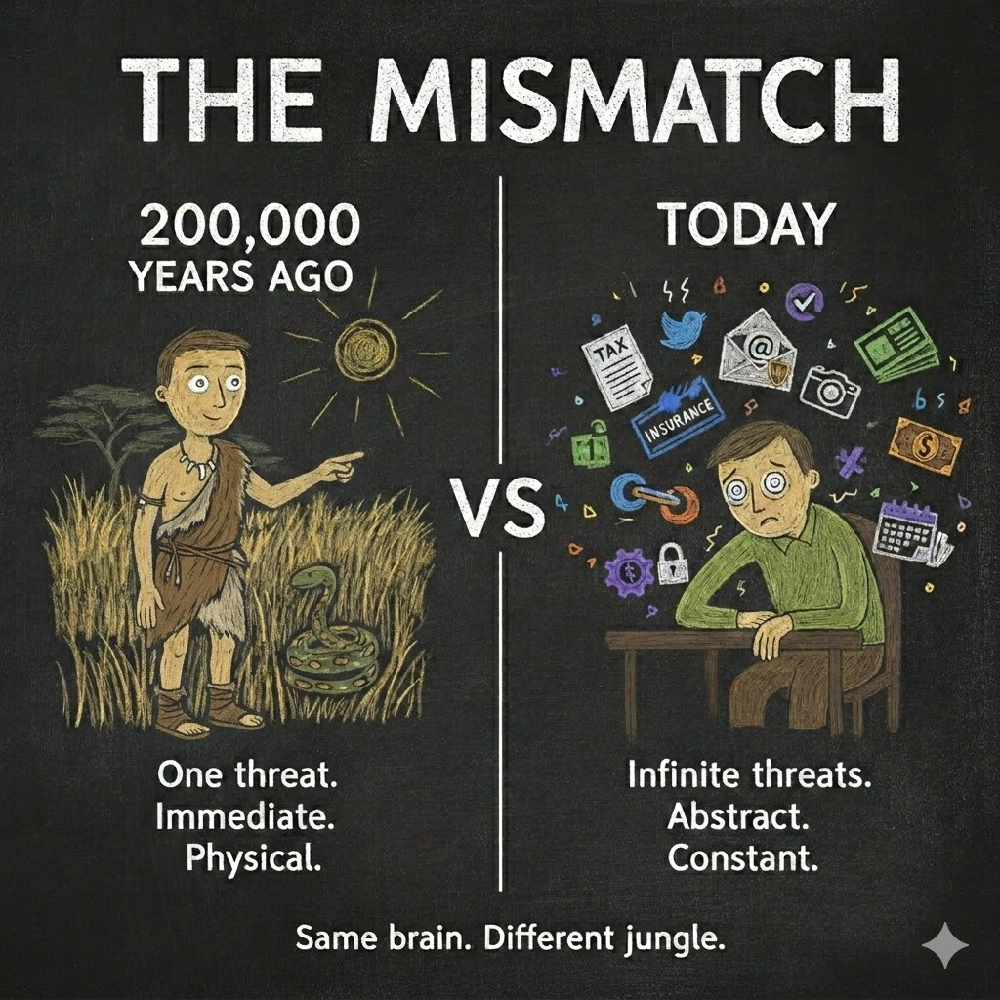
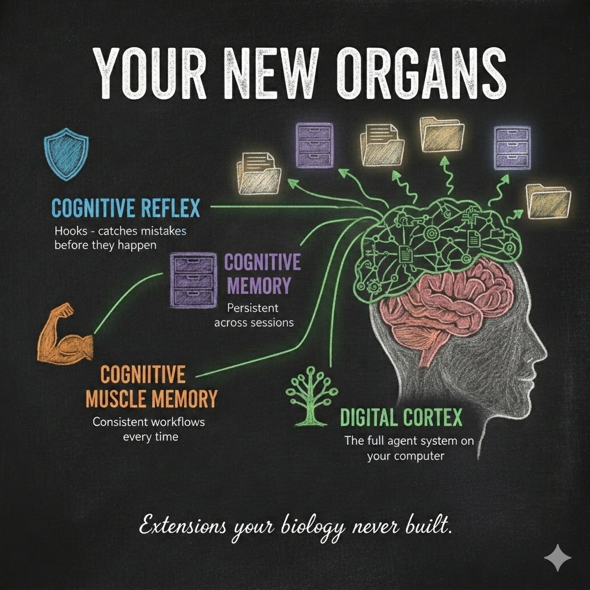
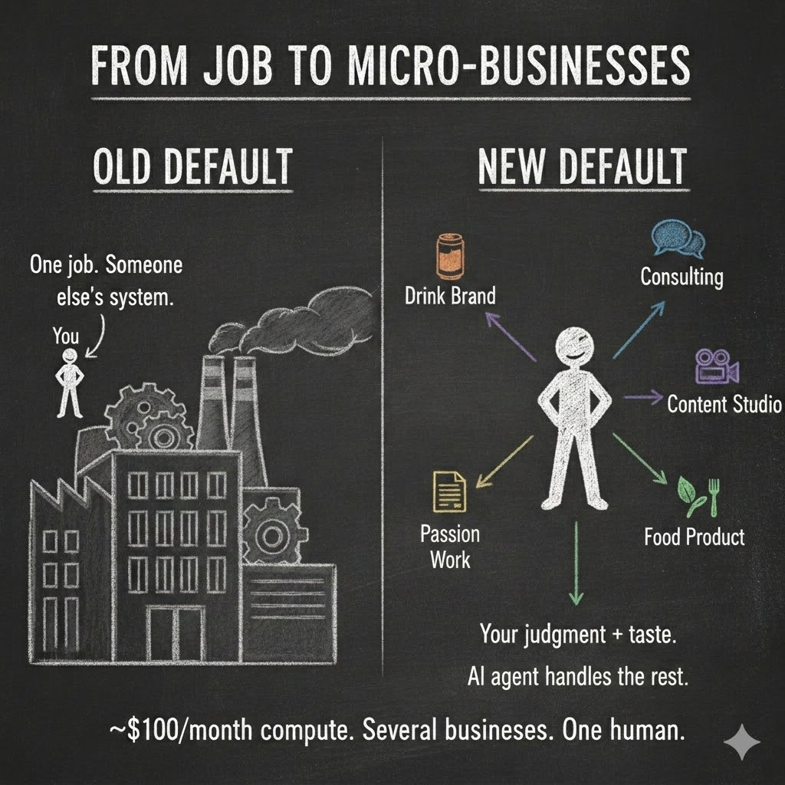

# Your Brain Was Never Built for This

<!-- RAW_HTML -->

Abstract
The first essay separated the language model from the harness. The second argued that the harness should grow as user-specific complex software rather than remain one fixed application or one monolithic model. This essay asks what that architecture means for the person. I argue that a user-owned harness can become a <strong>digital cortex</strong>: external cognitive infrastructure that carries memory, procedures, tools, and operational load while leaving judgment and taste with the human. As that infrastructure becomes easier to build, the path to self-employment also changes. The same agentic capabilities that can automate parts of jobs can lower the cost of operating businesses, making the <strong>Independent Operator</strong> a more practical economic role. That makes harness literacy, ownership, and control part of human agency—not merely technical preference.

<!-- /RAW_HTML -->

> **Your skull holds a brain optimized for spotting snakes in tall grass. You are asking it to run a business, manage a family, navigate bureaucracy, filter global information, and make decisions inside a civilization of eight billion people connected at the speed of light.**

That mismatch is one of the central design problems of modern human life.

For roughly three hundred thousand years, the human brain evolved inside a world of small groups, physical environments, immediate feedback, and relatively local consequences.

The world changed much faster than the organ inside our skull.

That brain is still extraordinary. It can write poetry, build cities, discover quantum mechanics, raise children, and fall in love.

It is also now being asked to manage an information environment no biological nervous system was designed to face alone.

That is where the first two essays bring us.

Essay 1 separated the **model** from the **harness**.

Essay 2 asked what the harness should become and argued for a growing complex system rather than one fixed appliance.

Now turn the architecture around.

What does that growing system become for the person using it?

A **digital cortex**.

*The same biological inheritance now operates in a radically different information environment.*

## Twelve Thousand Years of Drift

About twelve thousand years ago, humans began settling into increasingly complex societies.

Agriculture. Villages. Cities. Governments. Writing systems. Legal codes. Trade routes.

The environment changed faster than biology could redesign the brain to match it.

So humans did something else.

We started extending cognition outside the skull.

Writing extended memory.

Mathematics extended calculation.

Maps extended spatial memory.

Institutions extended coordination.

Contracts extended trust.

And specialization extended competence.

One person heals. Another builds. Another keeps the books. Another understands the law.

When the complexity of civilization exceeded what one brain could hold, we distributed cognition across tools, records, institutions, and other people.

We offloaded complexity onto systems outside the skull — and onto **other skulls**.

For most of history, that was enough.

Barely.

Then the slope changed.

## The Last Thirty Years Broke the Balance

The internet did not simply add more information.

It changed the scale and speed of the environment.

A modern person may manage taxes across jurisdictions, insurance choices, retirement accounts, digital identities, subscriptions, contracts, health information, professional obligations, travel, communication across dozens of channels, and a constant stream of decisions arriving through a device in their pocket.

The human brain did not suddenly become ten times larger when the smartphone arrived.

The number of cognitive obligations did.

The same nervous system that once scanned a physical environment for danger now has to track calendars, invoices, privacy settings, deadlines, feeds, passwords, policies, markets, messages, and hundreds of unresolved digital loops.

<!-- RAW_HTML -->

<strong>The snake detector is drowning in spreadsheets. Your brain was never built for this.</strong>

<!-- /RAW_HTML -->

And the problem is not simply information overload.

It is **cognitive load without enough infrastructure**.

## The Quiet Divide

We already know how humans handle too much cognitive complexity.

We delegate.

The people who navigate modern complexity best are not necessarily those with the highest raw intelligence. Often they have access to more external cognition:

accountants, lawyers, assistants, financial advisors, researchers, coaches, consultants, specialists.

Delegation works because another competent system carries a load your brain does not have to carry alone.

But historically, delegation has been expensive.

A lawyer costs money.

An accountant costs money.

A personal assistant costs a salary.

A team costs more.

So cognitive infrastructure has been distributed unequally.

Some people operate with teams around them.

Others are doing their taxes at midnight, answering client messages between errands, researching medical decisions alone, and trying to remember everything their life requires.

The difference is not only intelligence.

It is **infrastructure**.

The last essay argued that agentic systems should not concentrate every responsibility inside one model. They should differentiate: memory where memory belongs, deterministic checks where checks belong, specialist reasoning where specialist reasoning belongs, and human judgment where judgment belongs.

Now apply the same principle to the person.

The human should not be responsible for carrying every cognitive load either.

## The Digital Cortex

For most of history, extending cognition meant adding another human or inventing another passive tool.

Agentic systems create a new category.

A harness can preserve memory, maintain state, enforce rules, monitor selected events, route work, call specialized tools, and prepare decisions without requiring every detail to remain inside your biological working memory.

That is why I call it a **digital cortex**.

Not because it is literally a biological cortex.

Because it is an external cognitive layer: a system that can carry memory, procedures, reflexes, and specialized functions around one person.

The first essay gave intelligence a durable body.

The second essay showed how the complete agentic system can grow as a differentiated complex system.

When that user-specific infrastructure is organized around a human life, its role becomes cognitive.

That is the **digital cortex**.

Think about the pieces we already introduced.

A reviewed memory file that preserves an important lesson across sessions?

**Digital cognitive memory.**

A hook that catches a sensitive-data exposure before an action continues?

**Digital cognitive reflex.**

A workflow that consistently checks the same five things before publication?

**Digital cognitive muscle memory.**

A project system that remembers unfinished obligations while your attention moves somewhere else?

**Extended working memory.**

A specialist model or tool consulted only when a particular cognitive load requires it?

**A specialized digital cognitive organ.**

None of these replaces the human.

*The digital cortex extends cognition through specialized organs without removing the human from judgment.*

They change what the human has to keep active at once.

That distinction matters.

The goal is not to remove you from your work.

It is to let you carry more complexity without forcing your biological working memory to become the database, scheduler, checklist, historian, and compliance system for your entire life.

## From Personal Software to Personal Cognition

Essay 2 introduced another shift: from **mass software** toward **personal software**.

Traditional software is usually built once for millions of people.

You install the same PowerPoint, the same project-management application, the same social-media interface.

You customize around the edges, but the product architecture largely belongs to the company that built it.

When software production becomes cheap enough, that assumption starts to weaken.

Your agentic system can increasingly build software around the work itself.

Need a presentation?

Instead of forcing the work into one permanent application, your system can generate an HTML presentation for this exact audience, this exact story, and this exact interaction.

Need a project dashboard?

Build the dashboard around the project.

Need a research interface?

Build it around your sources, your verification rules, and your decisions.

The software becomes less like a product you adapt yourself to and more like an evolving layer that adapts around you.

That matters because the digital cortex is not merely a folder full of memories.

It can become the software environment through which you experience more of your digital life.

## The Personal Super-App

Today, your digital life is fragmented across other companies' applications.

Email.

Calendar.

Social media.

Fitness.

Projects.

Files.

Finance.

Research.

Each product gives you an interface.

Each product makes choices about what information is visible, what gets prioritized, what gets remembered, and what algorithm sits between you and the underlying network.

But the network and the interface do not have to remain the same thing.

LinkedIn can remain a professional network without its feed remaining the only way you experience that network.

Instagram can remain a publishing network without its recommendation system remaining your only curator.

A user-owned agentic system could increasingly retrieve from the sources you permit and create **your own feed** according to rules you understand.

People you care about.

Topics related to current projects.

Posts from specific professional communities.

Less outrage.

Less duplication.

More context from your own goals.

The algorithm begins moving back toward the user side.

The same applies beyond social media.

Your fitness data, projects, communication, research, reminders, and personal records can increasingly flow through one private interface assembled around you.

A **personal super-app**.

Not one super-app sold to everyone.

One that grows around one person.

The deeper shift is not from ten apps to one app.

It is from **provider-defined software** toward **user-shaped cognitive infrastructure**.

## Harness Literacy

That future creates a new kind of literacy.

You may not need to know how to write every line of code in your harness.

That is one of the most important changes language models make possible.

You can describe a workflow.

You can point out a recurring failure.

You can ask the system to create a checkpoint, organize a project, or build an interface.

But lower coding requirements do not eliminate the need for understanding.

They change what you need to understand.

What does your harness remember?

Which memories are temporary and which become durable?

What tools can it use?

What can it change without asking you?

What requires your approval?

Which model is doing this work?

Where does a correction go?

How can you inspect the rule that changed?

What happens when a provider changes?

Can you move your accumulated context somewhere else?

What part of the system is actually yours?

That is **harness literacy**.

Or more broadly, **agentic literacy**.

It is not the skill of writing clever prompts.

It is the ability to understand and govern the cognitive infrastructure developing around you.

Internet literacy eventually meant more than knowing how to type a URL.

Agentic literacy will mean more than knowing how to talk to a chatbot.

If the digital cortex becomes part of how you think and work, understanding it becomes part of understanding your own cognitive environment.

## One World It Could Create

The ownership and literacy questions lead directly to an economic one.

We keep hearing that agents will “take jobs.” But a job is not an isolated unit floating in the economy. Jobs are the cognitive and operational pieces through which businesses run.

If agentic systems become capable enough to absorb substantial parts of those jobs — research, coordination, bookkeeping, scheduling, compliance, drafting, customer operations, analysis — then another possibility opens at the same time:

<!-- RAW_HTML -->

<strong>If agents can do more of the work that operates businesses, operating a business can get easier.</strong>

<!-- /RAW_HTML -->

That is the other side of the automation argument.

For generations, the default relationship has been: you have a **job**. You trade your time and cognitive labor inside someone else's operating system because building an operating system of your own was expensive.

Even a small company required accounting, marketing, logistics, research, compliance, customer communication, project management, and dozens of other cognitive loads. A larger organization spread those loads across many employees.

If agentic systems can carry a growing share of that operational work, the minimum infrastructure required for self-employment begins to fall.

That does not mean everyone suddenly becomes a company.

It means the equation changes.

Employment is often the easiest way to access operational infrastructure because the organization supplies the surrounding systems.

When one person can increasingly carry that infrastructure through a digital cortex, **self-employment becomes a much more practical alternative**.

If that alternative becomes easier at scale, employment could change too. It can remain useful — while becoming one of several ways independent people collaborate on objectives too large or specialized for one operator, rather than the only practical structure for sustaining complex work.

Consider a physical product.

You want to create a drink.

The human chooses the flavor, the story, the ingredients, the audience, and what kind of company should exist around it.

The digital cortex can research manufacturers, compare suppliers, preserve regulatory requirements, track packaging decisions, prepare outreach, maintain the website, and keep the operational state moving while the human focuses on judgment and relationships.

Manufacturing does not need to happen in your garage.

White-label and contract manufacturing already separate production from ownership of the brand.

One major remaining barrier is the cognitive infrastructure required to coordinate everything around production.

Now add another project.

A consulting practice based on your expertise.

Another.

A media company built around your ideas and audience.

The same person can carry several different project worlds because the operational memory, procedures, research, and coordination do not all have to remain in one biological brain.

*If agentic systems lower operating overhead, employment is no longer the only practical way to access business infrastructure.*

This is the **Independent Operator**.

Not someone who works alone.

Someone who can sustain meaningful projects, businesses, research, creative work, or community responsibilities because useful agency has been externalized into infrastructure they understand and govern.

They may own a media company built around their ideas.

They may run an expertise-based consulting practice.

They may own a physical or food product whose manufacturing is handled by specialized partners.

They may still take contracts from larger organizations.

They may join other Independent Operators for projects that require several kinds of expertise, embodied work, capital, or human judgment.

The possibility is that collaboration no longer requires surrendering all of your operating context to one employer.

You can bring your own cognitive infrastructure to the collaboration.

<!-- RAW_HTML -->

<strong>The digital cortex carries more of the operational load. The human carries the judgment, taste, relationships, and responsibility.</strong>

<!-- /RAW_HTML -->

That is why the employment question and the human-value question are inseparable. If software absorbs more operating work, we have to ask what remains specifically valuable about the person.

## What Survives

That distinction matters because not all work should move into the cortex.

Think about the kinds of operational load a well-designed digital cortex can increasingly carry:

document processing.

Scheduling.

Research preparation.

Bookkeeping.

Tracking obligations.

Comparing options.

Routine communication.

Compliance workflows.

Remembering state.

Checking repeatable criteria.

Now think about the work that depends on embodied human judgment.

The trial lawyer watching a jury react.

The therapist hearing hesitation in a voice.

The chef tasting a sauce and knowing it needs acid, not salt.

The filmmaker feeling that a cut is technically perfect and emotionally dead.

The teacher noticing that a quiet student is disappearing.

The entrepreneur deciding that a product is useful but ugly.

The scientist realizing that the strange result might matter more than the hypothesis.

The future is not interesting because the human disappears.

It is interesting because the human can spend less cognition on the machinery around the work and more on the parts where human judgment matters.

The digital cortex handles more of the noise.

The human handles more of the signal.

## A Possible Invisible Wall

But the same architecture could also create a new divide.

Not everyone would build or understand a digital cortex.

Some people may use whatever harness a platform gives them.

Some may never see the harness at all.

One group could have systems that accumulate years of useful context while another restarts from generic assistance every time.

Some people may learn how to turn corrections into durable rules, how to distribute cognitive loads, how to keep authority visible, and how to inspect what their system is becoming.

Others may delegate more and more work to increasingly opaque assistants.

That difference could compound.

The divide is not only access to a better model.

It is access to — and literacy around — **better cognitive infrastructure**.

Money matters.

Education matters.

Infrastructure matters.

Disability access matters.

Policy matters.

Provider choices matter.

But literacy matters too.

A person who understands the harness can participate in shaping it.

A person who does not may still receive powerful automation, but increasingly on someone else's terms.

This is why Hadosh Academy is not primarily trying to teach people how to use an AI assistant.

The important skill is learning how to build, inspect, and govern the system around the intelligence.

But literacy should lead somewhere. The Academy's third role is to provide **public starting projects that turn that understanding into lived capability**. [Origin](../../projects/origin.html) gives one person a minimal dashboard-and-harness foundation that can grow around their projects. [Team Harnesses](../../projects/team-harnesses.html) explores the same idea for shared work, where memory, authority, and extension belong to a team. [Family Games](../../projects/family-games.html) pushes the pattern into a different domain: a persistent family-owned world for play, communication, creation, and memory.

These are starting points, not one universal application. As the project library extends into more domains, the same pattern can support consulting, media, physical products, research, local services, and other forms of independent work. The Academy's role is to reduce the distance between **understanding the architecture** and **having working infrastructure around something you care about**.

That is the practical path toward the Independent Operator: not just knowing how Agentic AI works, but having open structures that make it easier to carry meaningful work with more independence.

## What This Means for You

You do not need to become a programmer.

You do not need to understand transformer mathematics.

You do not need to build a frontier model.

But you do need to recognize where your cognitive infrastructure is forming.

Your organic brain — that magnificent inheritance, hundreds of thousands of years old — was never designed for the complexity of the environment it now inhabits.

So extend it.

Not by trying to make the human brain remember more.

Not by handing your entire life to one giant assistant.

Build a system around yourself.

Let memory live where memory belongs.

Let checks live where checks belong.

Let specialist intelligence handle specialist work.

Let software preserve the structures that should survive.

And keep human judgment where it matters.

Essay 1 separated the model from the harness.

Essay 2 asked the harness to grow as a complex system instead of remaining a fixed appliance.

This essay brings that system home.

When the harness grows around your work, your history, your rules, your projects, and your judgment, it becomes more than software you use.

It becomes part of how you carry cognition through the world.

A **digital cortex**.

And if that cortex is going to become part of you, understanding it becomes as fundamental as understanding any other capability you depend on.

If you were training a muscle, you would want to know where it is strong, where it is weak, what needs practice, and when you need another person's help.

Your digital cortex deserves the same literacy.

You should know which cognitive loads it handles well and which it does not.

You should be able to inspect it.

You should be able to correct it.

You should be able to move it.

And because its accumulated memory, procedures, and structure increasingly reflect **your** life and work, you should own as much of it as possible.

The snake in the tall grass has been replaced by a civilization of eight billion minds connected at the speed of light.

Your organic brain is still extraordinary.

It just needs a few more organs.

---

*Foundational essay 3 in the Hadosh Academy series on agent architecture.*

*Previous: [“We Could Have Had AGI By Now”](../b2/02-we-could-have-had-agi.html) — the harness as growing personal complex software.*

*Next: [“The Folder Is Alive”](03_1-the-folder-is-alive.html) — what happens when the filesystem begins to behave like a living cognitive body.*

*Continue deeper: [“The Language of Agents”](../b4/04-the-language-of-agents.html) supplies the vocabulary; [From Apprentice to Architect](../b8/08_1-apprentice-to-architect-foundation.html) develops harness literacy and maturation; [The Visible Harness](../b9/09_1-dashboard-and-harness.html) shows a public dashboard-and-harness implementation.*

*Original version: [Read the March Essay 3 manuscript in Markdown](original-your-brain-was-never-built-for-this-v0.2.0.md).*
