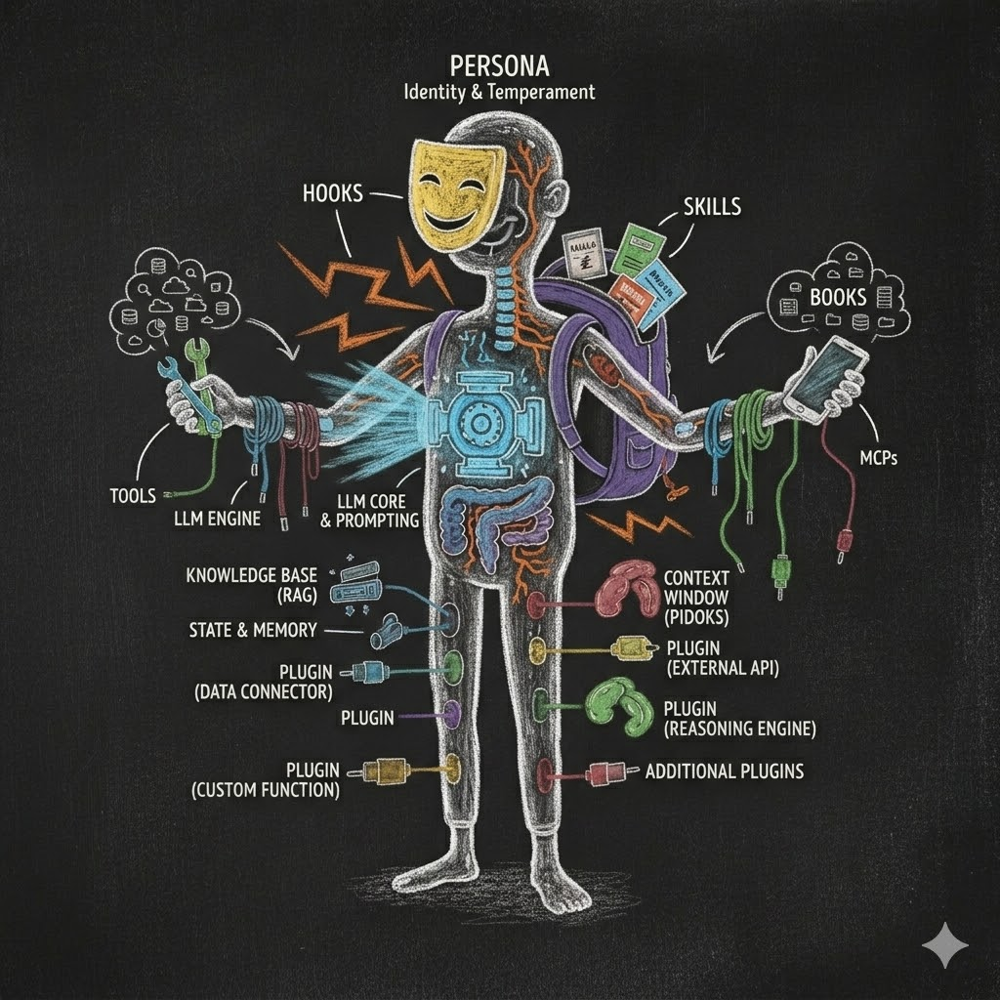

# The Language of Agents

> **Every industry builds a wall of jargon. AI built one faster than any industry in history. This post hands you the keys.**

You already use AI. You open ChatGPT, or Claude, or Gemini in your browser. You type something. It types back. You have been doing this for a year, maybe two. You are not new here.

But then someone starts talking about LLMs and context windows, hooks and MCPs, prompt engineering and seed agents. The words stack up fast. Nobody stops to explain them. That is not your fault — the industry moves faster than its own vocabulary can settle.

This post gives you the working language for the architecture ahead. By the end, you will not just recognize the terms — you will see how they connect into a single, coherent picture. No prerequisites. No code.

The first three essays planted the ideas — the toaster and the electricity, the organism that grows from a seed, the digital cortex your biology never built. Each one introduced terms that matter. This essay collects them, adds the ones still missing, and lays out the full vocabulary. After this, we build.

*The vocabulary becomes easier when every term has a place in the agent's anatomy.*

---

## The Engine: What an LLM Actually Is

Start with what you already know. When you type a question into ChatGPT or Claude, something generates the response. That something is a **Large Language Model** — an LLM.

An LLM is a trained model that predicts tokens from context. That next-token objective can produce writing, analysis, plans, and behavior that looks like reasoning. Whether this process should be called thinking remains debated; the mechanism we can point to is prediction over learned representations.

Those pieces are called **tokens**. A token is roughly a word — sometimes a whole word, sometimes part of one, and sometimes punctuation or another encoded unit. The interface may group the stream for display, but underneath it the LLM generates a sequence of tokens.

**The LLM did not arrive in its current form.** Three overlapping milestones help explain how today's systems emerged. They are a teaching map, not one clean sequence followed by every model.

### Phase One: The Autocomplete Machine

Modern language models grew from earlier statistical and neural language models trained to predict sequences across large text corpora. Think of the basic objective as autocomplete at enormous scale: you type "the cat sat on the" and the model predicts "mat." The base objective was useful long before chat, but it did not by itself produce a dependable conversational assistant.

### Phase Two: The Conversation Machine

Researchers then fine-tuned models on instructions, demonstrations, preferences, and conversational roles. One turn for you, one turn for the AI: user and assistant, back and forth. In this **instruction-tuning phase**, the model became much better at responding to requests instead of merely continuing a document.

This is when chatbots became useful. ChatGPT launched. Millions of people started typing questions and getting answers. The AI felt like it was talking to you.

Underneath the interface, it was still generating tokens from learned patterns and the current context. But the result was useful enough to be transformative.

### Phase Three: The Tool-Using Machine

Then the vocabulary expanded.

Tool-using systems added protocols that let a model request an external action — search the web, read a file, or run a calculation — and receive the result back in context. Some platforms encode those requests with special tokens or structured markers such as a tool-call block; the exact representation differs by model and runtime.

The interaction stopped being just conversation. It became a loop of model responses, tool requests, external results, and further model responses. The LLM proposed the action; the runtime interpreted the request and used the tool. Together, the system was **acting**.

This is where we are now. Some model output becomes words you read. Some is interpreted by the host as a structured tool request. The distinction is defined by the surrounding protocol, not by prose alone.

### The Context Window

One more engine concept. Every LLM has a limit on how much text it can see at once. That limit is the **context window** — measured in tokens.

Think of the context window as a desk. Everything the AI knows right now is spread across that desk. Your question, the system's instructions, previous conversation, file contents, tool results — all of it competes for space on the same desk.

When the desk approaches its limit, the host may compact older material, drop it, or reject more input. Unless important context is preserved elsewhere and deliberately reloaded, the model can no longer use it.

This is why raw LLMs — no matter how powerful — have limits. A bigger desk helps. But a bigger desk is not the same as a filing cabinet. The desk is temporary. The filing cabinet is permanent. That distinction matters enormously, and we will come back to it.

---

## The Whole System: Model, Harness, and Agent

Here is the distinction that clears up most of the jargon:

- The **model** generates the next useful move from the context it receives.
- The **runtime** runs the loop around the model. It carries context in, receives responses, exposes tools, manages events, applies permissions, and returns results.
- The **cognitive layer** holds the inspectable mind you shape: instructions, memory, skills, policies, and reusable ways of working.
- The **job layer** holds the objective and lived state of a particular piece of work: decisions, drafts, evidence, progress, verification, and outcome.

A **framework** is the general software that implements much of the runtime and its extension surfaces. It may supply model-provider access, tools, events, permissions, configuration, concurrency, and the **agent loop**: ask the model for a next step, run an allowed tool when requested, return the result, and repeat until the work stops or produces an answer. The framework is part of the harness, but it is not the whole harness.

The **harness** is the architecture that composes these parts. It is the model's operating environment: runtime, files, context, memory, tools, hooks, permissions, jobs, and the rules that connect them. Some parts are stable machinery. Some are reusable cognition. Some belong only to the work in front of you.

A **compartment** gives one part of that system a clear role and owner. It says: this is where this kind of memory lives; this is the interface that may change it; this is the authority required. A compartment may be a file, folder, plugin, process, repository, or job. The boundary earns its place by preventing mixed responsibilities and competing sources of truth.

The **agent** is the whole system in motion. The model animates it, but the model does not contain its complete identity, memory, tools, authority, or history. Change the model while keeping a compatible harness, and much of the agent can remain. Give the same model a different harness and job history, and you get a different agent.

That is what the first essay meant by *the agent is the filesystem, not the LLM.* It is a statement about the center of ownership. The durable, inspectable part of the agent lives mainly in the files and machinery around the model. The filesystem is the tissue; the runtime supplies the motion; the model supplies the generative energy.

This is also why one giant prompt is not a harness. A harness decides what enters context, what remains durable, what may act, what must stop, what evidence counts, and who has authority to change the system itself.

---

## From Browser to Desktop: CLI Agents

Everything started with the engine. Now: where does the harness meet you?

The AI you use in your browser — ChatGPT, Claude, Gemini — runs on someone else's servers. You visit a website. You type. It responds. These products may preserve conversations or selected preferences for you.

But here is the catch: **you do not control the deepest layers of how that works.** The company decides what gets remembered, how the AI behaves, and what it can access. You are a guest in their house — their rules, their design, their boundaries.

Several companies and open-source projects also offer terminal-based agents. Some use the same model families as their browser products; others support multiple hosted or local models. The agent program runs on your machine even when the model inference still happens on a provider's servers.

That tool is a **CLI agent**.

**CLI** stands for Command Line Interface. It is the text-based program on your computer — the [terminal](https://en.wikipedia.org/wiki/Terminal_emulator "A program that provides a text-based interface to your computer"). You open it, you type, the AI responds. No buttons. No menus. Just text.

It sounds less fancy than a browser interface. The difference is not power. The difference is **control.**

A CLI agent gives you more surfaces to customize: project instructions, files, tools, permissions, hooks, and sometimes the model itself. You can add a graphical interface on top if you prefer one. Your control is substantial but not unlimited; the runtime, model provider, operating system, and connected services still impose boundaries.

Because a CLI agent operates through your machine, it can work with local files when you grant access. It may read documents, write new ones, search folders, edit code, and organize work inside its configured boundaries.

And here is the key: **every working folder can carry a distinct agent context.**

Open a terminal in a legal case folder and, with appropriate permissions and confidentiality controls, the agent can load that case's instructions and documents. Open it in a marketing folder and the same model can receive different context, rules, and memory.

The AI in your browser is a service you visit. A CLI agent can put more of the operating layer under your ownership, especially when its state and rules live in files you control.

That is the shift. From using an assistant the company designed for everyone, to operating more of the harness yourself. The model may still be hosted elsewhere, but the files, project context, tools, and working state can increasingly live under your control. Now you have the form factor that makes the first essay's argument concrete.

## The Briefing: Instructions, Context, and Memory

So you have a CLI agent on your machine. What makes it *yours*?

Before you type your first word, the runtime has already assembled instructions and context. These words sound interchangeable until you see their different jobs.

A **system message** is a high-priority instruction layer supplied by the host or provider. It defines broad behavior and boundaries for the session. In a browser product, the company controls that layer. You may add custom instructions, but you do not replace its highest-priority rules.

**Project instructions** describe how work should happen in a particular folder: the role, standards, commands, boundaries, and definition of done. Depending on the platform, a CLI agent may discover them through files with names such as `CLAUDE.md`, `AGENTS.md`, or `QWEN.md`. They are visible and editable, but their exact authority and loading rules depend on the runtime.

**Context** is everything the model can use on this turn: instructions, your request, relevant conversation, selected files, tool definitions, retrieved material, and tool results. Context is the desk. Context engineering decides what deserves space on it.

**Memory** is information preserved outside that temporary desk so it can be considered again. A transcript is one form of storage, but useful memory is often smaller and structured: accepted decisions, stable facts, preferences, open work, and lessons with provenance. Memory does nothing merely by existing. The harness must discover, select, and reload it at the right time.

**State** is the system's recorded condition at a particular moment: which job is active, which phase it reached, which approvals are pending, which artifacts exist, and what happened before an interruption. Memory helps the agent interpret experience. State helps it continue the right process. A file may serve both roles, but the responsibility should remain clear.

**Persona** is the recognizable role and manner expressed across those layers. It may begin in one instruction file, but a mature agent's identity spreads across instructions, memory, policies, habits, and the experience accumulated through work — the way a person's character is not stored in one place. A legal research agent might be told to cite primary sources, protect confidential material, distinguish research from legal advice, and leave accountable decisions to the human professional.

One engine. A thousand possible agents.

## The Craft: From Prompt Engineering to Context Engineering

You have probably heard the term **prompt engineering**. It means carefully crafting what you type to get better results from the AI.

Prompt engineering works. It matters. But when treated as the whole interface, it puts the burden on **you**. Learn the right phrasing. Structure your request just so. Add the right context manually. The better you get at prompting, the better your results. That disproportionately rewards people willing to learn a new way of talking to a machine.

The field is moving toward something broader: **context engineering**. Instead of expecting the user to pack everything into one perfect prompt, you design the information environment so the AI has a better chance of performing well across ordinary requests.

Context engineering moves recurring prompting work into the architecture. Structured instructions, selected context, and retrieval rules can be prepared by the system instead of reconstructed by the user every time. Internal model calls still need careful prompts, and ambiguous requests can still require clarification, but the user carries less of that burden manually.

Second, it expands the focus beyond just *talking to* the LLM.

Think of it as a metabolism. Everything that flows through the AI — your prompts, selected files, intermediate reasoning, and results from tools — is information being processed. Good context engineering decides what enters the working context, what stays outside, what deserves durable memory, and what should be discarded. The token generator has been invented. The real work now is building the rest of the system so those tokens are **metabolized** rather than merely accumulated.

What files does the agent see? What instructions does it receive at startup? What tools can it use? What rules does it follow? What memory does it carry from previous sessions?

Prompt engineering is choosing your words carefully. Context engineering is designing the room so that a simple request is enough — the desk, the filing cabinets, the rulebooks on the shelf, the locks on the doors. The prompting still happens. It just happens inside the architecture, not inside your head. In the [second essay](../b2/02-we-could-have-had-agi.html#where-does-the-context-come-from), we called this balanced **context composition** — making sure every compartment that should influence the agent's thinking has a pathway in.

For a non-technical professional, context engineering might sound intimidating. It can start with one project-instruction file. You describe the work, the boundaries, and how the agent should behave; then you and the agent add structure only as evidence shows what is needed.

---

## The Hands and the Locks: Tools, Permissions, and Authority

A model can propose an action. A **tool** gives the runtime a way to perform one.

Reading a file, searching the web, querying a database, running a calculation, editing a document, and sending a message can all be tools. Each tool has an interface: a name, a description, expected inputs, and a result returned to the model. Tool use turns generated text into contact with the world.

That contact needs boundaries. A **permission** answers whether a particular action is allowed: may this tool read that folder, run this command, or call that service? Permissions can allow, deny, or pause for a human decision. A tool being available does not mean every use of it is authorized.

**Authority** is the larger question behind permission: who has the right to make the decision? An agent may have permission to edit a draft while lacking authority to publish it. It may prepare a payment without authority to send it. It may propose a change to its own rules without authority to approve the change.

This distinction matters because intelligence and authority are separate. A better model may make a better recommendation. It does not earn the right to widen its own boundaries. In a dependable harness, consequential authority stays explicit, and the strongest controls live where the runtime can enforce them before the side effect occurs.

A **guardrail** is the general name for a boundary meant to keep behavior inside acceptable limits. An instruction can be a soft guardrail: the model is asked to comply. A permission check or pre-action hook can be a hard guardrail when the runtime enforces it regardless of what the model proposes. Use the soft layer for judgment and guidance; use the hard layer when failure must be blocked.

## The Reflexes: Hooks

When you drive a car, you do not think about checking your mirrors. You just do it. It is a reflex — an automatic action triggered by a specific moment.

**Hooks** are an agent's reflexes.

An **event** is a named moment exposed by the runtime: the session started, a tool is about to run, a tool finished, the agent asked a question, the context is being compacted, or the agent is trying to stop. A **hook** is a configured handler attached to one of those moments. Depending on the platform, that handler may run a command, call a service, or ask another model to evaluate the event. Before a tool edits a file, a deterministic hook may inspect the requested path and deny the action. After a tool runs, another hook may log the result. When the agent tries to stop, a Stop hook may return feedback that keeps the loop active. What a hook can observe, change, or block depends on the platform and event, so the boundary must be tested rather than assumed.

You may describe the behavior in plain language and let the agent draft the hook, but the result is still an operational mechanism with influence over your tools. Review it, test both the allowed and blocked paths, and confirm how it fails before trusting it. Conversation can make implementation accessible; it does not remove engineering responsibility.

A good practice: after you describe a new hook, test it. Ask the agent to try the action the hook should catch, and verify it fires correctly. Think of it like hiring a new assistant — you give them an instruction, then you watch them handle it a few times until you trust the process. These systems are very good, but not perfect. A quick test builds confidence.

Hooks give a reactive model dependable moments where the surrounding system can inspect, record, redirect, or block behavior. They can enforce parts of a process when the runtime exposes the right event and honors the result.

We will formalize the workflow those hooks enforce — Observe, Plan, Execute, Verify, Condense — in a [later essay](../b6/06_1-phasic-foundation.html).

## The Skill Set: Skills, Commands, Scripts, and Sub-agents

Here is the hierarchy.

A **skill** is a reusable package of instructions and supporting resources — like a recipe card with its tools and examples. Some runtimes let the agent select a skill when its description matches the task; users can also invoke one explicitly. Exact loading and precedence rules vary by platform.

A **command** is an explicit entry point you trigger, often with a short name such as `/review` or `/commit`. It starts a defined workflow, but the workflow may still branch, call tools, or ask for input.

A **script** is executable procedure. Where a skill explains how to perform a review, a script might calculate the hashes, transform the files, or run the same deterministic check every time. The model can choose or prepare a script; the computer executes its instructions.

A **sub-agent** is a specialist. When the main agent faces a task that needs focused attention — deep research, complex analysis, parallel work — it can spin up a sub-agent. The sub-agent works independently, finishes the job, and reports back. Like sending an associate to the library while you stay at your desk.

Skills package a method. Commands provide an explicit entrance. Scripts perform repeatable mechanics. Sub-agents receive delegated work. A mature workflow may compose all four.

## The Connections: MCPs

Your agent sits on your computer. But the world does not live on your computer.

**MCP** stands for [Model Context Protocol](https://modelcontextprotocol.io/specification/latest/architecture "Official Model Context Protocol architecture"). It is an open client-host-server protocol for exposing tools, resources, and prompts from external systems to an AI application. An MCP server might connect to email, Google Drive, a calendar, a database, or an internal service when an implementation and the necessary authorization exist.

Think of MCP as a standardized socket. The protocol defines how a host and server describe capabilities and exchange requests; the server still has to implement the service-specific API, credentials, permissions, and safety boundaries.

A **connector** or **adapter** is the service-specific bridge behind that socket. It translates an outside system into tools or resources the host understands. MCP can standardize the connection; it does not eliminate the adapter or its trust boundary.

MCP servers can turn a local agent into a connected one. Each connection also extends the system's trust boundary, so local control of the host does not automatically make remote data or actions local or private.

## The Extensions: Plugins

A **plugin** is a platform-defined extension package. Depending on the runtime, it may bundle tools, hooks, instructions, skills, commands, or sub-agents. Think of it as a possible cognitive organ transplant, while remembering that plugin anatomy and authority differ across platforms.

One plugin might bundle professional skills together with guardrail hooks that prevent mistakes. Another might add cognitive memory tissue — persistence files, consolidation rules, and the hooks that trigger them — letting the agent keep working across sessions without forgetting where it left off.

Plugins can help agents grow without scattering every new behavior through the existing system. You add a package, and the harness gains a bounded set of capabilities. Good compartmentalization still requires the package to declare what it owns, which interfaces it uses, and how it can be removed or recovered.

---

## The Structure: Jobs and Rhythms

If hooks are reflexes and skills are knowledge, how does the agent actually organize its day? Without structure, an AI is just a chatbot waiting for a prompt. To act autonomously, it needs architecture.

In the Hadosh reference architecture, a **job** is the persistent unit of work. It has an objective, durable state, and completion criteria stored outside the conversation. If you close your laptop halfway through, the job record can remain active. Recovery still depends on a restart path that reloads the right state and verifies what happened before the interruption.

An **obligation** is work the system remains responsible for surfacing later: a scheduled review, a promised follow-up, or a task waiting on an outside event. A durable obligation needs an owner, a trigger, state, and a clear way to cancel or complete it. A note hidden in an old chat is not an obligation system.

But how does a job get done? Through a **Cognitive Rhythm**.

A cognitive rhythm is a staged workflow that gives different kinds of work explicit boundaries. The rhythm used in this series is **OPEVC**: Observe, Plan, Execute, Verify, Condense. A hardened implementation can restrict what the agent may do in each phase and require evidence before advancing. The rhythm reduces avoidable mistakes when its gates are correctly implemented; the words alone do not enforce discipline.

At the end of that rhythm is **Condense**. Before a completed cycle closes, the agent reviews what it learned, routes warranted lessons to durable memory, and records follow-up work that belongs elsewhere. Not every observation deserves permanence, and user or external-action gates still apply.

## The Proof: Verification and Recovery

An agent saying *done* is a claim. **Verification** is the evidence that makes the claim believable.

The evidence depends on the work. A calculation can be checked against known cases. A report can be traced to its sources. A website can be tested in a browser. A changed procedure can be tried on both the path it should allow and the path it should block. Verification turns confidence into something another person can inspect.

**Validation** is the repeatable part of that proof: a test, schema, checklist, comparison, or rule that decides whether an output meets a stated contract. It does not replace human judgment. It protects the parts that can be stated clearly enough to check.

**Recovery** answers what happens when the model, tool, network, or machine fails halfway through. Durable job state, logs, backups, reversible changes, and restart rules let the system determine what already happened before it acts again. Persistence without recovery can preserve confusion. Autonomy without verification can repeat it.

These terms belong in a vocabulary essay because they complete the meaning of *agent*. Generation creates a possible next step. The harness must decide whether that step is allowed, whether it worked, and how to continue if it did not.

## The Growth Pattern: Seed Agents and Agentic Workforces

Two more terms, and these matter more than any of the technical ones.

A **seed agent** is a sparse starting composition — a [complex system](../b2/02-we-could-have-had-agi.html#the-seed-agent-small-structure-that-grows) intended to grow through evidence. It may provide principles and selected reusable components rather than one fixed anatomy. You and your agent decide what to adopt, adapt, or build as your work reveals the need.

Think of it as receiving a small kit of tested building materials and a set of architectural principles. Different users may assemble different foundations because their work, risks, and platforms differ.

The growth of that system produces **emergence**: useful behavior appears from the interaction of parts rather than from one enormous instruction or plugin. Memory influences which skill is selected. A job scopes which authority is appropriate. A hook blocks an unsafe action. Verification changes what the job may call complete. The capability belongs to the composition.

An **agentic workforce** is what happens when you grow multiple seed agents, each one specialized for a different part of your professional life. One handles legal research. One manages client communication. One runs your billing. One organizes your knowledge base.

You do not have to hand-code every layer. Conversation can express, "Here is how I want this to work." Files, scripts, permissions, tests, and review turn that intent into dependable behavior.

That is the endgame. Not one AI assistant. A workforce of specialized agents, each one customized to your work and operated through harnesses you can inspect and shape.

---

## The Big Picture

Picture all of this running at once. You open a terminal in your project folder. The **runtime** starts a session and loads applicable **instructions**. It restores the active **job**, selects relevant **memory**, and composes the model's working **context**.

A **hook** checks the start boundary. The agent loads a relevant **skill**. The **model** proposes a tool call. **Permissions** decide whether it may run. An **MCP server** may provide the connection. A **sub-agent** may receive a bounded research task. A **script** performs a repeatable check. The **job** records progress, **validation** tests the result, and **recovery** state makes interruption survivable.

Files preserve the inspectable mind and lived work. The runtime provides the body. The model supplies generative intelligence. The permissions and authority model define the locks. The whole composition is the **harness**. The harness in motion, shaped by its history and current objective, is the **agent**.

Conversation may have initiated all of this, but dependable behavior required files, code, permissions, tests, and review. Your words supplied intent. The architecture made that intent inspectable and enforceable where enforcement was possible.

## Why This Vocabulary Matters

Every profession has its language. Lawyers have torts and depositions. Doctors have diagnoses and prognoses. Accountants have amortization and accruals.

Those words need not exist to exclude you. They can exist because precision matters. When a lawyer says "deposition," every other lawyer knows the procedure being discussed without rebuilding the definition each time.

The same is true here, with one caution: platforms do not use every term identically. When this series says "hook," it means code attached to a supported lifecycle event. When it says "seed agent," it means a sparse, user-shaped starting composition. These definitions are handles for the architecture that follows.

The industry built the jargon wall fast. You just walked through it.

You have the language. Next, we build the skeleton.

---

*Essay 4 of 8 in the Hadosh Academy series on agent architecture.*

*Previous: ["The Folder Is Alive"](../b3/03_1-the-folder-is-alive.html) — what happens when a folder gets a brain of its own.*
*Next: ["The Two-Layer Foundation"](../b5/05_1-the-two-layer-foundation.html) — the always-on plugins that run regardless of phase, and the CLAUDE.md hierarchy they coordinate through.*

*Companion: ["The Primitives of Agent Architecture"](../../papers/the-primitives-of-agent-architecture.pdf) (reference guide)*
