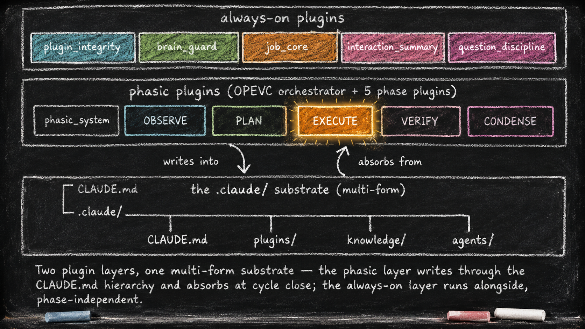

# The Two-Layer Foundation

*Essay 5.1 — The Always-On Digital Cortex, Part 1 of 9. Essay 5 opens here; Parts 2 through 9 follow.*

---

For four essays we have circled the claim that the agent is its filesystem. Now we open one filesystem and study how its parts were arranged.

[Essay 4](../b4/04-the-language-of-agents.html) separated the model, runtime, cognitive layer, and job layer. This series now opens an earlier Claude-based prototype inside the cognitive layer. It is a case study, not the required anatomy of every seed agent and not a description of the current public Q-Seed implementation.

In that prototype, project instructions begin in `CLAUDE.md`, and an intentionally chosen `.claude/` compartment holds more of the inspectable brain. [Claude Code can load](https://code.claude.com/docs/en/memory#choose-where-to-put-claudemd-files "Official Claude Code project-instruction locations") `CLAUDE.md` and `.claude/CLAUDE.md` as project instructions; it does not automatically treat every file under `.claude/` as model context. The prototype's own index and hooks decide how the other files participate. *[ref: claude-prototype-brain-boundary | .claude/CLAUDE.md + .claude/settings.local.json | The private reference prototype declares .claude as its brain compartment and registers the hooks that connect its files to Claude Code lifecycle events.]*

```
your-project/
├── CLAUDE.md                ← project-level instructions
└── .claude/                 ← the prototype's chosen brain compartment
    ├── CLAUDE.md            ← brain index and instructions
    ├── context/             ← canonical concepts and design decisions
    ├── knowledge/           ← durable knowledge organized by topic
    ├── plugins/             ← reusable cognitive behavior and controls
    ├── agents/              ← specialist sub-agent definitions
    ├── jobs/                ← job state, plans, evidence, and history
    └── settings.local.json  ← runtime hook configuration
```

That tree is the substrate. It uses plural forms — folders, files, scripts, narratives, configuration, and state — because no single form serves every cognitive role. Topical knowledge needs different machinery from a pre-action guard. A plugin may carry instructions, hooks, scripts, tests, coaching text, an evolution narrative, and private state, but it should include only the forms its concern requires. *[ref: prototype-plugin-forms | .claude/plugins/CLAUDE.md Plugin Structure Convention | The prototype defines a full plugin anatomy while explicitly allowing smaller plugins to omit unnecessary directories.]*

The deeper move is to represent different cognitive responsibilities in forms suited to their use. Some information should enter model context. Some should remain machine state queried through a narrow command. Some should execute as a deterministic hook. Compartmentalization lets the harness select relevant context without pretending that all cognition is prompt text.

The prototype does not entrust durable project memory exclusively to the chat session. Conversation context is bounded, and compaction can omit detail. Files preserve selected instructions, decisions, job state, and reviewed lessons across sessions; the runtime still has to reload the right pieces. *[ref: durable-memory-outside-chat | .claude/plugins/brain_guard/CLAUDE.md + .claude/knowledge/ + .claude/jobs/ | brain_guard manages context pressure while knowledge and job compartments preserve selected durable information outside conversation history.]*

**Inside this cognitive layer, the prototype organizes plugins into two behavioral groups.** They are the two layers named by this essay. They do not replace Essay 4's broader model, framework/runtime, cognitive, and job architecture.

The **always-on group** contains phase-independent controls. Its hooks cover selected events such as session start, user prompts, tool use, questions, and stop attempts. Individual plugins do not all fire on every event. Together they protect plugin edits, monitor context pressure, maintain job lifecycle, summarize long interactions, and structure questions. *[ref: phase-independent-hook-group | .claude/settings.local.json | The hook registry maps each always-on plugin to specific lifecycle events and matchers rather than firing every plugin on every event.]*

The **phasic group** activates behavior for one stage of the focused job at a time while the phase-independent controls continue underneath. The prototype's rhythm is OPEVC — Observe, Plan, Execute, Verify, Condense. Its guards give the stages different tool and write boundaries: Observe and Plan protect project files, Execute works within an approved scope, Verify emphasizes approved checks, and Condense routes warranted lessons into the brain compartment. The exact exceptions and budgets belong to the implementation, which we open in [Essay 6](../b6/06_1-phasic-foundation.html). *[ref: phase-specific-runtime-guards | .claude/plugins/phase_{observe,plan,execute,verify,condense}/hooks/ | Each phase plugin implements event-level guards and trackers with stage-specific tool, path, and command rules.]*

Both groups are built from smaller plugins, each centered on one primary concern. The architecture's value is what those focused parts **compose** into — ceremonies no plugin could perform alone.

We tour the always-on layer first because it surrounds everything else.



<!-- RAW_HTML -->
<aside class="explore-callout" style="margin: 2rem 0; padding: 1.1rem 1.3rem; border-radius: 10px; background: linear-gradient(135deg, rgba(99,102,241,0.10), rgba(139,92,246,0.10)); border: 1px solid rgba(139,92,246,0.30); display: flex; flex-wrap: wrap; align-items: center; gap: 0.9rem; justify-content: space-between;">
  <span style="font-size: 0.92rem; line-height: 1.5; color: rgba(255,255,255,0.82);"><strong>Interactive diagram.</strong> Walk the plugin population as a deck &mdash; the two layers split by <em>when</em> they fire, the live roster (active plugins, unimplemented designs, the shared <code>lib/</code> tier), and the two always-on plugins drawn deep: <code>interaction_summary</code> (mega-prompt compression) and <code>question_discipline</code> (the prefix gate). Click any box for the live code behind it.</span>
  <a href="explore/plugin-population.html" title="Open the interactive plugin-population walkthrough" style="flex: none; display: inline-flex; align-items: center; gap: 0.32rem; padding: 0.5rem 0.9rem; font-size: 0.85rem; font-weight: 700; line-height: 1; color: #ffffff; text-decoration: none; background: linear-gradient(135deg, var(--primary, #6366f1), var(--accent, #8b5cf6)); border: 1px solid rgba(255,255,255,0.35); border-radius: 8px; box-shadow: 0 4px 16px rgba(99,102,241,0.5);">&#8599; Walk the plugin population</a>
</aside>
<!-- /RAW_HTML -->

## The journey ahead

Essay 5 splits into nine short sub-essays:

- **Essay 5.1 — The Two-Layer Foundation** *(you are here)* — the prototype substrate + its two behavioral groups + this map
- [Essay 5.2 — Plugin Edit Safety — `plugin_integrity`](05_2-plugin-integrity.html) — the test gate
- [Essay 5.3 — Context Window Discipline — `brain_guard`](05_3-brain-guard.html) — the progressive squeeze
- [Essay 5.4 — Job Lifecycle — `job_core`](05_4-job-core.html) — the unit of compartmentalization
- [Essay 5.5 — Mega-Prompt Compression — `interaction_summary`](05_5-interaction-summary.html) — keeps the dynamic mega-prompt legible
- [Essay 5.6 — Structured Questions — `question_discipline`](05_6-question-discipline.html) — the prefix registry
- [Essay 5.7 — The CLAUDE.md Hierarchy](05_7-claude-md-hierarchy.html) — the working-memory substrate form the phasic layer writes through
- [Essay 5.8 — The Historian Ratchet](05_8-historian-ratchet.html) — three single-concern plugins composed into one ceremony
- [Essay 5.9 — The Customization Guardrail](05_9-customization-guardrail.html) — the gate that decides when plugin-code edits and new-plugin births are admitted at all

Essays 5.2 through 5.6 deep-dive the always-on plugins, one each. Essay 5.7 covers the substrate form the phasic layer USES. Essays 5.8 and 5.9 are for the architects in the audience — how single-concern plugins compose into emergent ceremonies, and how the operator gates substrate edits.

The phasic plugins get their own series in [Essay 6](../b6/06_1-phasic-foundation.html). The cell template that lets new plugins be born safely is [Essay 7](../b7/07_1-plugin-kit-foundation.html). The four-stage arc from your first job to your first custom plugin is [Essay 8](../b8/08_1-apprentice-to-architect-foundation.html).

---

## Why "Single Concern" Matters

Each phase-independent plugin declares one primary concern. That does not mean it has only one function or dependency; it means related behavior has a named home.

`plugin_integrity` owns the protected edit cycle for prototype plugins: scope an edit, run its checks, commit a passing checkpoint, or restore the last clean checkpoint when that cycle fails. Its admission rules for plugin changes are opened in [Essay 5.9](05_9-customization-guardrail.html). `brain_guard` owns context-pressure monitoring and controlled compaction. `job_core` owns job lifecycle and unresolved obligations. `interaction_summary` maintains a cumulative summary chain for the focused job. `question_discipline` owns the registered formats used when the prototype asks the user structured questions. *[ref: five-primary-plugin-concerns | .claude/plugins/{plugin_integrity,brain_guard,job_core,interaction_summary,question_discipline}/CLAUDE.md | Each plugin's Objective names its primary responsibility; its hooks and scripts implement supporting behavior for that responsibility.]*

Each plugin lives in its own folder under `.claude/plugins/<name>/`. A mature plugin may have hooks, scripts, protected state, tests, documentation, and coaching text. Smaller plugins may need fewer parts. The compartment is defined by responsibility and interface, not by filling every slot in a template.

The single-concern principle is a *minimize* rule, not an *eliminate* rule. Pure isolation is what a traditional library aims for — clean modules with no shared state, talking to nothing they don't import. The seed agent is a complex cognitive system, and a small amount of structured coupling between plugins is what lets the parts compose into ceremonies larger than any one plugin. Call this **single-concern + careful coupling**: each part stays narrow; the composition is what makes the ceremony possible.

The historian ratchet inside `plugin_integrity` is a concrete example. When a plugin's evolution narrative falls behind the commit history, the edit flow can require its historian before unlocking more work. The ceremony combines `question_discipline`'s registered `[PLUGIN-LOCK]` request, `job_core`'s capture of the user's answer, the historian sub-agent, and `plugin_integrity`'s safe edit cycle. We deconstruct this composition in [Essay 5.8](05_8-historian-ratchet.html); the cell-anatomy view is in [Essay 7](../b7/07_1-plugin-kit-foundation.html). *[ref: historian-ratchet-composition | .claude/plugins/plugin_integrity/hooks/lock-manager.sh + .claude/plugins/question_discipline/hooks/question-discipline-gate.sh + .claude/plugins/job_core/hooks/question-capture-hook.sh | The lock request, approval capture, drift gate, historian routing, and protected edit cycle are owned by separate components.]*

The shape is not unique to software. A real-estate transaction closes through distinct responsibilities: the buyer's agent, listing agent, escrow officer, title underwriter, lender, and inspector coordinate through shared documents and events on a common timeline. Their boundaries are not perfect isolation, but the closing works because each participant has a defined role, source material, and handoff.

The discipline is in *how* the coupling happens. The prototype prefers published command surfaces, a question-prefix registry, named coaching handles, and structured instruction files over direct access to another plugin's state. `job.sh focused` is one example of a narrow read interface. The boundary is partly enforced and partly contractual: guards block ordinary direct access to protected `data.json` files, but code running with sufficient operating-system access can still bypass a convention. The architecture reduces accidental coupling; it does not create mathematical isolation. *[ref: interface-over-shared-state | .claude/plugins/job_core/scripts/job.sh + .claude/plugins/plugin_integrity/hooks/plugin-guard.sh | job_core publishes narrow commands, while plugin_integrity blocks ordinary direct reads and writes to plugin state within the configured runtime boundary.]*

The shape buys three practical advantages. It reduces the blast radius of change when interfaces remain stable. It lets many components be tested in focused sandboxes before integration. And it gives a new phase-independent plugin a defined route into the system through its own hooks and public commands. None of these properties is automatic: shared dependencies and integration paths still require tests.

---

We start with `plugin_integrity`.

---

*Essay 5.1 — The Always-On Digital Cortex, Part 1 of 9.*

*Previous: [Essay 4 — The Language of Agents](../b4/04-the-language-of-agents.html) — vocabulary that prepares the architecture.*
*Next: [Essay 5.2 — Plugin Edit Safety — `plugin_integrity`](05_2-plugin-integrity.html) — first of the always-on plugin deep-dives.*
