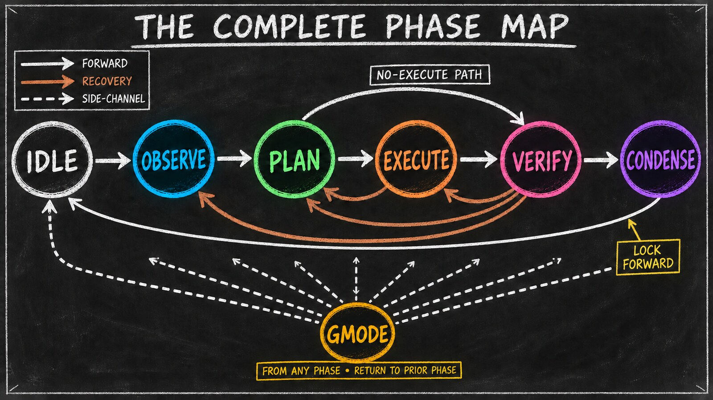

# The Phase Map — A Tour Before the Deep-Dives

*Essay 6.2b — The Markov Phasic Brain, Part 3 of 13.*

---

[Essay 6.2](06_2-discipline-and-map.html) drew the full transition map and named the tool-restriction discipline that makes each phase distinct — the rules of the cycle. Before we open each compartment one at a time, here is the whole set at a glance. Each line below names the phase, its essence, and what it is on the hook to produce — a quick tour to hold in your head before the per-phase deep-dives begin, starting with OBSERVE in the next essay.

<!-- RAW_HTML -->
<figure class="blog-image" data-visual-style="I90-A10" data-information-weight="90" data-artistic-weight="10" data-visual-role="storytelling" data-visual-batch="4" style="margin: 2rem 0;">
  
  <figcaption>The complete map: solid forward progress, explicit recovery choices, one lock-forward consolidation edge, and a temporary off-cycle lane.</figcaption>
</figure>
<!-- /RAW_HTML -->

---

## The Phases at a Glance

**IDLE** — the meta-state between cycles. Lifecycle management only — a narrow allowlist opens, and everything else stays shut. *[ref: idle-as-meta-state-between-cycles | private historical prototype | Checked against a private historical prototype; identifying repository, revision, source paths, and unpublished implementation details are omitted.]*
- Unlock the job-management CLI — the lifecycle surface. Six of its verbs answer from idle: `show`, `focused`, `list`, `activate`, `focus`, and `pause`. Changing or closing a job through `update`, `complete`, or `approve` belongs to later phases. Creation and graph mutations live elsewhere.
- Unlock the phase CLI (`advance`, `current`, `cycle`, `exit-gmode`) — agent-callable `advance` only goes idle → observe
- Keep the always-on infrastructure running: memory-file edits, plus a small named-script allowlist on the IDLE Bash gate — `interaction_summary/scripts/summary.sh` for cross-conversation summaries, `brain_guard/scripts/self-compact.sh` for context-window compaction, and `plugin_integrity/scripts/lock-cmd.sh` for the universal active-lock close-out. Every other shell command exits blocked. *[ref: idle-bash-allowlist-named-scripts | private historical prototype | Checked against a private historical prototype; identifying repository, revision, source paths, and unpublished implementation details are omitted.]*
- Block reads, project edits, CLAUDE.md edits, web access, general shell
- *Job creation happens automatically: top-level via `prompt-handler.sh` (the user's prompt itself creates the job when none is focused); dependent jobs via CONDENSE step 3 consuming `[PENDING-JOB]` markers. The agent does not call `job.sh create` itself.*

**OBSERVE** — gather context before any plan can form. *[ref: observe-cycle-1-expands-objective | private historical prototype | Checked against a private historical prototype; identifying repository, revision, source paths, and unpublished implementation details are omitted.]*
- On cycle 1, expand the job's objective from its short creation stub into a full statement of intent — OBSERVE's distinctive cycle-1 work; the Stage decision (the `set-plan-file` call PLAN must make) comes next, in PLAN
- Populate the working-memory CLAUDE.md files with relevant context
- Dispatch parallel research subagents and synthesize their returns
- Refuse code edits — the only allowed write target is CLAUDE.md
- Cross the exit threshold only after enough investigation has happened

**PLAN** — turn observations into a binding contract. *[ref: plan-names-file-claude-md-only | private historical prototype | Checked against a private historical prototype; identifying repository, revision, source paths, and unpublished implementation details are omitted.]*
- Record the Stage decision in cycle 1 via an explicit `set-plan-file` call — `false` for a single-cycle job, a `.md`/`.yaml` name for a multi-cycle one; PLAN itself never writes the plan file — EXECUTE creates it
- Declare the *altered list* — the set of dirs whose CLAUDE.md the agent edited during OBSERVE or PLAN; EXECUTE will be allowed to write project files inside each of those dirs exactly (no ancestor or nested dirs)
- Write acceptance criteria VERIFY will check against
- Refuse code edits — the contract is what gets written, not the work

**EXECUTE** — build what the plan declared, in checkpoints. *[ref: execute-creates-plan-file-cycle-1 | private historical prototype | Checked against a private historical prototype; identifying repository, revision, source paths, and unpublished implementation details are omitted.]*
- Edit project files, but only inside the altered list — the merged set of CLAUDE.md files OBSERVE and PLAN together declared, frozen at execute entry
- Materialize every artifact the seed agent produces — code, the `.md` plan in cycle 1 of a Stage-2 job, the `.yaml` plan in cycle 1 of a Stage-3 job, anything else with a path; EXECUTE is the universal file-creator
- Favor small, focused checkpoint commits over one long uncommitted run; the intermediate-commit mode keeps checkpoints cheap
- Capture *execution notes* in the working CLAUDE.md so the cycle stays narratable
- Delegate file work to execute subagents (sequential by default, a small in-flight ceiling); keep the main session on the spine

**VERIFY** — judge prior work with independent eyes. *[ref: verify-refines-plan-forces-backward | private historical prototype | Checked against a private historical prototype; identifying repository, revision, source paths, and unpublished implementation details are omitted.]*
- Run scripts and validators; refuse all code edits in this phase
- Dispatch auditor subagents to read the executed work without bias
- Write pass/fail results into CLAUDE.md and the plan file
- Refine the focused job's plan file (`.md` or `.yaml`) — but editing it blocks forward-advance and forces a backward step to PLAN; the plan is refined in place and persists, nothing is approved or sealed
- Hand completion to CONDENSE — VERIFY has no job-completion authority; `[JOB-COMPLETE]` is a CONDENSE-only ceremony, a phase away
- Review the focused job's open dependencies and, when the audit reveals one is no longer needed, either unlink it but keep the work (`job.sh remove-dependency` — the child survives as standalone work) or unlink and abandon it (`job.sh void-dependency` — the child is marked `voided`, a terminal-abandon state) — the lifecycle-symmetry partner of CONDENSE's `add-dependency`
- Route the cycle forward to CONDENSE, or backward to whichever prior phase the failure points at

**CONDENSE** — consolidate the cycle's learnings into the brain. *[ref: condense-7-step-waterfall-owns-job-creation | private historical prototype | Checked against a private historical prototype; identifying repository, revision, source paths, and unpublished implementation details are omitted.]*
- Walk a strict staged waterfall that routes content to its durable home
- Consume marker types the prior phases dropped into footers
- Compress the working CLAUDE.md back to a clean state
- Own all job creation (`create`, `create-dependent`) and dependency additions (`add-dependency`) — the phase with the right cycle-wide context for graph mutations
- Lock forward to idle; no escape hatch back to verify

**GMODE** — the freestyle side-channel from any phase. *[ref: gmode-as-off-cycle-lane | private historical prototype | Checked against a private historical prototype; identifying repository, revision, source paths, and unpublished implementation details are omitted.]*
- Enter via a `[GMODE]` user question with a substantive reason (currently a roughly 100-word floor in the prototype)
- Run outside the OPEVC phase restrictions; platform permissions, user authority, and the harness's always-on safeguards still apply
- Exit explicitly with a clean git tree; the home phase resumes atomically
- Host work that doesn't fit the OPEVC ceremony — deadlock fixes, plugin maintenance, custom workflows

That is the operational shape — and every edge, every locked tool, every gated boundary exists for one payoff: the agent can no longer skip the thinking a phase was built to force. The rest of this essay series opens each compartment one at a time to show exactly how that discipline does its work.

---

## What you would customize

The discipline is the architecture; the specific edges and the specific allow-lists are this prototype's calibration. Several surfaces are open to the next architect.

The architect would tune the *backward map*. The prototype lets verify roll back to several destinations — execute, plan, or observe — picked by the failure shape. A seed that runs short, surgical cycles might collapse the menu to one (always observe; let the next cycle re-plan from scratch). A seed running long structural sweeps might widen the menu to include condense for re-routing learnings without re-executing. *[ref: verify-backward-three-destinations | private historical prototype | Checked against a private historical prototype; identifying repository, revision, source paths, and unpublished implementation details are omitted.]*

The architect would tune the *gmode usage policy*. Gmode is the freestyle escape hatch; the prototype reserved it for plugin maintenance because the prototype was building the seed agent itself. A user-facing seed might keep almost all work inside OPEVC and never enter gmode. A research-heavy seed might push routine literature scans through gmode rather than inflating every cycle's observe phase. *[ref: gmode-policy-tunable-not-code-fixed | private historical prototype | Checked against a private historical prototype; identifying repository, revision, source paths, and unpublished implementation details are omitted.]*

The architect would tune the *per-phase tool allow-lists*. The current cuts — read-only in observe and plan, scripts-only in verify, full-write-inside-scope in execute, brain-only in condense — encode this prototype's notion of cognitive separation. A seed wanting a stricter observe could ban the web entirely. A seed wanting a looser verify could allow targeted code edits inside named directories. The guards are code; the cuts are decisions. *[ref: per-phase-allow-lists-edit-the-case-arms | private historical prototype | Checked against a private historical prototype; identifying repository, revision, source paths, and unpublished implementation details are omitted.]*

The architect would tune the *metacog menu* — how much reflection each phase owes before it may advance. The exit gate asks for a minimum number of reflection ops per phase, and that minimum is a dial, not a constant. A seed running fast, low-stakes work might require a single reflection op at each boundary. A seed doing careful, high-consequence work might demand several — a first-principles pass in OBSERVE, a second-order-effects pass in PLAN, an inversion check before building. A consulting practice could require a premortem lens before any client deliverable enters its build phase — the gate ensures the plan was stress-tested before a single hour is billed. The reflection lenses themselves come in two tiers: a small core that every phase must run, plus richer mental-model lenses the architect can switch on phase by phase. The knob decides how much of the agent's compute goes to *examining* the work versus *doing* it. *[ref: metacog-menu-knob | private historical prototype | Checked against a private historical prototype; identifying repository, revision, source paths, and unpublished implementation details are omitted.]*

What the architect would **not** customize is the rule that each phase publishes its allow-list and the guard enforces it against every registered tool surface. The principle is the floor: a phase whose restrictions are advisory is not a phase. *[ref: per-phase-guard-is-the-architectural-floor | private historical prototype | Checked against a private historical prototype; identifying repository, revision, source paths, and unpublished implementation details are omitted.]*

The shape lifts off the prototype into work that has nothing to do with seed agents. A patent attorney shaping a prior-art-review seed could compartment the work into `pull-references`, `extract-claim`, `cross-check`, and `draft-opinion` phases — each with its own tool fence, each with its own write scope — and the transition map would refuse a `draft-opinion → pull-references` slide that smuggles unverified prior art into the brief.

The discipline here is bounded mechanical enforcement: guards block the registered actions they intercept, while coaching voices shape judgment that code cannot evaluate. It does not control edits made outside the harness or prove that the agent chose the right scope and depth. The slow-downs — rhythm gates, commit shapes, and the substantive-reason floor — buy the operator time to intervene. [Gmode](06_9-gmode.html) is the documented escape hatch when the work genuinely needs to route around the OPEVC ceremony, and its long-form justification surfaces that bypass to the operator.

---

You now have the whole map in your head: each state with its essence and its output, and the customization knobs that let a different architect re-cut them. The rest of the series opens each compartment one at a time. The next essay opens the first one — OBSERVE, the read-wide-write-once entry phase that decides what the rest of the cycle will work on.

---

*Essay 6.2b — The Markov Phasic Brain, Part 3 of 13.*

*Previous: [Essay 6.2 — The Discipline and the Map](06_2-discipline-and-map.html) — the full transition map and the tool-restriction discipline that makes each phase distinct.*
*Next: [Essay 6.3 — OBSERVE — Read Wide, Write Once](06_3-observe.html) — the entry phase, its wide sources, and the read-before-write rhythm.*
