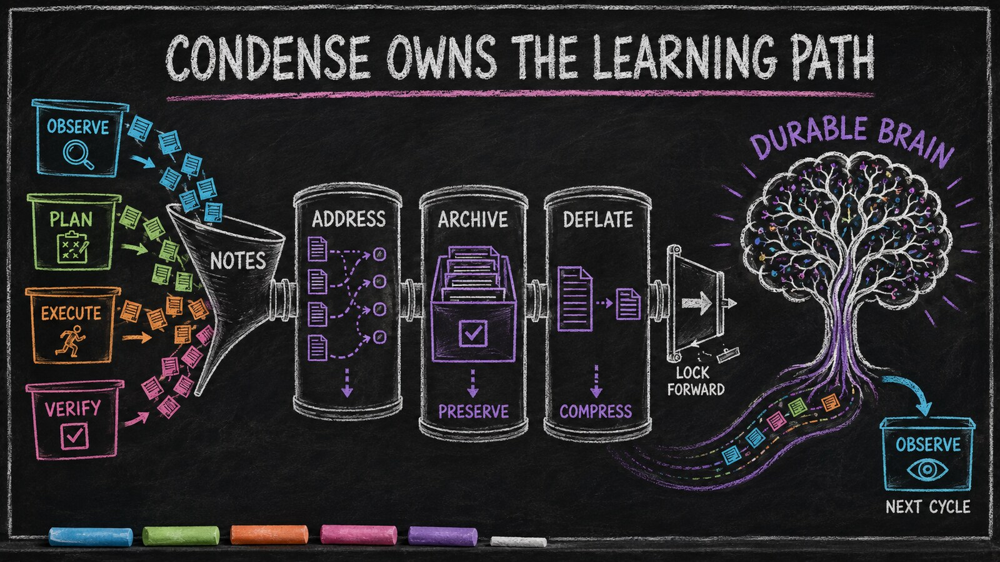

# CONDENSE — What It Uniquely Owns

*Essay 6.7b — The Markov Phasic Brain, Part 9 of 13.*

---

[Essay 6.7](06_7-condense.html) mapped the CONDENSE waterfall — the operation catalog and the three gated phases that metabolize a cycle's working memory into durable form, with the deflation gate forcing the footers to compress. This essay turns to what CONDENSE uniquely *owns* beyond the waterfall: the job graph it alone is allowed to grow, and the reflection that closes the phase and seals the cycle's learning. These ownership rules describe one historical Claude-based reference architecture; other harnesses can assign the same responsibilities differently while preserving the underlying separation of powers.

<!-- RAW_HTML -->
<figure class="blog-image" data-visual-style="I70-A30" data-information-weight="70" data-artistic-weight="30" data-visual-role="storytelling" data-visual-batch="5" style="margin: 2rem 0;">
  
  <figcaption>The work phases produce experience; CONDENSE preserves, compresses, and routes it into the brain the next cycle will recall.</figcaption>
</figure>
<!-- /RAW_HTML -->

---

## The job graph CONDENSE owns

CONDENSE is also the one phase allowed to *grow the job graph*. The other phases never call the job-creation script themselves; when they need a follow-up job, they declare intent in a `[PENDING-JOB]` note and move on. The notes sit unconsumed until CONDENSE arrives, walks them in operation three, and — after the explore-first check that decides whether each proposed job is even valid — creates the ones that survive. The additive moves (`create`, `create-dependent`, `add-dependency`) all live behind a CONDENSE-only guard, because CONDENSE is the phase with the cycle-wide context to judge what new work is actually needed. *[ref: condense-owns-additive-job-mutations | private historical prototype | Claim checked against a private historical prototype.]*

The "graph" here is concrete. A *dependency* is a directed edge `job-A → job-B` stored as a list of dependent-job IDs in the parent job's top-level `depends_on` array on the job object. `add-dependency <focused> <dep>` appends an ID; the completion gate refuses to mark a job `completed` while any ID in its `depends_on` is still in `pending` or `active`. The graph is required to be acyclic — a job cannot depend, transitively, on a job that depends on it — because cycles would deadlock the completion gate forever. CONDENSE adds edges with cycle-wide context; a different phase removes them with audit-time context. *[ref: depends-on-list-on-job-object | private historical prototype | Claim checked against a private historical prototype.]*

The removal end belongs to VERIFY — the phase that re-examines the job before it closes. While CONDENSE has cycle-wide context to decide what new work needs creating, VERIFY has audit-time context to discover that a declared dependency turned out unnecessary, and it runs *before* the cycle reaches CONDENSE-completion, so the graph gets corrected without any backward step. Each cycle, the agent reviews the dependencies still *open* — the ones in `pending` or `active`; resolved dependencies are skipped, no noise once they are done — and for each open dependency it picks one of three moves. *[ref: verify-owns-remove-dependency | private historical prototype | Claim checked against a private historical prototype.]*

- **Keep it.** The dependency is still needed. The agent does nothing; the completion gate holds the parent until the dependency finishes — usually by the agent switching focus to it, resolving it, and returning.
- **Unlink it but keep the work.** The dependency was hung on the wrong parent, but the work itself is still wanted. `remove-dependency` cuts the edge only — the child job survives, now standing on its own as ordinary work in the queue.
- **Unlink it and abandon it.** The dependency turned out to be dead work. `void-dependency` does both halves in one move: it cuts the edge *and* marks the child job **voided** — a fourth job status that means *abandoned without being completed.* A voided job is not deleted; it stays on disk so its history is there if anyone needs to look back, and it no longer counts against the agent's drive to finish all its work. *[ref: void-dependency-three-outcomes | private historical prototype | Claim checked against a private historical prototype.]*

This is one face of a larger pattern. A dependency does not just appear and vanish — it has a life. When a phase first flags a follow-up job in a `[PENDING-JOB]` note, the agent can record right there whether the *current* job depends on the proposed one — the moment that need is clearest, because CONDENSE cannot see back to it later. CONDENSE then makes the binding call when it creates the job. If a dependent is left open, the agent can switch to it from idle and come back. VERIFY reviews the open dependencies each cycle with the three moves above. And the completion gate is the hard backstop underneath all of it — a job simply cannot close while it still waits on unfinished work. *[ref: dependency-lifecycle-full-loop | private historical prototype | Claim checked against a private historical prototype.]*

One vocabulary note keeps the moves distinct. *Voiding* is not the same as CONDENSE *declining* a `[PENDING-JOB]` note — declining means no job is ever born, while voiding parks an already-born job in a terminal state. And neither is a general "delete this job" command: the system has none on purpose, because a job that should never have existed is supposed to be caught at creation, not discarded afterward. Voiding is the narrow, honest exit for legitimate work that circumstances later made unnecessary. *[ref: voided-vs-reject-no-discard-verb | private historical prototype | Claim checked against a private historical prototype.]*

<!-- RAW_HTML -->
<aside class="explore-callout" style="margin: 2rem 0; padding: 1.1rem 1.3rem; border-radius: 10px; background: linear-gradient(135deg, rgba(99,102,241,0.10), rgba(139,92,246,0.10)); border: 1px solid rgba(139,92,246,0.30); display: flex; flex-wrap: wrap; align-items: center; gap: 0.9rem; justify-content: space-between;">
  <strong>Interactive diagram.</strong> See how a job ends &mdash; the completion events CONDENSE runs, and why marking a job complete stays separate from unfocusing the phase. Each box is clickable, with the live code behind it.
  <a href="explore/completion-events.html" title="Open the interactive completion-events walkthrough" style="flex: none; display: inline-flex; align-items: center; gap: 0.32rem; padding: 0.5rem 0.9rem; font-size: 0.85rem; font-weight: 700; line-height: 1; color: #ffffff; text-decoration: none; background: linear-gradient(135deg, var(--primary, #6366f1), var(--accent, #8b5cf6)); border: 1px solid rgba(255,255,255,0.35); border-radius: 8px; box-shadow: 0 4px 16px rgba(99,102,241,0.5);">&#8599; Explore the events</a>
</aside>
<!-- /RAW_HTML -->

## A worked example

Pick up the multi-cycle plan-job from the earlier essays. VERIFY rolled the cycle backward to PLAN; PLAN re-authored the sharpened acceptance criteria; EXECUTE landed the backward-compat work alongside the marker-schema work; VERIFY ran the audit family again and this time the criteria all passed. The orchestrator advances the job to CONDENSE.

The agent enters CONDENSE. The entry voice fires and orients the phase. The condense-sensor snapshots the bottom-section word counts of every CLAUDE.md the cycle touched and stores the baseline. *[ref: condense-entry-baseline-snapshot | private historical prototype | Claim checked against a private historical prototype.]*

**Phase A — ADDRESS runs first.** The cycle's footers carry a small set of live marked notes. A `[PENDING-JOB]{audit-marker-schema-drift}` declares a follow-up job. A `[KNOWLEDGE]{marker-schema-versioning}` flags a finding worth promoting. A `[VOICE-UPDATE]{observe-entry | mention marker-schema audits | add as a research target}` asks that the OBSERVE entry voice be tightened. The agent dispatches each note's subagent, one note per dispatch, each prompt quoting its live note. *[ref: condense-five-markers-entry-voice-teaches | private historical prototype | Claim checked against a private historical prototype.]*

The condense-job-creator explores the pending note — it touches *other* plugins, the proposal is valid, no existing repeating job covers it — creates the job, and rewrites the note to `[RESOLVED:PENDING-JOB]{job <id> created}`. The condense-voice-updater finds the OBSERVE entry voice, tightens it, commits, and writes `[RESOLVED:VOICE-UPDATE]{<commit>}`. The condense-knowledge-extractor reads the surrounding paragraph, writes a new file at `.claude/knowledge/opevc/marker-schema-versioning.md`, re-reads its own write to confirm the bytes landed, and rewrites the note to `[RESOLVED:KNOWLEDGE]{knowledge/opevc/marker-schema-versioning.md}`. No note was handed back, so the agent has nothing left to carry. Every marked note is now terminal. Deletion is still locked. *[ref: condense-subagents-consume-to-terminal | private historical prototype | Claim checked against a private historical prototype.]*

**Phase B — ARCHIVE runs next.** With Phase A clear, the session-log command captures the full footers of every altered CLAUDE.md — execution notes, the backward-transition story, the resolved-note breadcrumbs, everything — into the cycle's session file in the run-aware job directory. The command verifies the capture landed. Only now does deletion unlock.

**Phase C — DEFLATE runs last.** The agent absorbs the durable findings up into each file's body, the mover routes one cross-file paragraph to the phase_condense plugin's CLAUDE.md, the archived remainder is deleted, and a single breadcrumb pointing to the session file is left in the footer. The deflation gate runs: the baseline footer-word count was 1,820; after deflation the footer holds 312 — an 83 percent reduction, clear of the eighty-percent threshold. The orchestrator commits the cycle and advances the job to idle. The next OBSERVE will open with the freshly-tightened voice, the new knowledge file in the recall path, and the new standalone job waiting in the queue. *[ref: condense-baseline-vs-current-arithmetic | private historical prototype | Claim checked against a private historical prototype.]*

The cycle's experiential data is now durable memory. The brain just learned.

## The reflection that closes the phase

Everything above is CONDENSE's operational half — the three phases, the note consumption, the deflation gate that forces the footers to compress. The phase has a second half, and it opens only at the exit. Before CONDENSE may advance, a reflection pass runs: a **promotion-scan** sweeps the whole cycle for knowledge candidates the explicit `[KNOWLEDGE]` notes missed, and returns findings for the seed to route into the rolling cycle-lessons and the Prior Summary — the running capsule of the job's cognition that seeds the next session — so the reflection carries forward across a context reset. Its answer is written into CONDENSE's slice of the cycle's compaction file — the cross-session memory introduced in [the always-on cortex](../b5/05_3-brain-guard.html).

The knowledge operation routed the findings the earlier phases flagged by hand; the promotion-scan is the second-order sweep for what no note caught — and unlike the footers, the compaction file is the one thing CONDENSE never deflates, because it carries exactly what must survive the reset. *[ref: per-phase-accrue | private historical prototype | Claim checked against a private historical prototype.]*

This is why CONDENSE is the most-gated phase of all. Like every phase its boundary opens on the three-family exit gate — and CONDENSE keeps its eighty-percent deflation gate on top, so it advances only when the footers have compressed *and* the reflection has run. And because CONDENSE consumes the cycle's notes rather than leaving new ones, the new-notes family does not apply here; what it must show instead is that its metacognition ran and judged how well it condensed — the seed's learning phase auditing its own learning. [Essay 6.2](06_2-discipline-and-map.html) maps the cycle's full transition structure across all five phases; the gate's own anatomy is the subject of the next essay. *[ref: three-family-exit-gate | private historical prototype | Claim checked against a private historical prototype.]*

The note side of the gate is where CONDENSE inverts the work phases most sharply. A work phase is measured on the notes it *creates*; CONDENSE creates none — its job is to *feed on* them. So its note gate runs the other way: per note class, the cycle must run that class's dedicated subagent as many times as there are marked notes of that class in the footers — one `condense-job-creator` run per `[PENDING-JOB]`, one `condense-voice-updater` run per `[VOICE-UPDATE]`, and so on. But running the subagent is necessary, not sufficient. The note must reach a terminal state — resolved, or explicitly carried. A run that simply concluded "I looked at it" and left the note bare no longer counts; the gate confirms the note actually landed somewhere. Carry-over stays legitimate — that is what `[CARRIED:]` is for, and it is why the twenty percent of footer content that survives a healthy deflation, and the extension cycle that re-examines unresolved work, both stay intact — but now it is explicit and counted, not silent. *[ref: condense-consumption-gate | private historical prototype | Claim checked against a private historical prototype.]*

The note classes are open, not fixed. The five generics fire in *every* job, but a particular *kind* of job can teach its own note class — declared by the job's prompt, not baked into the universal phase voices. The first such job-custom note is `[DRAFT-TERM]`: when a vocabulary-touching job meets a term the project's shared-language files do not yet define, any phase can drop a `[DRAFT-TERM]{...}` note naming the gap, and CONDENSE processes it directly — the seed deposits a flagged-draft vocabulary stub via main-session edit (no consuming subagent), for a human to confirm or correct, then resolves the note to `[RESOLVED:DRAFT-TERM]`. The five generics are the floor; a job class adds the notes its own work needs. *[ref: draft-term-job-custom-marker | private historical prototype | Claim checked against a private historical prototype.]*

## What you would customize

CONDENSE is the phase with the most opinionated default behaviors and, perhaps because of that, the richest customization surface for any architect who wants to bend the brain's metabolism to their own work.

The architect would extend the *operation catalog*. The prototype ships seven operations; the Stage-3 Distributed Job Extension pattern is the mechanism for adding more. A seed running large-scale research jobs might want an eighth operation that archives cycle artifacts into a project-specific long-term store. A seed running collaborative work might want one that broadcasts the cycle's findings to a peer agent. The three-phase order is the framework; the operations are yours, and downstream plugins append cleanly without rewriting the core. *[ref: condense-stage-3-distributed-job-extension | private historical prototype | Claim checked against a private historical prototype.]*

The architect would tune the *deflation threshold*. The prototype's eighty percent was calibrated against its own tempo. A seed running short, sharp jobs might tighten it; a seed running long-horizon strategic work might loosen it. The threshold lives in an environment-tunable variable; the gate arithmetic stays the same. *[ref: condense-threshold-env-tunable | private historical prototype | Claim checked against a private historical prototype.]*

The architect would adjust the *session-archive policy*. The prototype captures the full footer as a per-cycle snapshot — a complete raw record, large by design, the safety layer behind the discoverable knowledge. A different seed might want to archive only an unrouted remainder, or promote the archive to a first-class durable layer with its own retention policy and recall hooks. The three-phase order is the framework; the archive policy is the architect's. *[ref: condense-session-archive-customizable | private historical prototype | Claim checked against a private historical prototype.]*

The CONDENSE pattern — a cognitive metabolism organ that consolidates the cycle's experiential data through a gated three-phase sequence, preserving the footer before it deflates it — lifts off the prototype into any work where the cost of learning nothing from finished work is high. A consulting practice cultivating a delivery-engagement seed could install an eighth operation that emails each cycle's findings to the engagement lead before the cycle closes — the cognitive metabolism organ now feeds an external stakeholder. A research-lab seed could route every `[KNOWLEDGE]` note into a structured literature-review file rather than ad-hoc knowledge dirs — the same phases, a different durable destination.

The honest limit is that the deflation gate is friction, not mathematical certainty: voice coaching plus a single word-count gate, and the agent retains discretion over what distills cleanly and what gets carried. [Gmode](06_9-gmode.html) bypasses the cycle entirely, and the lock-forward-only rule makes that a deliberate operator exit rather than an accidental drift — the mechanism slows the agent enough to force the choice, not enough to make the choice physically impossible. *[ref: condense-friction-not-mathematical-certainty-principle-10 | private historical prototype | Claim checked against a private historical prototype.]*

What the architect would **not** remove is the lock-forward-only rule, nor the preserve-before-delete ordering. *[ref: condense-lock-forward-preserve-order | private historical prototype | Claim checked against a private historical prototype.]* A cognitive metabolism organ that can be backward-rolled is not a metabolism organ — it is an editing pass. A metabolism organ that deletes before it preserves is not safe — it loses what it was supposed to digest. The forward-only commitment is what makes condensation a discrete *event* in the cycle's life; the three-phase order is what makes it a *safe* one.

The deepest payoff of CONDENSE is the cognitive failure mode it prevents: the *forgetting cycle* — the seed agent that completes the work, declares victory, and starts the next cycle as cold as the previous one, having absorbed nothing from the experience. The three phases are the structural answer. ADDRESS routes each finding to a durable destination and forces every note to a terminal state. ARCHIVE preserves the whole footer before anything is lost. DEFLATE forces the compression to actually happen. The lock-forward rule means it happens *now* or the cycle does not close. The friction is the pedagogy. The phase is the metabolism.

## Where the brain grows most

CONDENSE is the phase where the soft brain grows most — the root CLAUDE.md, the plugin-level CLAUDE.md files, the coaching voices in `voice.xml`, the markdown subagent definitions, the durable knowledge files. It is not the *only* path into the memory layer: a plugin-unlocking job (PLUGIN-LOCK on an approved job) and the operator's off-cycle gmode lane both edit the substrate too. What CONDENSE owns is the *normal-cycle* path — and during the work-on-project phases, the brain is held closed: EXECUTE hard-blocks edits to the root brain so consolidation can't be smuggled into the build. CONDENSE owns consolidation, not arbitrary substrate surgery; hard plugin code stays behind the PLUGIN-LOCK/gmode/approved-job boundary from Essay 5. When an earlier phase notices a voice should change, an agent definition should tighten, or a finding should be promoted to long-term memory, it does not edit; it writes a note in its footer. The note stays unconsumed until CONDENSE arrives and routes it. This makes CONDENSE the lever by which the brain rewrites itself in the ordinary cycle — at known moments, at the end of a cycle, only after the cycle's work has been verified. *[ref: execute-blocks-root-brain-condense-only | private historical prototype | Claim checked against a private historical prototype.]*

The cycle then returns to idle. The cycle counter does not advance on this edge — CONDENSE's exit only closes the books. The bump fires on the next `idle to observe`, when the user's next prompt drives the agent to call `phase.sh advance` and the orchestrator increments `cycle += 1` as it opens the new compartment. The new cycle's OBSERVE phase reads the brain that CONDENSE just edited. The loop is closed. *[ref: cycle-bump-on-idle-to-observe | private historical prototype | Claim checked against a private historical prototype.]*

That is the cognitive organ. The work-on-project phases produce experiential data; CONDENSE turns that data into durable memory. The brain that the next cycle's OBSERVE recalls is the brain CONDENSE just shaped. Without this step the cycle would still complete the work, but the seed agent would learn nothing from doing it.

The phases give the agent compartmentalized cognition. CONDENSE is the step that lets the compartmentalization compound.

But the phases share one more mechanism we have not opened yet — the rhythm that paces work inside each phase and the reflection gate that closes it.

Next.

---

*Essay 6.7b — The Markov Phasic Brain, Part 9 of 13.*

*Previous: [Essay 6.7 — CONDENSE — The Cognitive Organ](06_7-condense.html) — the operation catalog, the three gated phases, and the deflation gate.*
*Next: [Essay 6.8 — The Rhythm of Work](06_8-inverse-multiplier.html) — the min-max rhythm, the three-family exit gate, and the floor-not-target principle.*
