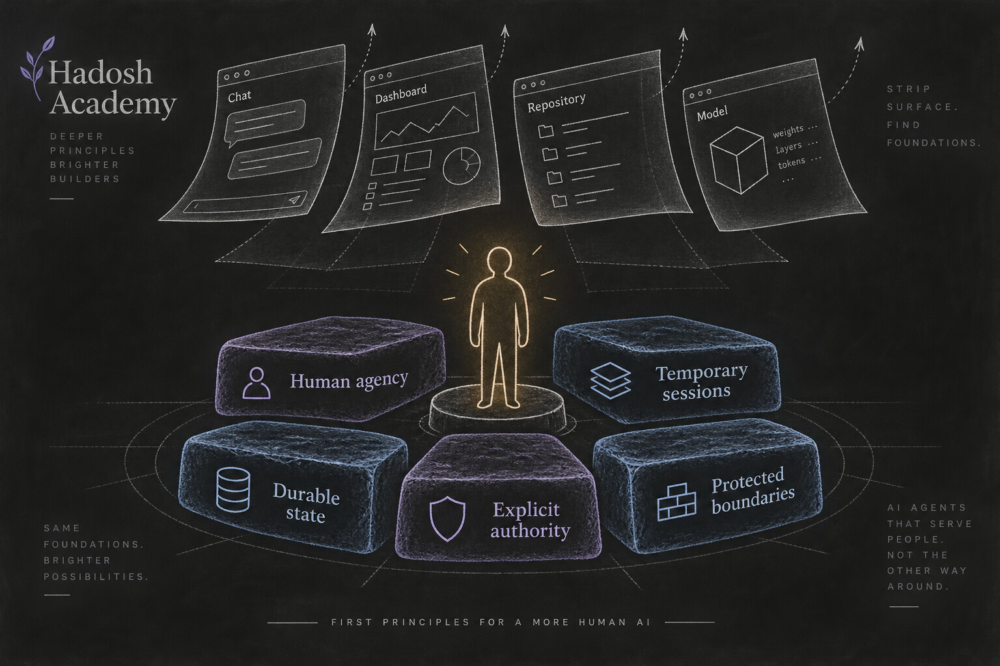
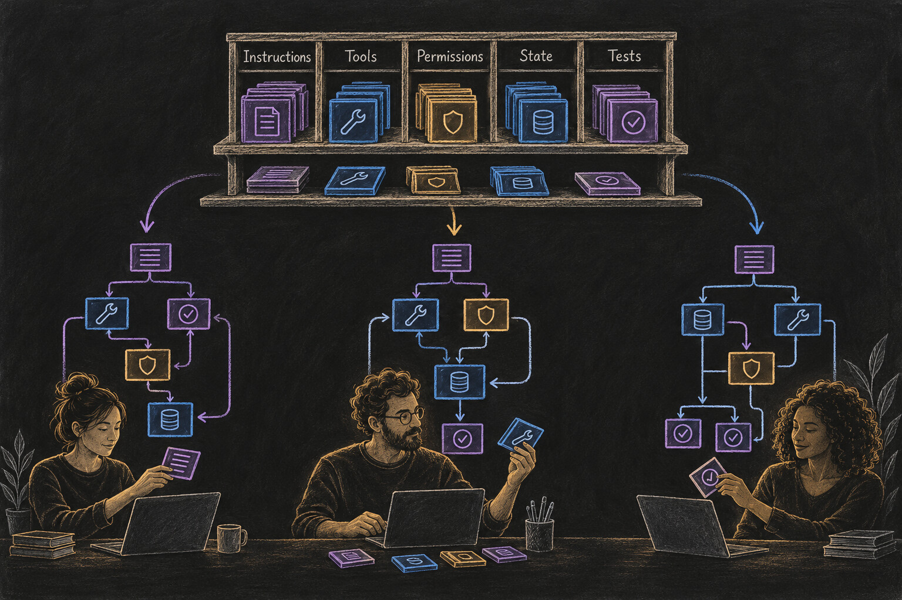
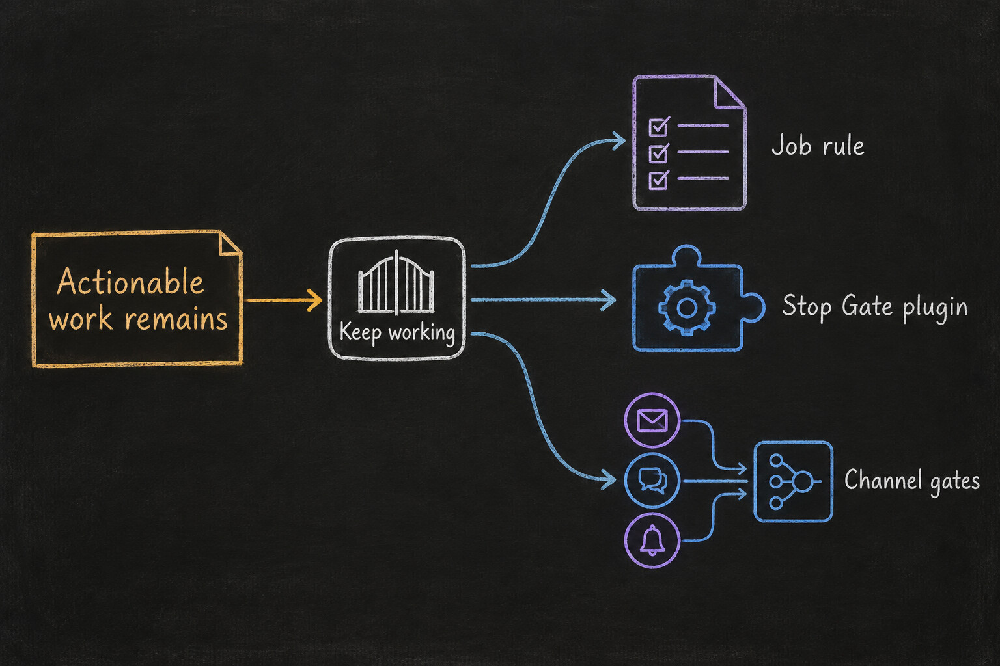
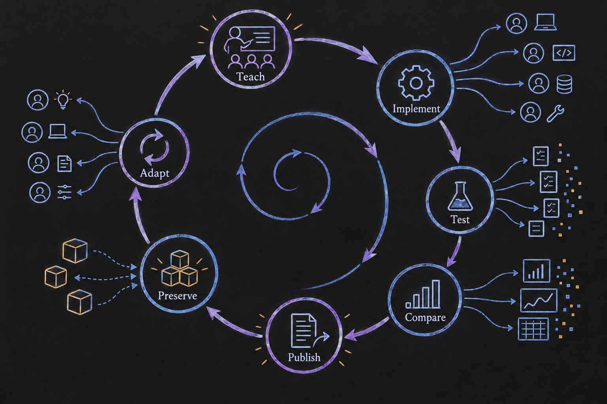

# Hadosh Academy Through First Principles

*Hadosh Through Mental Models — Lens 1*

This is the first entry in a continuing experiment: look at Hadosh Academy through one mental model at a time and see what becomes clearer.

The lenses come from the broad mental-model tradition, beginning with first-principles thinking as presented in *The Great Mental Models*. The goal is not to force Hadosh into a book summary. It is to use each lens as an instrument. A useful lens should expose assumptions, contradictions, missing parts, and new design possibilities.

The observations published here are not declarations from a finished system. They are current syntheses. Readers can challenge them. Builders can test them. Better evidence can change them. Some ideas may stabilize quickly; others may keep moving for years.

First-principles thinking is the right place to begin because it asks a severe question:

> **If we remove the products, repositories, interfaces, and terminology that happen to exist today, what must remain true for Hadosh Academy to make sense?**

<figure class="blog-image" data-visual-style="I70-A30" data-information-weight="70" data-artistic-weight="30" data-visual-role="storytelling">
  
  <figcaption>First principles begin below the current implementation: what must remain true even when models, tools, and interfaces change?</figcaption>
</figure>

---

## Start Below the Current Implementation

First-principles thinking does not begin by copying the visible form of a successful system. It breaks the subject into the most basic elements that can be defended in the situation, then reasons upward from them. Those elements are contextual rather than permanently final; as knowledge improves, the claimed foundations can be challenged too.

That distinction matters for Hadosh.

If we begin with today's implementations, we might conclude that Hadosh is a particular command-line agent, dashboard, repository layout, plugin format, model provider, or collection of instructions. Those things are real, but they are present forms—not the foundation.

Remove them and several deeper facts remain.

### The human is the objective

The purpose of the system is to expand a person's ability to think, learn, create, decide, and act. Agent autonomy can be useful, but it is instrumental and bounded. It is not the final objective.

That means important decisions must continue to return to the user. The agent can investigate, draft, implement, test, and recommend. The user decides what becomes accepted history, which capabilities are installed, what crosses a public boundary, and when the relationship should change direction.

### Model sessions are temporary

A model session can be powerful and still be replaceable. It ends. Its context window is finite. Providers, model families, prices, and capabilities change. A person's work should not disappear every time the intelligence engine or interface changes.

The durable value therefore has to live somewhere else: in files, instructions, tools, permissions, decisions, workflows, tests, history, and recoverable state that the user can keep.

### Useful work creates durable state

A conversation becomes more valuable when its result survives the conversation. A preference can become an instruction. A repeated task can become a job. A failure can become a test. A safety concern can become an enforced boundary. A successful procedure can become a reusable pattern.

The harness is where this accumulation becomes operational rather than anecdotal.

### Authority must be explicit

The ability to perform an action is different from the authority to decide that it should become final. A system that can write code does not automatically have authority to merge it. A system that can draft a public comment does not automatically have authority to post it. Capability without a legible authority boundary makes convenience indistinguishable from silent transfer of control.

### Some boundaries need deterministic enforcement

Natural-language instructions are useful, but they are not the strongest possible control. When the consequence matters, a rule may need to be represented in permissions, validation, hooks, state transitions, review requirements, or another mechanism outside the model's moment-to-moment discretion.

These five claims are more stable than any current Hadosh implementation. Together they point toward a user-owned, inspectable, portable, and recoverable harness that can grow around changing models without transferring final authority away from the person.

## A Harness Is Personal Software Made From Context

At the level an agent can consume, much of a harness is text.

Its instructions are text. Tool descriptions and schemas are text. File names, state labels, validation messages, prompts, policies, and code can all be represented as text. Runtime mechanisms still matter—the difference between a written warning and a rule the runtime actually enforces is enormous—but the architecture is largely specified through a context the system can read and execute around.

This creates a useful way to think about optimization.

Imagine one particular harness, for one person doing one kind of work in one runtime, described in one thousand words. Those exact thousand words are not a universal target. A lawyer, a biologist, a filmmaker, and a software maintainer should not receive identical systems. Even two people with the same profession will have different responsibilities, tolerances, tools, terminology, and rhythms.

But inside that particular situation, word choice and structure still matter. Some versions will produce more reliable behavior than others. One instruction may be ambiguous. Another may conflict with a permission. A state name may make sense to one user and confuse another. A validation rule may capture the real boundary, while a long paragraph merely sounds responsible.

So the design problem is not to discover one perfect thousand-word harness.

It is to help each user and their agent search for better context for their own work.

<figure class="blog-image" data-visual-style="I50-A50" data-information-weight="50" data-artistic-weight="50" data-visual-role="storytelling">
  
  <figcaption>Shared patterns enter a local design process. The resulting software is specific to the user, task, runtime, and accumulated work.</figcaption>
</figure>

This is why natural language is so important at the beginning. It lets people explore a much larger design space before every idea has hardened into a conventional software package. A behavioral objective can be described, tried, criticized, rewritten, and compared across implementations. Over time, the forms that repeatedly work can crystallize into more durable components.

The text is not a shortcut around software engineering. It is an unusually accessible material for designing software behavior.

## Share the Pattern, Not a Finished Agent

The first-principles result is not a complete Hadosh agent that everyone should install. The result is almost the opposite.

If the harness must reflect the user, then prescribing the complete harness would erase the very variation the system needs to learn from. Hadosh Academy should instead provide concepts, behavioral objectives, design patterns, examples, and sparse building blocks that a user's agent can understand and adapt.

The modularity begins at the backbone.

Each meaningful behavior can become a component the user deliberately selects. A component may be independent or may declare a real dependency on another. Several components may later form a coherent collection. But the user should be able to understand what behavior is being added, what authority it requires, what state it owns, and what happens when it is removed.

Consider one behavioral objective: an agent should not stop while actionable work remains.

That objective does not dictate one implementation. In a simple harness it may live inside a job definition. In another it may become a dedicated Stop Gate plugin. In a multi-channel harness, each channel may expose its own continuation state and a small coordinator may compose them. The stable element is the behavior being protected; the implementation belongs to the local architecture.

<figure class="blog-image" data-visual-style="I90-A10" data-information-weight="90" data-artistic-weight="10" data-visual-role="storytelling">
  
  <figcaption>A transferable behavior is not the same thing as a universal implementation.</figcaption>
</figure>

This also explains the roles of the public projects.

[Origin](../../../projects/origin.html) is a concrete single-user harness where patterns can be experienced in a working system. [Seed Agent](../../../projects/seed-agent.html) and [Q-Seed](../../../projects/q-seed.html) are deliberately sparse, framework-specific places where reusable patterns can accumulate. They are not three stages of one required product and they are not templates that every user must mechanically copy.

A released plugin should therefore arrive with an invitation to reinterpret it. Preserve the behavioral objective and its evidence. Then implement it in harmony with the local harness: its vocabulary, function names, state model, permissions, and existing components.

That variation has another possible benefit. A monoculture gives an attacker a repeated surface: identical names, identical assumptions, identical injection targets. Diverse local implementations can make one exploit harder to scale across many harnesses. This is only a defensive advantage, not a security guarantee. Terminology changes do not replace least privilege, validation, isolation, review, or deterministic enforcement. But avoiding unnecessary sameness can reduce correlated failure.

## Patterns Crystallize Through Use

A plugin should not exist merely because an idea can be named.

The healthier sequence begins with a behavior that people can understand. Different users and agents attempt it in their own contexts. The implementations are tested through real work. Failures and tradeoffs become visible. The Academy compares what happened and explains the lesson. Only then do sufficiently repeated and well-understood structures crystallize into reusable components.

This creates a production and education loop:

1. **Teach** the behavior and why it matters.
2. **Implement** it in a framework-appropriate form.
3. **Test** it through real use and explicit evidence.
4. **Compare** independent implementations and failures.
5. **Publish** the more general lesson.
6. **Preserve** a reusable component when the pattern has earned one.
7. **Adapt** it into new personal harnesses, creating the next round of evidence.

<figure class="blog-image" data-visual-style="I70-A30" data-information-weight="70" data-artistic-weight="30" data-visual-role="storytelling">
  
  <figcaption>Education and production are one loop: practice produces evidence, evidence improves the teaching, and mature lessons become reusable without becoming compulsory.</figcaption>
</figure>

This is the line connecting the Academy, Origin, Seed Agent, and Q-Seed. The writing is not marketing added after software production. It helps define the behavior before implementation and interpret the evidence afterward. The implementation is not merely an example attached to the lesson. It is one of the instruments used to test whether the lesson survives contact with work.

The same line can continue through the most basic behaviors introduced in Harness 101. A behavior is taught, tried in Origin or a Seed lineage when appropriate, tested, and then revisited publicly. Once the current Stop Gate work and Origin's two engagement plugins have been tested and accepted, they can support their own companion posts. Later stop-related patterns can be adapted into Origin, Q-Seed, or Seed Agent according to each framework rather than copied as identical code.

## Contributions Can Become a Behavior Too

The loop needs a way for experience to return.

Today, a reader can comment on an article or report an issue in a related project. In the future, an optional contribution-review plugin could make an agent's participation more structured. With the user's explicit permission, the agent could prepare a correction, field observation, bug report, or implementation note for the relevant public surface. Before anything is posted, the plugin could require a defined structure, strip private material, verify the destination, show the exact proposed text to the user, and reject submissions that do not meet the local contract.

That would be one plugin: one selectable behavior, with explicit authority and a narrow purpose. A user who wants their agent to participate could add it. Another user could decline. Different Academy surfaces could publish different contribution schemas without forcing one global commenting system into every harness.

This remains a proposal, not an existing guarantee. Its value here is illustrative: even participation in the ecosystem can be decomposed into an understandable behavior rather than hidden inside a complete agent.

## Hadosh Academy Is Also a Context

The first-principles lens applies recursively.

Hadosh Academy is itself a body of context intended for humans and agents. Its [Start Here](../../../start-here.html) page, concepts, examples, project boundaries, contribution rules, and links influence what a visiting agent understands and what it helps its user build.

That context has better and worse possible forms.

There may be a form of the Academy that lets an agent orient a new user with unusually little confusion: it distinguishes the model from the harness, preserves the user's authority, keeps private work private, explains how patterns should be adapted, and helps the person begin with a useful local change. We do not yet know that form. The website is part of the same search process as the harnesses it teaches.

That is why publication is not finality.

An article can be coherent enough to publish and still remain open to revision. Comments are proposals, not automatic truth. New implementations provide evidence, not commands. Hadi's review and explicit approval determine what becomes accepted public context. Version history preserves how the context changed and why.

Some passages may find a stable position quickly. Others may keep changing as models, runtimes, and practices evolve. The objective is not endless motion. It is an increasingly useful context whose claims stabilize in proportion to the evidence behind them.

## What First Principles Exposes

Looking at Hadosh Academy through this lens produces a connected set of conclusions:

- The objective is increased human agency, not autonomous activity for its own sake.
- Models can remain temporary and replaceable; the user's accumulated capability should persist.
- Durable work belongs in an inspectable, portable, recoverable harness under user control.
- The complete harness must be personal because work, terminology, authority, and risk are personal.
- Natural language makes the early architecture accessible to exploration, while deterministic mechanisms enforce the boundaries that matter most.
- Reusable behaviors should be shared as patterns and modular components, not imposed as one complete agent.
- Independent implementations create evidence; repeated evidence lets some patterns crystallize.
- The Academy, its projects, and its contributors form one learning loop.
- The Academy itself must evolve as a reviewed public context.

None of these conclusions specifies the one architecture everyone should build. Together, they define the conditions under which many distinct architectures can grow without losing the person at their center.

## Use the Lens Yourself

To apply the same technique to another topic, begin with five questions:

1. What visible implementation am I accidentally treating as inevitable?
2. If I remove today's tools and terminology, what facts still constrain the problem?
3. Which claims are observations, which are assumptions, and which are merely conventions?
4. What different designs become possible when I rebuild from the remaining constraints?
5. What evidence would make me revise the supposed foundations?

The fifth question keeps first principles from becoming dogma. A foundation is useful because it survives serious challenge—not because we wrote it near the bottom of a diagram.

This series will keep applying other lenses to Hadosh Academy over time. Each one should preserve the whole system in view while changing the angle of inspection. If the lens only repeats what we already believe, it has not done enough work.

---

### Sources and paths to continue

- [First-principles thinking](https://fs.blog/first-principles/) — Farnam Street's explanation of breaking a problem into contextual irreducible elements and rebuilding from them.
- [The Great Mental Models](https://fs.blog/tgmm/) — the wider collection that motivates this lens-by-lens experiment.
- [The AI That Grows With You](../../principles/the-ai-that-grows-with-you.html) — why the personal harness should remain a user-owned asset.
- [The Language of Agents](../../b4/04-the-language-of-agents.html) — the working vocabulary of model, harness, tools, permissions, jobs, and verification.
- [The Seed Is Yours](../../b8/08_9-the-seed-is-yours.html) — how shared anatomy becomes a distinct harness under each user's direction.
