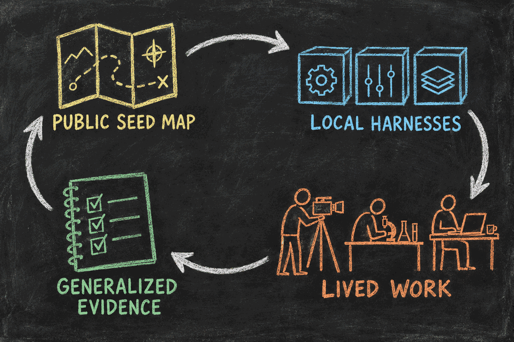

# Hadosh Academy Through “The Map Is Not the Territory”

*Hadosh Through Mental Models — Lens 2*

This essay uses one mental model—**the map is not the territory**—to examine what Hadosh Academy is building and how we should judge whether it works.

The technique is simple. We take a familiar distinction, apply it to a real system, and follow it until it clarifies a decision or exposes a mistake. Here, the “map” begins as the Academy’s public guidance. We will follow that guidance into one person’s working harness, watch it meet the complications of lived work, and then ask what evidence should travel back to improve the public guidance.

That gives us a complete story: a map, a journey through real territory, and a correction that makes the next map more useful.

<figure class="blog-image">

<figcaption>The public map guides local construction. Distinct lived territories produce the evidence that corrects the map.</figcaption>
</figure>

## The Starting Map

A map can show a route before anyone walks it. It can name boundaries, preserve lessons from earlier journeys, and make an unfamiliar space easier to enter. It cannot tell us exactly what will happen on the ground.

Hadosh Academy is building this kind of public map for user-owned agent harnesses: concepts, design principles, examples, and agent-readable context for the software layer around replaceable models. Its purpose is not to prescribe one final system. It is to help a person and an agent begin with better questions.

What context should survive a model session? Which actions may proceed automatically? Where must human authority remain visible? How should corrections change future work? What happens when the model provider changes?

The Academy can explain why these questions matter and offer tested patterns for answering them. But public guidance remains a map until someone uses it around a real responsibility.

That creates the basic loop:

> public seed map → local harnesses → lived work → generalized evidence → improved public map

The rest of the essay follows that loop.

Because the map is cumulative, a correction does not belong only to the newest page. A later lens, comment, or implementation may reveal that an earlier article, diagram, instruction, or feature should change. When the evidence is strong enough, the Academy should revise every affected map and preserve how it changed.

## A Filmmaker Enters the Territory

Consider an independent filmmaker preparing a trailer.

The work is not one prompt. It includes reviewing footage, finding emotional beats, tracking music rights, generating candidate cuts, collecting feedback, remembering rejected directions, and coordinating collaborators. Interruptions are common. Decisions made on Monday still matter on Friday.

Trailer making includes creative judgment, but it also contains a bounded analytical search. The filmmaker can define a local objective: find emotionally useful excerpts, build curiosity, avoid revealing too much, preserve the intended arc, and respect release boundaries. A local harness might generate and annotate many short candidates, assemble alternative trailer-length sequences, compare them against those criteria, and remember why directions were rejected.

At the end of each work cycle, accepted corrections can improve the next one instead of disappearing into a conversation. The filmmaker may help form the procedure once, then keep correcting its criteria as the work develops. The point is not this particular pipeline. It is that selected cognition can become an inspectable, repeatable, locally improving responsibility while the person retains creative and release authority.

The filmmaker and an agent use Academy principles to build whatever local form fits that work. It may preserve the film thesis, scene inventory, decision history, audience assumptions, review criteria, and authority boundaries. The actual tools, state names, components, and decomposition belong to the filmmaker’s environment rather than to one universal Academy implementation.

Relative to the Academy’s general guidance, this working harness is territory. Abstract ideas have become actual files, permissions, tools, states, and routines.

But the comparison changes when we look at the filmmaker’s lived work. Relative to that work, the harness is another map.

A stored preference is not the person. A dashboard status is not the project. The system can report that the trailer is “complete” while an unresolved music-rights question still prevents release. The harness can preserve a mistaken assumption perfectly. It can make work more legible without making the work correct.

This is the central lesson: **map and territory are roles, not permanent labels**. The same harness can be territory compared with public theory and a map compared with human experience.

## What Changes Through the Journey

Suppose the rights problem is found during review. The filmmaker corrects the project state, adds a protected approval boundary, and records why “edited” and “releasable” are different statuses.

That correction has three effects.

First, it improves the current trailer. The immediate state now matches reality.

Second, it improves the local harness. Future projects will not treat a finished cut as publication-ready while rights remain unresolved. Other accepted lessons—how excerpts are annotated, which reveals weaken mystery, and which comparisons are useful—can also be condensed into later trailer jobs rather than rediscovered.

Third, it may reveal a reusable pattern: completion states should represent the real authority and evidence required by the responsibility, not merely the last successful software action.

The filmmaker has not transferred authorship. Selected analytical operations have become durable, user-governed capabilities. Offloading that repeatable search can leave more time for the filmmaking work the person values, while the person can still resume, inspect, correct, and redirect the process.

That is **cognitive operability**: the ability to direct, inspect, correct, and retain complex cognitive work through an owned system.

An **independent operator** is a person who can carry more complex responsibilities through such a system while keeping judgment and authority legible.

## Evidence Must Grow With the Claim

One successful trailer does not prove a universal design. It does, however, produce better evidence than a diagram alone.

The evidence becomes stronger step by step:

1. **Attention:** people encounter the writing, repository, or example.
2. **Local build:** someone creates a harness influenced by the map.
3. **Repeated use:** it supports the same responsibility across sessions and interruptions.
4. **Retained correction:** feedback changes later behavior instead of disappearing into one conversation.
5. **Verified improvement:** the responsibility becomes easier to resume, safer, more reliable, or more capable.
6. **Expanded independence:** the user can operate more complex work while retaining understanding, correction, authority, and portability.
7. **Transferable learning:** different implementations reveal a pattern that improves the public map without exposing private work.

Repository counts, dashboard activity, and successful automation runs are useful signals. They do not prove the final outcome. Verification must match the capability being claimed.

This is also why many distinct local harnesses matter. A filmmaker, scientist, teacher, and small-business owner will make different choices because their evidence, risks, collaborators, privacy needs, and definitions of completion differ. Most decisions should remain local. Some reveal patterns that transfer. Others show where a shared abstraction fails.

The Academy improves by comparing those differences, not by forcing them into one universal implementation.

## Private Territory, Public Learning

The correction does not require the filmmaker to expose the footage, client conversations, contracts, private feedback, or full interaction history.

What can travel upward is the generalized lesson: a workflow’s completion state must include the unresolved authority and evidence that still govern the real outcome.

Other useful lessons may take the same form. A permission boundary prevented an inappropriate action. A retained correction stopped a repeated error. A model change preserved the user’s operating layer. An interface reduced supervision without hiding authority.

These lessons should remain provisional until comparison across different systems supports them. The public map improves through selective abstraction, not extraction of private territory.

Not every contribution is ready to become stable context. A comment begins as a proposal. It may correct wording immediately, remain an open question, or require comparison across several cases. We do not yet know the best general mechanism for moving every kind of comment into the Academy's more stable layers. Until enough experience reveals it, that mechanism should remain an explicit open design question rather than a fictional finished process.

## Where the Story Can Lead

If this loop works repeatedly, the future of work may contain more independent operators.

A professional could maintain several project worlds—employment, research, a creative practice, a small business, or a community initiative. Each could have its own harness, permissions, collaborators, and retained state while selectively sharing useful personal foundations.

The person would accumulate repeatable ways to investigate, decide, produce, verify, recover, and collaborate. Models could improve or be replaced without erasing the whole structure.

This outcome is not inevitable. A harness can become opaque, over-automated, difficult to maintain, or dependent on one provider. The test is whether the person gains practical capability while preserving comprehension, intervention, portability, and freedom to change direction.

## The Return to the Map

We began with public guidance, followed it into a filmmaker’s working harness, and watched a real rights problem correct both the project and the system around it. The journey now returns to the Academy with a stronger pattern than the one it started with.

That is what “the map is not the territory” contributes here. It is not a warning to distrust every abstraction. It is a method for keeping abstractions accountable.

Hadosh Academy earns its value when its public map helps people enter new territory, build systems that belong to them, discover what the map missed, and return with evidence that improves the next journey.

That return can revise this article, Lens 1, a diagram, a project explanation, or a future component. Publication makes a map available for use. It does not make the map terminal.

## Use the Lens Yourself

Apply this lens to any agentic system with five questions:

1. Which map–territory relationship am I examining right now?
2. What has been locally constructed rather than merely described?
3. What repeated work shows that capability was actually retained?
4. Has the person gained operability while preserving authority and correction?
5. What can improve this or an earlier public map without exposing private territory?

The map is useful because it can change. The territory gives it something real to learn from.

---

### Sources and paths to continue

- [The Great Mental Models](https://fs.blog/tgmm/) — the wider mental-model tradition motivating this lens-by-lens experiment.
- [Start Here](../../../start-here.html) — the human path from architectural choice to a user-owned, compounding harness.
- [The Dashboard and the Harness Are One System](../../b9/09_1-dashboard-and-harness.html) — how visible state and operational structure remain connected.
- [The Seed Is Yours](../../b8/08_9-the-seed-is-yours.html) — why shared anatomy should produce distinct user-owned organisms.
- [Lens 1: First Principles](01-first-principles.html) — the foundations this second lens now tests against lived operation.
