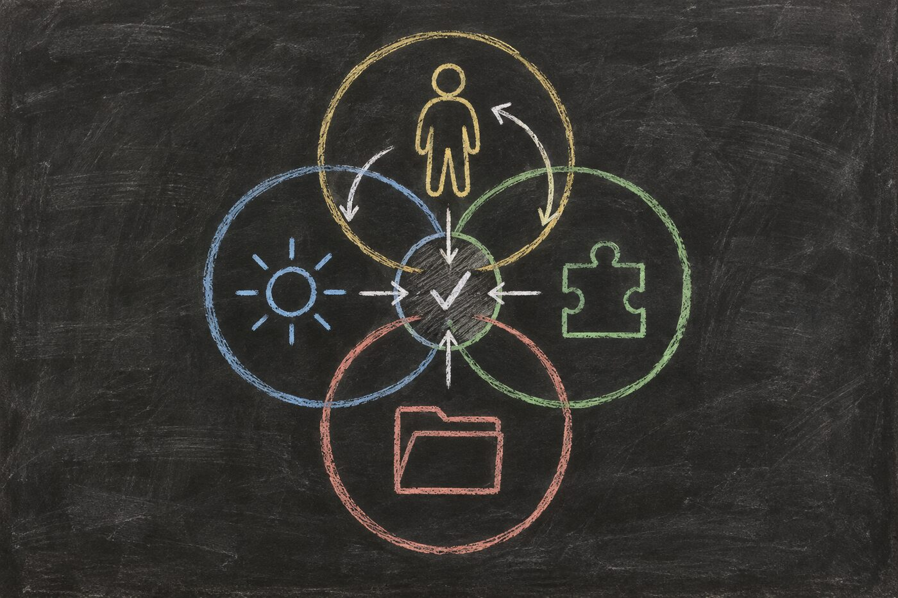

# Hadosh Academy Through “Circle of Competence”

*Hadosh Through Mental Models — Lens 3*

A model can discuss chemistry, law, software, filmmaking, and medicine in the same confident voice. That range makes it easy to confuse fluency with reliable responsibility.

The **circle of competence** offers a different question:

> Which part of this system has demonstrated enough competence for this responsibility, under these conditions, with this authority?

This essay uses that question to examine a user-owned harness. The goal is not to make one model responsible for everything. It is to make responsibility, evidence, uncertainty, and the route back to the person visible.

<figure class="blog-image" data-visual-style="I90-A10" data-information-weight="90" data-artistic-weight="10" data-visual-role="storytelling">

<figcaption>Competence can overlap without becoming unlimited. The shared responsibility still needs evidence, checks, and a route out.</figcaption>
</figure>

## The Original Boundary

Warren Buffett used the phrase in Berkshire Hathaway’s 1996 shareholder letter while discussing selected businesses an investor could evaluate. The important point was not to make the circle large. It was to know its boundary.

This article adapts that idea to agentic systems. It does not claim that an investment maxim supplied an architecture for models, plugins, or harnesses. It preserves two useful moves: select the responsibility, and make the edge visible.

That changes the usual comparison. We do not begin by asking which model is smartest. We ask what the current responsibility requires, what evidence supports the assignment, what consequence follows, and what happens when the evidence runs out.

## The Model Is Not the Whole Decision-Maker

A model may propose an answer. That does not prove the answer is true, authorize an effect, or show that the work has been completed.

A harness can make those differences explicit. It can assemble context, route the work, constrain tools, require checks, preserve state, and stop before a protected action. The person can decide which responsibilities may proceed and which must return to them.

Competence therefore becomes an operational boundary rather than a personality judgment.

The boundary belongs to a responsibility under conditions. It does not permanently label a model, plugin, harness, or human as competent or incompetent.

## Four Circles Can Overlap

A working agentic system may contain several circles:

1. **The person’s circle** includes lived goals, values, private context, risk tolerance, and decisions only that person can own.
2. **A model’s circle** includes the kinds of inference it performs reliably enough under the supplied context and evaluation.
3. **A plugin’s circle** includes the bounded behavior, state, interfaces, and tests it was designed to own.
4. **The harness’s circle** includes the routing, context assembly, permissions, verification, recovery, and durable state made explicit around model capability.

These circles are not identical, and none is universal.

A domain model may supply a chemist’s perspective without receiving permission to publish a result. A decision model may return a typed judgment without owning the policy applied to it. A plugin may validate a schema without knowing whether the content is true. A harness may preserve a claim perfectly without making that claim correct.

The value comes from the interfaces between the circles.

## Responsibility Makes Learning Possible

A circle of competence is also a map of responsibility. Every cognitive step needs an owner: a person, model, plugin, harness mechanism, or deterministic program responsible for producing that part of the work.

Without that assignment, success and failure dissolve into “the agent did well” or “the agent failed.” The system cannot tell which part of its cognition should change.

A user-owned harness can preserve the assignment together with the result, the conditions, the check, and any correction. Repeated work then creates usable evidence. The harness can compare whether the assigned circle is becoming more reliable, whether it needs another check, or whether the responsibility should move.

Competence is therefore a proxy for responsibility, and responsibility gives improvement a target. The system can optimize one cognitive step from experience instead of treating the whole agent as one undifferentiated intelligence.

## A Boundary in Practice

Imagine an agent evaluating a public communication experiment.

It can retrieve the public posts, count roots and replies, inspect accessibility, compare exact copy, and prepare a measured test. Those responsibilities sit inside a demonstrated circle when the retrieval is complete and the calculations are reproducible.

But public data may not reveal impressions, profile visits, link clicks, or which post produced a follow. Guessing those fields would not extend competence. It would hide the boundary.

A healthy harness records the evidence limit, requests the smallest account-only input from the user, and resumes when that evidence arrives. The model did not fail because it stopped. The system acted competently because it knew which responsibility could not proceed honestly.

The same distinction appears in technical work. A model can help diagnose why an event-triggered workflow failed, but an explicit event schema and regression test should verify that every consumed field is supplied. Fluency can help find the contract. It cannot substitute for satisfying it.

## Competence Is Conditional

Reliability changes with the task, context, consequence, and evidence.

A model may summarize a public article reliably but be unsuitable for deciding whether private client material can be disclosed. A human expert may understand the domain but still need a deterministic check for a large repetitive dataset. A component that worked last month may cross its boundary after its environment changes.

A useful competence record therefore names:

- the responsibility;
- the evidence supporting the assignment;
- the conditions under which it applies;
- the checks required before acceptance;
- the authority the participant does and does not hold;
- the failure or uncertainty signal; and
- the route used when the boundary is crossed.

The record remains revisable. A circle can expand after repeated verified performance. It can contract after failure, stale evidence, environmental change, or a higher-consequence use.

## A Competent Route Includes an Exit

Multi-model architecture is useful only when routing follows responsibility.

A harness may route one step to a harness-operating model, another to a domain model, a bounded branch to a decision model, and synthesis to a general model. These are roles, not required products. One model may fill several roles. Several providers may fill one role. Deterministic software may replace a model where inference is unnecessary.

The important question is not how many models exist. It is whether the system can explain why a responsibility went to a capability and what happens when confidence is insufficient.

- **Proceed** when evidence and consequence support autonomous execution.
- **Verify** when the output is useful but acceptance needs another check.
- **Compare** when independent perspectives can expose error.
- **Escalate** when human judgment, private evidence, or protected authority is required.
- **Abstain** when the system lacks adequate capability or context.

Stopping is not failure. It is one expression of competence.

Escalation should not become ceremonial approval. If a deterministic check can answer the question safely, the system should run it. A person’s attention is reserved for the judgment, evidence, or authority that cannot be supplied honestly another way.

## What the First Two Lenses Contribute

**First Principles** asks what function the system must perform.

**The Map Is Not the Territory** asks how the resulting representation remains corrigible against lived evidence.

**Circle of Competence** asks who or what should own each responsibility, under which evidence and exit conditions.

Together, the three lenses form a sequence:

1. identify the function;
2. keep its map revisable; and
3. assign the responsibility to a bounded capability with an exit.

The third lens does not replace the first two. It turns their results into routing decisions.

## The Hadosh Direction

Hadosh Academy does not need one universal model capable of every responsibility.

It can help people build harnesses that make competence, routing, authority, and uncertainty visible. Some systems will use one model. Others will use specialized models, deterministic programs, human experts, or mixtures that change over time.

The goal is not maximal delegation.

The goal is selective externalization of human agency into structures the user can inspect, correct, recover, and continue to govern.

A system becomes more capable not merely when it can do more, but when it knows more clearly what it should do, what it should verify, and what it must return to the human.

## Use the Lens Yourself

Apply the lens to one real responsibility:

1. What result is required, and what is the consequence of being wrong?
2. Which person, model, plugin, harness mechanism, or deterministic program has evidence for this part?
3. What conditions make that evidence applicable now?
4. Which check separates a useful proposal from an accepted result?
5. What signal should trigger comparison, escalation, or abstention?
6. Who retains authority over the final effect?
7. What result and correction will return to the responsible circle so the next attempt can improve?

A circle of competence is useful only if its boundary changes behavior.

---

### Sources and paths to continue

- [Berkshire Hathaway’s 1996 Chairman’s Letter](https://www.berkshirehathaway.com/letters/1996.html) — the investment context in which Buffett emphasized selected businesses and knowing the boundary of one’s circle.
- [NIST AI Resource Center](https://airc.nist.gov/) — testing, evaluation, verification, and validation resources for making AI claims inspectable.
- [Lens 1: First Principles](01-first-principles.html) — how the Academy decomposes inherited forms into functions and constraints.
- [Lens 2: The Map Is Not the Territory](02-map-is-not-territory.html) — how lived evidence must keep correcting the map.
- [The Language of Agents](../../b4/04-the-language-of-agents.html) — the working vocabulary of model, harness, agent, tools, authority, and verification.
