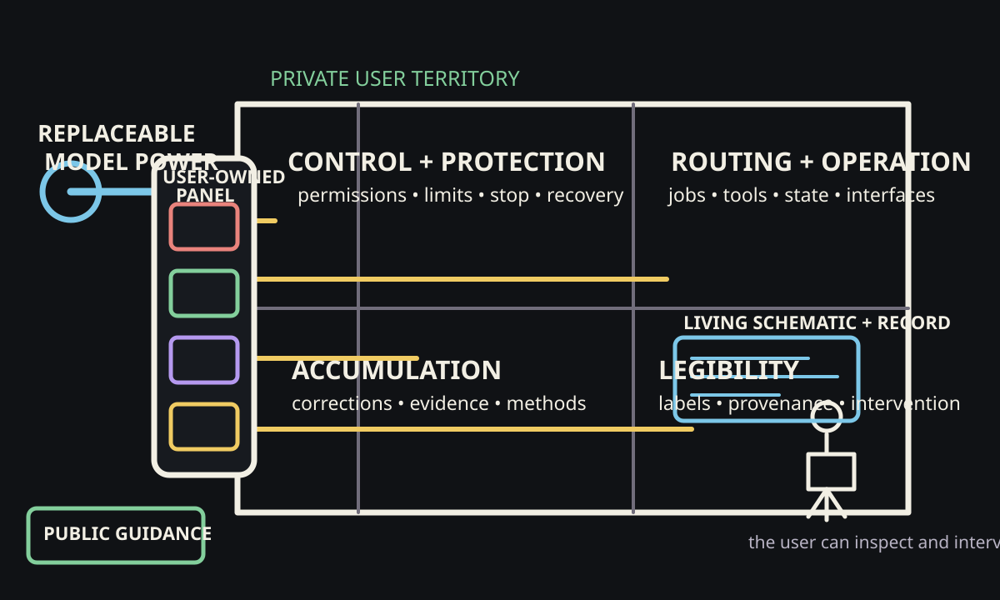

# The Harness Is User-Owned Infrastructure

Power is useful only when a structure makes it usable.

Electricity arriving at a building does not decide where it should go, which room may use it, how much load is safe, or how a person can interrupt it. The building needs a service entrance, a panel, protected circuits, switches, meters, labels, and a history of inspection and repair.

Model capability has a similar problem. A powerful model can reason, generate, compare, and act through tools. But capability alone does not define the user's responsibilities, preserve the right context, constrain authority, verify outcomes, or make the growing system understandable.

That surrounding structure is the harness.

The electrical analogy is useful, but only if we do not stop at insulation. Safety matters. So do operation, retained learning, and the user's ability to understand and direct the system. A mature harness is the evolving, user-owned infrastructure that makes model capability useful, bounded, inspectable, and cumulative.

## The Exposed Wire Is Only the First Problem

Connect a capable model directly to private data, accounts, tools, and public surfaces, and the danger is obvious. The system may have more reach than it has judgment. A vague instruction can become a consequential action. A mistaken inference can cross a privacy boundary. A temporary objective can be treated as durable authority.

Permissions, sandboxing, approval gates, and revocation are the insulation and breakers of an agentic system. They prevent capability from reaching every surface merely because it can.

But a fully insulated building with no useful circuits is not a functioning building. Protection answers where power must not go. It does not yet explain how capability becomes reliable work, how one responsibility continues across interruptions, how corrections change future behavior, or how the user knows what the system is doing.

The harness needs four connected functions.

## 1. Control and Protection

The first function is to define authority.

Which repositories may an agent read? Which files may it change? Which messages may it draft but not send? Which actions require review? What happens when evidence is incomplete? How can the user interrupt, revoke, or recover?

These boundaries should not live only in the model's momentary interpretation. They need durable expression in permissions, repository rules, job states, validation, approval surfaces, and recovery paths.

A breaker does not prove that every appliance is safe. It limits how far a failure can propagate. Harness controls work the same way. They cannot make every model output correct, but they can keep uncertainty from silently becoming unlimited authority.

## 2. Routing and Operation

General capability becomes useful through explicit responsibility paths.

A recurring job has an objective, current state, evidence, tools, authority, next action, and definition of done. The harness routes model capability through that structure. It tells the agent what work exists, what context matters, where the output belongs, what may change, what must be verified, and when the user is needed.

Think of these paths as circuits. One circuit may support a research responsibility. Another may maintain a website. Another may prepare outreach without sending it. Another may monitor reliability and repair bounded defects.

The point is not to turn every activity into bureaucracy. It is to keep responsibilities separate enough that they can be resumed, inspected, and changed without rewiring the entire system.

This also explains why the model and the harness are different assets. The model supplies general intelligence. The harness supplies the local operating structure that makes that intelligence specific to the user's work.

## 3. Accumulation and Adaptation

Useful work should change future work.

Every meaningful job can produce two outputs. The first is the object needed now: an article, decision, analysis, design, message, test, or code change. The second is context: a correction, accepted term, verified method, boundary, source, failure pattern, or unresolved question that should affect later behavior.

A transcript is not automatically this second output. Storing every utterance can preserve noise as easily as knowledge. Accumulation requires selection.

The harness must decide what belongs in the current job, what should become reusable guidance, what changes the owning implementation, what remains provisional, and what must stay private. In Hadosh Academy, this is the role of Condense: experience is inspected and routed into the narrowest durable place that should govern later work.

The electrical analogy shifts here. Electricity does not learn, and wires do not accumulate understanding. The closer mappings are the living schematic, panel labels, inspection record, maintenance history, and renovation. They preserve what has been learned about the building and make later changes safer.

The same principle applies to a harness. A user correction should not disappear after one session. A failed verification should change the next workflow. A repeated authority mistake should strengthen the control. A useful method should become easier to reuse without exposing the private work that produced it.

## 4. Legibility and Governance

Infrastructure must remain understandable to the person who owns it.

An unlabeled electrical panel may technically control a building, but it leaves the occupant guessing which switch affects which room. An agentic system can fail in the same way. It may have permissions, memory, and automation while giving the user no coherent picture of responsibilities, evidence, dependencies, or intervention points.

Legibility is not cosmetic. It is part of authority.

The user needs to see what responsibility is active, what state is claimed, what evidence supports it, what the agent may do, what requires human judgment, and what will happen next. Important status should lead back to artifacts and checks rather than merely presenting a polished dashboard.

Shared understanding does not sit inside the harness like one more software component. It is a relationship between the person and the system. The harness supports that relationship through clear labels, provenance, explanations, correction paths, and interaction surfaces. Conversation can therefore be infrastructure work: it can refine the objective, reveal a hidden boundary, correct the architecture, and improve the user's own model of the system.

## One Responsibility Through the Infrastructure

Consider a recurring outreach responsibility.

The protection layer says that no message may be sent without explicit authority and that private research cannot be copied into public text. The operational layer routes work from recipient research to a bounded packet, review, and send decision. The accumulation layer preserves verified routes, recipient history, response evidence, and lessons that improve future packets. The governance layer shows the user the exact recipient, ask, risk, evidence, and action waiting for approval.

The immediate output may be one email. The durable result is larger: the user now owns a better, safer way to carry this responsibility again.

This pattern applies beyond outreach. A research harness can preserve evidence standards and unresolved claims. A production harness can retain creative decisions and rights boundaries. A reliability harness can remember recurring defects and strengthen controls after failures. Each bounded circuit uses shared infrastructure without collapsing every project into one giant assistant.

## Public Code, Private Premises

Infrastructure patterns can be shared without sharing the building's private floor plan.

Public guidance can explain how to represent authority, structure a continuing job, preserve provenance, verify a result, or recover after failure. Reusable code can implement capability checks, state transitions, or evidence links. Those patterns become stronger when they are tested across different local systems.

The user's actual context remains different. It may contain private relationships, unfinished work, client information, personal history, account access, and judgments that should never become public training material or a centralized institutional asset.

This is why Hadosh Academy should publish principles and reusable building blocks while each person's harness remains locally governed. Shared knowledge is the code. The exact wiring plan, room contents, operating history, and keys remain with the owner.

## Where the Analogy Stops

The metaphor reveals structure; it does not establish equivalence.

- Electricity does not interpret, reason, or infer. Models do.
- Electrical behavior is comparatively deterministic. Model behavior is probabilistic and context-sensitive.
- Wires do not accumulate understanding. Records, configurations, corrections, and human learning are the closer comparison.
- A breaker can limit a circuit. It cannot decide whether a conclusion is wise or an explanation is honest.
- More power is not automatically better. The objective is expanded human agency under understandable authority.
- A building has one physical wiring plan. User-owned harnesses should remain plural and adaptable to different people, risks, tools, and purposes.

The analogy has done its work when it helps us ask better architectural questions. It becomes harmful when it makes an intelligent, interpretive system look mechanically predictable.

## What Ownership Means

The model may improve. The provider may change. The interface may be replaced. None of those changes should erase the user's accumulated operating structure.

Ownership means the user can inspect and retain the state, methods, corrections, permissions, evidence, and history that make the system useful. It means the user can choose a different source of model capability without reconstructing every responsibility from nothing. It means private context does not have to be surrendered to benefit from shared patterns.

The long-term asset is not one answer and not one model subscription. It is the infrastructure through which the person can direct increasingly capable computation while preserving judgment, intervention, portability, and the ability to change course.

A harness earns its place when it does four things together: protects authority, routes responsibility, retains useful learning, and remains legible to the person it serves.

That is what turns capability into a user-owned system.

## Questions for a Harness

1. Where does model capability enter, and what limits its reach?
2. Which continuing responsibilities have explicit state, evidence, authority, and completion conditions?
3. What did the last completed job change about future work?
4. Can the user understand and interrupt the system without reconstructing it from logs?
5. Which parts can be shared publicly, and which belong only to the user's private territory?
6. If the model provider changed tomorrow, what valuable infrastructure would remain?

