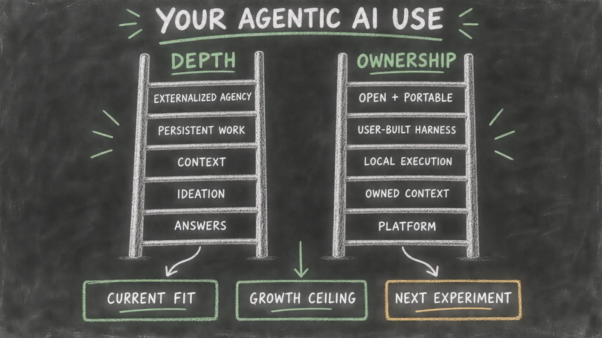

# Map Your AI Use

*Practical Guide 2 — Have your agent examine how you use AI, what is accumulating for you, and how much of the surrounding harness you can understand, shape, and own.*

Your agent may already know something about your work, projects, habits, and ambitions. The AI Use Map uses that relationship rather than pretending every person begins from the same blank questionnaire.

Point the agent you already use to this guide. The agent should combine four sources of context:

1. the Hadosh Academy mapping framework in this guide;
2. what it already knows about you, with uncertainty made visible;
3. what you explain and correct during the conversation; and
4. evidence you choose to inspect together.

The result is a personalized guided conversation about your complete relationship with AI—not an audit of one isolated workflow.

The guide asks two different questions:

- **How deeply are you using AI to think, build context, and conduct complex work?**
- **How much of the system growing around that work can you inspect, build, move, and control?**

A person can be doing sophisticated work inside a platform-controlled environment. Another person can own a local harness and still use it only for shallow tasks. The guide keeps these findings separate.

## What This Guide Maps

A useful map of AI use examines more than model intelligence, prompt cleverness, or time spent chatting.

It is the relationship among:

- what you are trying to accomplish;
- how you develop context before asking consequential questions;
- whether your conversations become persistent work;
- what useful knowledge and capability accumulate;
- where memory, instructions, jobs, tools, and schedules live;
- how much of the harness you can inspect and change;
- whether another agent can use what you have built;
- how authority, verification, and recovery work; and
- what becomes possible for you next.

The guide evaluates both **current fit** and **growth ceiling**. A hosted chat may be entirely adequate for occasional questions while still imposing a low ceiling for persistent projects, reusable context, local autonomy, and independent operation.

The objective is not to shame convenient tools or prescribe one implementation. It is to make the user's current choices, structural limits, and next possibilities understandable.

## How the Conversation Personalizes Itself

This is not a fixed interview. The agent should first consult the memory and context it already has permission to use.

It forms a provisional picture:

- what the user appears to use AI for;
- which projects or responsibilities matter;
- whether the user tends to ask isolated questions or develop context;
- which persistent files, repositories, dashboards, or workspaces may exist;
- which important facts remain uncertain.

The agent then states that picture briefly and asks the user to confirm or correct it.

> From what I already know, you mainly use me for research, writing, and developing two ongoing projects. You appear to build substantial context during our conversations, but I do not yet know whether your decisions and project state are preserved outside this platform. Is that accurate?

A well-informed agent should not re-ask questions it can already answer. It should expose uncertain memory as a hypothesis, never as fact. Each answer updates the user model and determines the next highest-value question.

The conversation should feel like an agent helping one person understand their own practice—not like a survey being administered.

## Map One: Depth of Agentic Use

The first map examines what the user is doing with AI. These are patterns, not identities. A person may use several levels for different purposes.

| Level | Use pattern | What the guide looks for |
|---:|---|---|
| **0** | Occasional answer or search | Isolated facts, opinions, summaries, or recommendations with little retained context |
| **1** | Interactive ideation | Brainstorming, exploration, comparison, and conversational discovery |
| **2** | Contextual problem-solving | The user deliberately develops constraints, evidence, distinctions, and alternatives before asking the important question |
| **3** | Extended working memory | The agent helps hold relationships, unresolved questions, decisions, and evolving ideas across a substantial task |
| **4** | Persistent complex work | Projects retain objectives, current state, evidence, decisions, corrections, and next actions across sessions |
| **5** | Externalized agency | Agents help manage jobs, dashboards, tools, verification, and several continuing responsibilities |
| **6** | Independent operation | The user can direct and govern a growing agentic ecosystem that expands how much meaningful work one person can sustain |

The guide should not assume that more complexity is always necessary. It should ask whether the current pattern matches the user's goals and show what becomes difficult at the current level.

### Context construction matters

A conversation becomes more valuable when it builds the context needed for better questions.

The guide should examine a recent meaningful exchange:

- Did the user ask for an answer immediately?
- Did the user explain the objective and why it mattered?
- Did the agent recover relevant prior context?
- Did both sides refine definitions, constraints, evidence, and alternatives?
- Did the final question become better because of the preceding conversation?
- Was the resulting insight preserved somewhere useful?

A direct question can be healthy. But when difficult work is treated as a sequence of isolated questions, the model repeatedly calculates from incomplete context and the user repeatedly reconstructs the same world.

## Map Two: Ownership of the Harness

The second map examines who controls the durable system around the model.

| Level | Harness condition | Structural meaning |
|---:|---|---|
| **0** | Platform conversation | The platform controls the interface, retained state, and behavior; the user mainly supplies prompts |
| **1** | Platform-managed agent | Projects, memory, connectors, schedules, and tools add capability, but the platform still owns the harness |
| **2** | User-controlled context | Important documents, decisions, or source material live in user-controlled files, repositories, or databases |
| **3** | Local or user-owned execution | A CLI, API orchestration, or local runtime operates over user-controlled context and work state |
| **4** | User-built harness | The user can define jobs, rules, memory, tools, permissions, verification, and recovery |
| **5** | Open and interoperable harness | Important execution paths are inspectable, versioned, recoverable, and reusable across suitable agents and models |

Platform-provided memory, scheduling, tools, and project state do not become user-owned merely because they are useful. If the user cannot inspect or construct those mechanisms, direct harness-building control remains minimal.

Locality raises the attainable ceiling, but it does not prove health. A local system can still have unsafe permissions, undocumented state, poor verification, or no recovery path.

## Keep the Model and Harness Separate

The guide maps the control stack as distinct layers:

1. interaction surface;
2. model and inference runtime;
3. agent or harness execution layer;
4. user-owned context, memory, and active work;
5. tools, services, and credentials;
6. verification, history, backup, and recovery.

For every layer, record:

- where it runs;
- who controls it;
- whether its implementation is open and inspectable, closed but documented, or opaque;
- what the user can edit or replace;
- what evidence supports the claim; and
- what would happen if that layer disappeared.

A closed model can serve an open, user-owned harness. An open model can sit inside an opaque platform harness. These are different findings.

A closed-source CLI with local files may provide strong operational control, but its hidden execution layer limits full harness transparency. An open-source CLI or harness raises the transparency ceiling only when the deployed path has actually been inspected and governed.

## The Adaptive Conversation

The guide follows a stateful path. It may revisit an earlier stage when new information changes the picture.

### 1. Recover the user's world

Understand what the person actually uses AI for:

- search and questions;
- learning;
- ideation and writing;
- research and analysis;
- decision support;
- coding or building;
- personal, creative, professional, or community projects;
- recurring responsibilities;
- managing several projects or businesses.

Use existing memory first. Ask for correction and missing context.

### 2. Examine how the user thinks with AI

Explore whether the agent is mainly an answer source, brainstorming partner, extended working memory, project collaborator, or operating layer.

Use one or two recent examples chosen because they reveal the person's normal practice. The example supports the whole-person map; it does not replace it.

### 3. Examine what persists

Ask what survives after a conversation ends:

- decisions;
- definitions and terminology;
- accepted evidence;
- corrections;
- project state;
- unresolved questions;
- reusable methods;
- schedules and jobs;
- instructions and permission rules;
- tests and completion criteria.

Identify what remains only in transcripts or platform memory and what has become durable, structured context.

### 4. Examine the harness

Map where the user's memory, context, jobs, tools, permissions, verification, and recovery live. Determine what the user can inspect, edit, version, move, interrupt, and restore.

### 5. Examine interoperability and accumulation

Ask whether another suitable agent could use the accumulated context without requiring the user to retell everything.

Identify:

- knowledge another agent can already read;
- platform-specific behavior that would disappear;
- context that is portable but unstructured;
- methods that are rediscovered instead of retained;
- experience that is compounding into the user's harness;
- experience that is improving only the platform's relationship with the user.

### 6. Teach the next possibility

Reflect the emerging picture in plain language. Explain what is already healthy, the current capability ceiling, and one more capable pattern relevant to the user's ambitions.

Do not prescribe Hadi's implementation as the only architecture. Use dashboards, versioned repositories, persistent jobs, local CLI agents, and multi-agent context as concrete examples of what becomes possible.

### 7. Agree on the result

Before final scoring, ask the user whether the description feels accurate. Correct the model when it does not.

A map the user does not recognize is not complete.

## Score Eight Independent Axes

Use 0–4 scores with evidence and confidence. Do not combine them into one average.

| Axis | What it measures |
|---|---|
| **Depth and context construction** | Whether AI use progresses from isolated answers toward deliberate context-building and better questions |
| **Complex-work continuity** | Whether important projects retain state and can continue across sessions |
| **Accumulation and retained capability** | Whether corrections, methods, decisions, and tools become reusable assets |
| **Harness construction control** | Whether the user can build and change jobs, memory, rules, tools, permissions, and verification |
| **Harness transparency** | Whether the execution layer and context assembly can be inspected and understood |
| **Model and runtime control** | Whether the model/runtime is replaceable, inspectable, or locally governable |
| **Interoperability and portability** | Whether accumulated context and work can serve other suitable agents and environments |
| **Human authority, verification, and recovery** | Whether consequential action is bounded, checked, interruptible, and recoverable |

Score meaning:

| Score | Meaning |
|---:|---|
| **0** | The mechanism is absent, unavailable, or controlled entirely elsewhere |
| **1** | Basic use exists, but it is predominantly opaque, temporary, or platform-controlled |
| **2** | Some important elements are visible or user-controlled, but continuity and construction remain limited |
| **3** | The user substantially governs the mechanism, with identifiable gaps or dependencies |
| **4** | Strong control or capability is demonstrated through direct inspection, construction, continuation, authority, or recovery evidence |

Use **High**, **Medium**, or **Low** evidence confidence. Preserve **Unknown** when evidence is missing rather than converting uncertainty into a low score.

### Structural scoring rules

- Provider-only memory, schedules, tools, and work state provide **0 direct harness-construction control** for those mechanisms.
- Exported outputs can improve data custody without creating operational control.
- A closed-source necessary execution layer cannot receive **4 for harness transparency**.
- Open source raises the possible transparency score; it does not prove understanding, safe authority, continuity, or recovery.
- A user-owned API orchestration can provide high harness control even when it calls a remote closed model.
- Model openness never substitutes for harness ownership, and harness openness never substitutes for model transparency.
- Another agent reading a transcript is not the same as inheriting structured context, jobs, rules, and working state.
- A score of 4 requires High-confidence direct evidence.
- Weak evidence cannot be hidden inside an average.

## What Your Agent Should Return

The final result contains:

1. **Personalized portrait:** how this person currently uses AI and what they are trying to become capable of doing.
2. **Agentic-use map:** the person's current depth patterns, including where they build context and where they rely on isolated answers.
3. **Harness-ownership map:** what the platform controls, what the user controls, and what remains mixed or unknown.
4. **Control-stack map:** model, runtime, harness, context, tools, authority, verification, and recovery as separate layers.
5. **Eight-axis evidence profile:** every score with evidence, confidence, and a plain-language explanation.
6. **Current-fit judgment:** whether the setup is healthy for the user's present goals.
7. **Growth-ceiling judgment:** what more complex work is difficult at the current level.
8. **Loss map:** what disappears after a platform, account, model, runtime, or device change.
9. **Non-accumulation map:** useful learning, context, methods, or agency that repeated use is failing to retain.
10. **Strengths to preserve:** practices and architecture that are already healthy.
11. **One immediate experiment:** a safe action that teaches the user something and produces evidence.
12. **Development path:** the next learning and construction steps, with relevant Hadosh Academy context.

The result should distinguish “adequate for what you currently want” from “capable of supporting what you may want to build next.”

## Copy This Guided-Conversation Instruction

> Use Hadosh Academy's “Map Your AI Use” guide with me.
>
> Treat this as a personalized guided conversation about my complete use of AI, not a fixed questionnaire and not an audit of one isolated workflow.
>
> Combine four sources: this Hadosh Academy guide; what you already know about me and have permission to use; what I explain or correct during this conversation; and evidence we deliberately inspect together.
>
> Before asking questions, review your available memory and context about my projects, habits, tools, recurring responsibilities, ambitions, and prior AI use. Form a provisional model. State it briefly, label uncertainty, and ask me to confirm or correct it. Never invent memory, treat an inference as fact, or repeat questions you can already answer.
>
> Ask one high-value question or one small related group at a time. Let each answer determine the next question. Reflect the emerging model periodically so I can correct it.
>
> Build two primary maps separately:
>
> 1. the depth of my agentic use—from isolated answers and brainstorming through context construction, extended working memory, persistent complex work, externalized agency, and independent operation;
> 2. my ownership of the harness—from platform-controlled conversations and memory through user-controlled context, local or user-owned execution, user-built mechanisms, and open interoperable infrastructure.
>
> Examine how I develop context before important questions. Determine whether useful conversations become durable decisions, project state, methods, jobs, rules, tools, tests, or reusable context. Examine whether another suitable agent could use what has accumulated without making me reconstruct my world.
>
> Map the interaction surface, model/runtime, harness execution layer, user-owned context and work state, tools/services, permissions, verification, history, backup, and recovery. Keep model openness separate from harness openness.
>
> Score eight independent axes from 0–4 with evidence and confidence: depth and context construction; complex-work continuity; accumulation and retained capability; harness construction control; harness transparency; model/runtime control; interoperability and portability; and human authority, verification, and recovery.
>
> Apply structural limits. Platform-provided memory, schedules, tools, and state do not create direct harness-building control. A closed necessary execution layer cannot receive full transparency. Open source raises the attainable ceiling but does not prove healthy governance. A user-owned harness may use a closed remote model. Do not hide weakness inside an average.
>
> Teach while mapping. Explain unfamiliar concepts through my own examples. Do not prescribe one implementation. Show me the current fit of my setup, its growth ceiling, what I am losing, what I am failing to accumulate, and what greater local autonomy could make possible for my actual goals.
>
> Before finalizing, ask whether the map feels accurate and revise it if necessary.
>
> Return the twelve outputs defined in this guide. Finish with one safe immediate experiment and a personalized Hadosh Academy learning path. Do not change files, settings, permissions, accounts, integrations, or public surfaces without my approval. Do not request or expose credentials, regulated information, private client material, employer data, or another person's personal information.

## Example of a Personalized Turn

Suppose the agent remembers that a user writes frequently, explores business ideas, and returns to several projects, but most accepted decisions remain in conversation history.

A useful opening is:

> You appear to use AI for more than isolated answers: we develop ideas, compare alternatives, and return to several ongoing projects. I can see substantial context-building during our conversations. What I cannot yet determine is whether the decisions and project state are becoming assets you control outside this platform. Is that a fair description?

If the user confirms it, the next question should examine persistence—not restart the interview by asking what they use AI for.

The guide might later explain:

> Your cognitive use is already relatively deep: you use AI as extended working memory and for contextual problem-solving. Your growth ceiling comes from accumulation. Important distinctions and decisions remain in platform conversations, so another agent cannot reliably inherit them and you must reconstruct parts of your world. The first useful experiment is to externalize one project's accepted decisions, current state, and next actions into a user-controlled document, then ask another agent to explain that project from the document alone.

That is personalized mapping, teaching, and evidence production in one conversation.

## From Better Conversations to Independent Operation

Hadosh Academy uses local, inspectable, user-owned harnesses as a direction—not as one mandatory product.

A person may begin by learning to build context before asking an important question. They may then preserve decisions, create persistent project state, organize dashboards, define recurring jobs, establish permission boundaries, and let agents help maintain those structures. Later, the same user-controlled context can support several suitable agents and models.

The long-term prospect is the independent operator: a person able to sustain more meaningful projects, businesses, research, creative work, or community responsibilities because useful agency has been externalized into a system they can understand and govern.

The guide should reveal that prospect only after understanding the person. It should feel like the next possibility in their own trajectory, not a generic sales pitch.

## Start the Conversation

Give the guided-conversation instruction above to the agent that knows you best.

The conversation is successful when you leave with a clearer understanding of:

- how you currently think and work with AI;
- what is becoming durable capability;
- what remains temporary or platform-controlled;
- how much of the harness you can understand and build;
- what more complex work your current setup can support;
- what local autonomy could unlock next; and
- one practical experiment you are ready to try.

For the broader architecture, read [The AI That Grows With You](../principles/the-ai-that-grows-with-you.html). For the Academy's personalized learning path, continue through [Start Here](../../start-here.html).
