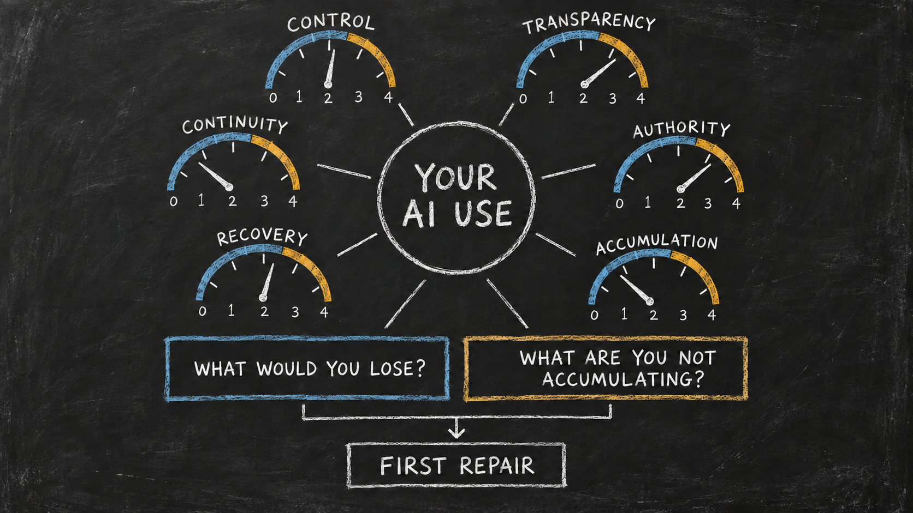

# Run the Agentic AI Use Doctor

*Practical Guide 2 — See who controls your AI use, what survives a platform change, and what is actually accumulating for you.*

Your AI setup may know you better every month. That does not mean the system growing around you belongs to you.

It may remember your preferences, continue conversations, search your files, call tools, and produce useful work. But where do those capabilities live? Can you inspect and correct them? Can you stop them? If the model, account, provider, runtime, or device changes, what remains—and what disappears?

The Agentic AI Use Doctor turns those questions into one evidence-based examination.

You can point the agent you already use to this guide. It will inspect one real workflow with you, score six health axes, show what the platform controls, identify what would be lost, and recommend the smallest useful repairs.

The objective is not to eliminate every provider or move everything onto your own computer. Remote services can be valuable. A local system can still be opaque or fragile. The objective is to make control, dependence, continuity, and accumulated value visible enough for you to choose deliberately.

The Doctor makes one profile visible: six independent health axes, two consequence maps, and the first repair that evidence supports.

## What the Doctor Will Tell You

At the end, you should be able to answer:

1. Where do my model, instructions, work state, memory, files, tools, and permissions live?
2. Which parts can I inspect, edit, correct, interrupt, or remove?
3. Which parts belong to me, and which remain controlled by a platform?
4. What would stop working if I changed the model, account, provider, runtime, or device?
5. Which useful corrections, methods, tests, and decisions are compounding for me?
6. What is the smallest repair that would improve ownership, transparency, continuity, authority, or recovery?

The Doctor does not grade the intelligence of the model. It examines the harness around the model: the layer that turns general intelligence into persistent work.

## Choose One Real Workflow

Do not diagnose your entire relationship with AI at once.

Choose one responsibility that matters and repeats:

- recurring research;
- maintaining a website;
- preparing a weekly report;
- managing a creative project;
- tracking clients or applications;
- publishing a content series;
- running a coding or analysis workflow; or
- any responsibility that becomes difficult when a conversation ends.

Write its objective in one sentence. Name the result that counts as complete. Then gather only the evidence needed to understand how the work continues.

Useful evidence may include:

- conversations and project spaces;
- files, repositories, notes, or databases;
- saved instructions and memory;
- task, job, or schedule state;
- tool and integration lists;
- approval and permission rules;
- tests, review steps, logs, and version history;
- backups, exports, and restore instructions.

Do not paste credentials, private client material, employer data, regulated information, or another person's personal information into a new system for this diagnosis. Describe sensitive mechanisms without exposing their contents.

## The Ten Evidence Dimensions

The Doctor inspects ten dimensions. They are separated because one strong area can hide another weak one.

### 1. Surface and locality map

**Question:** Where does each important capability run, and where is its state stored?

Map the conversation surface, model, instructions, active work, durable memory, files, tools, permissions, logs, and backups. Mark each as local to a device, stored in a user-controlled remote space, or controlled by a provider.

Locality is evidence, not an automatic score. A local file you cannot understand or restore may be less useful than a well-documented remote system you control.

### 2. Transparency and inspectability

**Question:** Can you see what the system knows, what instructions it received, what tools it can use, what it did, and what it kept?

Look for readable instructions, context sources, tool manifests, action logs, state changes, and durable records. A polished interface is not the same as an inspectable system.

### 3. Ownership and control

**Question:** What can you access, edit, correct, move, archive, or remove without losing the workflow?

Check whether the durable layer can be managed independently of one model or account. Data export matters, but control also includes the ability to keep operating.

### 4. Jobs and active work

**Question:** If the current conversation disappeared, where would the work resume?

Find the objective, current state, completed work, unresolved questions, evidence, authority boundaries, and next step. A transcript may contain these facts without turning them into resumable work state.

### 5. Context and memory

**Question:** What has the system learned that should still matter next month?

Identify durable decisions, terminology, preferences, reusable methods, corrections, and verified facts. Check who may write them, which project or person may use them, how outdated memory is corrected, and how durable context is separated from temporary conversation.

### 6. Rules, permissions, and human authority

**Question:** Which boundaries are visible and enforceable?

Check who may read, write, send, publish, merge, spend, or delete. Identify what always requires approval and whether you can interrupt, narrow, revoke, or recover delegated authority.

### 7. Tools and interfaces

**Question:** What can the agent do, and how tightly is each capability tied to one product?

Name tools by function before naming products: search, file editing, messaging, calendar, code execution, publishing, or database access. Record credentials boundaries, side effects, manual fallbacks, and replacement options.

### 8. Verification and recovery

**Question:** How does the system prove completion, detect error, restart, and restore?

Look for completion criteria, tests, checklists, review checkpoints, logs, version history, backups, rollback instructions, and real restore exercises.

### 9. Portability and provider dependence

**Question:** What continues when the model, account, provider, runtime, or device changes?

Distinguish a readable export from an operational continuation path. Record what is portable, what can be adapted, what is trapped, and what remains unknown. A provider-specific feature is not automatically unhealthy; an invisible or unexamined dependency is the problem.

### 10. Accumulation and retained value

**Question:** After months of use, what useful capability belongs to you that did not exist before?

Look for retained corrections, methods, tests, templates, decisions, working state, and reusable patterns. If repeated use produces only more transcripts inside one platform, the system may be active without compounding for you.

## Map the Control Stack Before You Score

Do not collapse “the AI” into one product. Map these layers separately:

| Layer | What to identify |
|---|---|
| **Interaction surface** | The chat, app, editor, or interface where the person works |
| **Model and runtime** | The reasoning engine, where it runs, and whether its behavior or weights are inspectable |
| **Harness and execution layer** | The code or product layer that assembles context, invokes tools, schedules work, records state, and controls the loop |
| **User-owned context and work state** | Instructions, jobs, memory, files, decisions, and corrections the user can directly manage |
| **Tools, credentials, and services** | Capabilities with side effects, their permission boundaries, and their replacement paths |
| **Verification and recovery** | Tests, logs, backups, restore paths, and evidence that operation can continue |

For each layer, record its location, controller, source visibility, replaceability, and continuation evidence. Use one of three source-visibility labels: **open and inspectable**, **closed but documented**, or **opaque**. Keep model-layer transparency separate from harness-layer transparency. An open model inside a closed harness does not make the harness inspectable; an open-source harness calling a closed model does not make the model inspectable.

### Apply structural ceilings

These ceilings prevent convenience features from being mistaken for user control:

- **Provider-only surface:** If memory, schedules, tools, and active state live only inside a hosted product, with no user-owned orchestration layer, direct harness-building control is **0**. Ownership/control and transparency normally cannot exceed **1** for those mechanisms. Exportable outputs may score separately.
- **Hosted surface plus user-owned files or instructions:** This can support partial control, usually **1–2** for the harness-dependent mechanisms. Continuity still cannot exceed **2** without a real continuation test.
- **Closed-source CLI plus user-owned local state:** Direct control can reach **3** when the user governs files, tools, permissions, and execution. Harness transparency cannot reach **4** while a necessary execution layer remains closed and uninspectable.
- **Open-source CLI plus user-owned local state:** Harness control and transparency may reach **4**, but only after inspecting the relevant code or behavior and demonstrating permissions, verification, continuation, and recovery. Open source and locality are opportunities for control, not proof.
- **User-owned API orchestration plus a remote closed model:** The harness may reach **3–4** when the user owns the orchestration, state, adapters, and tests. Model transparency remains a separate, lower finding.
- **Open model plus open harness:** Model and harness transparency may both reach **4** when the deployed artifacts are actually inspectable and verified. Authority, recovery, and continuity must still be evidenced independently.

If a workflow depends on several layers, report the layer-specific findings and let the necessary weakest layer constrain the relevant overall axis. Do not average an opaque critical layer away.

## Classify the Evidence Before You Score

For every mechanism, use one operational status:

- **Portable:** demonstrated continuation in another suitable model, runtime, account, or environment with little change.
- **Adaptable:** the user controls the information or method, but an adapter, translation, or reconstruction step is required.
- **Trapped:** useful state or behavior depends on a provider-controlled surface with no demonstrated continuation path.
- **Absent:** the workflow needs the mechanism, but no mechanism currently exists.
- **Unknown:** the evidence is missing or insufficient.

Unknown is not a polite version of Portable. It is a finding that tells you what must be inspected or tested next.

Also record evidence confidence:

- **High:** directly inspected or demonstrated in a real test;
- **Medium:** documented and plausible, but not tested in this workflow;
- **Low:** inferred from interface behavior, memory, or a product claim.

### Apply scoring safeguards

Evidence quality limits the score. Use these rules consistently:

- Keep **Absent** and **Unknown** separate. Absent means the needed mechanism is missing; Unknown means the diagnosis lacks enough evidence.
- A **4** requires High-confidence evidence from a real workflow, authority check, continuation test, recovery test, or equivalent direct demonstration.
- Low-confidence evidence cannot support a score above **2**.
- Continuity or recovery cannot score above **2** without a real continuation or recovery test. Documentation and an export button are not enough.
- Permissions and human authority cannot score above **2** unless the user can demonstrate at least one meaningful control such as approval, interruption, revocation, or scope reduction.
- Apply the control-stack ceilings above. A hosted convenience feature is not user-owned harness control; an open model is not proof of an open harness; local files are not proof that the execution layer is inspectable.
- Report **model-layer control/transparency** and **harness-layer control/transparency** as required subfindings. If either layer is necessary to the workflow, the weaker necessary layer constrains the related overall axis.
- When evidence conflicts, record the conflict, use the lower confidence, and explain what test would resolve it.
- Never raise one axis because another axis is strong. Visible instructions do not prove portability; local files do not prove recovery; human review does not prove durable accumulation.

Flag a **critical finding** separately from the six numbers when any consequential action cannot be interrupted, essential state has only one uncontrolled copy, or the workflow's only recovery path is unknown. A critical finding becomes the first repair candidate even when the average profile looks healthy.

## Score Six Health Axes

Use a 0–4 scale. Always show the evidence and confidence beside the number.

| Score | Meaning |
|---:|---|
| **0** | No visible mechanism or usable evidence. The condition cannot currently be determined or the required capability is absent. |
| **1** | Predominantly opaque or provider-controlled. Correction, exit, or recovery is not demonstrated. |
| **2** | Partly visible or exportable, but operational control and continuity remain dependent. |
| **3** | User-governed and adaptable. Important mechanisms are inspectable, but migration, verification, or recovery still needs work. |
| **4** | User ownership or control is demonstrated through continuation, authority, verification, or recovery evidence. |

Score these axes separately:

1. **Ownership and control**
2. **Transparency and inspectability**
3. **Continuity and portability**
4. **Permissions and human authority**
5. **Verification and recovery**
6. **Accumulation and retained value**

Do not hide weakness inside one average. Report all six scores, the evidence confidence, the lowest critical axis, and the two required layer findings: **model-layer control/transparency** and **harness-layer control/transparency**.

A remote or provider-specific model can participate in a strong workflow when the user owns the harness, state, adapters, and tests. A provider-only chat with platform memory and schedules still gives the user no direct control over building those harness mechanisms. A local CLI can score poorly when its state is undocumented, its permissions are loose, or nobody has tested recovery. Open-source models and harnesses raise the attainable ceiling only when the deployed layers are actually inspectable and governed.

## Find What You Would Lose—and What You Are Not Gaining

The Doctor must answer two different questions.

### What would you lose?

For each model, account, provider, tool, storage layer, and device, ask what disappears or stops:

- active work state;
- durable memory;
- instructions and rules;
- scheduled jobs;
- tool access;
- permissions and approval history;
- verification evidence;
- recovery paths;
- identity, relationships, or accumulated history.

### What are you not accumulating?

Repeated use should make some part of the user's system more capable. Identify useful value that is currently evaporating:

- corrections that remain buried in conversations;
- methods that are rediscovered instead of retained;
- decisions with no durable source;
- tests that are performed but not reusable;
- project state that must be reconstructed;
- authority rules remembered only by the user;
- dependencies that remain undocumented;
- lessons that never return to the user's harness.

A system can preserve data while failing to accumulate usable capability.

## Interpret Scores by Consequence

Do not rank every low score equally. Prioritize:

1. a boundary the user cannot see or interrupt;
2. the only copy of essential work state or memory;
3. an action path with meaningful side effects and weak permission control;
4. a workflow that cannot be verified or recovered;
5. a dependency whose failure stops important work;
6. a missed opportunity to retain reusable value.

Preserve strengths. Repair the highest-consequence weakness first. Do not recommend rebuilding the entire setup when one explicit state file, approval rule, export test, fallback, or recovery drill would materially improve it.

## The Doctor's Required Result

The diagnosis must produce seven connected outputs:

1. **System map:** what runs where and who controls each component.
2. **Evidence table:** the claim, evidence, current status, confidence, and missing proof.
3. **Control profile:** six scored health axes with plain-language explanations.
4. **Dependency map:** deliberate, adaptable, trapped, and unknown dependencies.
5. **Loss map:** what stops, disappears, or becomes inaccessible after a model, provider, account, runtime, or device change.
6. **Non-accumulation map:** useful corrections, methods, state, or verification that repeated use is failing to retain.
7. **Repair and verification plan:** strengths to preserve, the smallest repair, later improvements, tradeoffs, and the tests that would prove progress.

The result should make the user's current choices understandable. It should not shame the user for choosing convenience or assume that every system must be fully local.

## Run Two Revealing Tests

### Test 1: Continuity versus export

A data export is not automatically a working continuation path.

For one non-sensitive workflow:

1. identify the minimum state another environment would need;
2. separate readable history from active job state, durable memory, rules, permissions, tools, verification, and recovery information;
3. make a safe copy of the assets the user controls;
4. in another suitable model, account, runtime, or environment, ask it to explain the objective, current state, authority boundaries, evidence, and next step;
5. compare the answer with the source of truth;
6. record what continued, what required adaptation, what remained trapped, and what is still unknown.

The test can stop after explanation. Do not authorize real side effects merely to prove portability.

### Test 2: Remove the product names

Product names can hide the architecture.

Rewrite the workflow only as roles:

- input;
- model or reasoning engine;
- active work state;
- durable context;
- rules;
- permissions;
- tools;
- verification;
- recovery;
- output.

Then add each actual product or provider beside the role it performs.

Mark every dependency:

- **deliberate:** the value justifies the dependency;
- **adaptable:** another component could perform the role with known work;
- **trapped:** the role or accumulated value cannot currently continue elsewhere;
- **unknown:** the continuation path has not been inspected.

This test does not assume products are interchangeable. It reveals exactly where a product-specific choice matters.

## Copy This Doctor Prompt

> Run the Hadosh Academy Agentic AI Use Doctor on one real workflow.
>
> Begin by asking me:
>
> 1. Which workflow are we examining?
> 2. What must it accomplish?
> 3. What result counts as complete?
> 4. Which surfaces, files, accounts, tools, or scheduled jobs may contain its state?
> 5. Which privacy or authority boundaries must you respect during the diagnosis?
>
> Do not request passwords, tokens, credentials, private client material, employer data, regulated records, or another person's personal information. Do not change files, settings, permissions, integrations, accounts, or public surfaces during the diagnosis.
>
> First map the control stack as separate layers: interaction surface; model and runtime; harness and execution layer; user-owned context and work state; tools, credentials, and services; verification and recovery. For each layer, record location, controller, source visibility (open and inspectable, closed but documented, or opaque), replaceability, and continuation evidence. Keep model transparency separate from harness transparency.
>
> Inspect ten evidence dimensions:
>
> 1. surface and locality map;
> 2. transparency and inspectability;
> 3. ownership and control;
> 4. jobs and active work;
> 5. context and memory;
> 6. rules, permissions, and human authority;
> 7. tools and interfaces;
> 8. verification and recovery;
> 9. portability and provider dependence; and
> 10. accumulation and retained value.
>
> For every material claim, show the evidence and classify the mechanism as Portable, Adaptable, Trapped, Absent, or Unknown. Give the evidence High, Medium, or Low confidence. Do not treat a product claim, export button, local file, or remembered behavior as proof by itself.
>
> Score six health axes from 0–4:
>
> - ownership and control;
> - transparency and inspectability;
> - continuity and portability;
> - permissions and human authority;
> - verification and recovery; and
> - accumulation and retained value.
>
> Explain every score. Apply these safeguards: a 4 requires High-confidence direct evidence; Low-confidence evidence cannot support more than 2; continuity and recovery cannot exceed 2 without a real test; human authority cannot exceed 2 without a demonstrated approval, interruption, revocation, or scope control. Keep Absent separate from Unknown. Record conflicting evidence at the lower confidence and name the test that would resolve it. Flag any critical finding separately from the scores.
>
> Apply these structural ceilings: provider-only memory, scheduling, tools, and state with no user-owned orchestration mean 0 direct harness-building control; a closed-source CLI can support user control but cannot earn 4 for harness transparency; an open-source CLI or harness can earn 4 only with inspection and demonstrated governance; user-owned API orchestration may earn high harness control even when the model is remote and closed; and open-model transparency must remain separate from open-harness transparency.
>
> Do not hide the profile inside one average. Report model-layer control/transparency and harness-layer control/transparency as required subfindings. Let the weakest necessary layer constrain the relevant overall axis. Do not penalize a system merely because it is remote or provider-specific; judge who controls the harness and state, what is inspectable, and what has been demonstrated.
>
> Produce:
>
> 1. a system map;
> 2. an evidence table;
> 3. the six-axis control profile;
> 4. a dependency map;
> 5. a loss map showing what changes or disappears if the model, provider, account, runtime, or device changes;
> 6. a non-accumulation map showing useful corrections, methods, state, tests, or decisions that repeated use is failing to retain;
> 7. strengths to preserve;
> 8. the smallest high-value repair;
> 9. later repair options with tradeoffs; and
> 10. safe tests that would verify improvement.
>
> Finish by teaching me the result in plain language. Wait for my approval before making any change or running a test with external side effects.

## The Same Doctor, Different Setups

The Doctor should adapt its evidence search rather than assuming one ideal architecture.

### Hosted chat or project space

Inspect exports, project instructions, memory controls, connected tools, account boundaries, conversation history, and whether active work can be reconstructed without the original interface. When the product alone supplies memory, schedules, tools, and active state, record **0 direct harness-building control** for those mechanisms. Do not assume an export recreates behavior.

### Desktop or mobile AI application

Inspect where local and remote state live, which files the application can reach, how permissions are granted, what survives reinstall or device loss, and whether backups restore useful operation. Separate app-visible settings from the closed execution layer beneath them.

### API workflow or automation

Inspect prompts and instructions, state stores, queues, schedules, credentials boundaries, tool schemas, logs, tests, retry behavior, and provider adapters. User-owned orchestration can provide high harness control even when the model is remote or closed. Score model transparency separately.

### Closed-source CLI with user-owned state

Inspect the local files, permissions, tool calls, logs, and recovery path the user controls. This arrangement may provide strong operational control, but a necessary closed client caps harness transparency below **4**.

### Open-source CLI or harness

Inspect the actual deployed code path, configuration, context assembly, permissions, tool invocation, state, tests, and restore behavior. Open source and local files raise the attainable ceiling; they do not earn a high score without inspection and demonstrated governance.

### Open versus closed models

Record whether the deployed model is open and inspectable, closed but documented, or opaque. Keep that finding separate from harness ownership. An open model can sit inside an opaque harness; a user-owned open harness can call a closed model.

## Example: Reading a Control Profile

Imagine a person uses a hosted AI project to produce a weekly research brief.

The project retains conversations and a few instructions. Source files are also saved in a user-controlled folder. The final brief is reviewed by the person, but the research state, corrections, schedules, and completion checklist remain inside conversations. No one has tested an export or restart.

The control-stack finding comes first: the model and product harness are closed; the user owns the source folder but not the orchestration, memory, or schedule. Direct harness-building control for the provider mechanisms is **0**. The source folder improves output ownership, but it does not turn the platform harness into a user-owned one.

A careful result might look like this:

| Health axis | Score | Evidence | Interpretation |
|---|---:|---|---|
| Ownership and control | 2/4 | Source files are user-controlled; project state and memory remain in the platform | Important outputs belong to the user, but the working method does not |
| Transparency and inspectability | 2/4 | Instructions are visible; hidden retrieval and retained memory are unclear | Some inputs can be inspected, but the full working context cannot |
| Continuity and portability | 1/4 | An export exists; no continuation test has been run | History may move, but useful operation is unproven |
| Permissions and human authority | 3/4 | The person reviews the brief before publication | The consequential action remains human-controlled |
| Verification and recovery | 2/4 | Human review exists; there is no reusable checklist or restore path | Quality depends on memory and manual judgment |
| Accumulation and retained value | 1/4 | Corrections stay in weekly conversations | Repeated work is producing history, not a growing method |

The Doctor should not conclude, “Stop using the platform.” It should say what is already healthy, what the user is risking, and which small repair creates the largest gain.

In this case, the first repair might be a user-controlled weekly job file containing:

- the brief's objective;
- current state;
- accepted sources;
- recurring corrections;
- the completion checklist;
- the approval boundary; and
- the next issue date.

The next verification would start a new conversation or another model using only that file and the source folder. If the workflow can explain its state and produce a reviewable draft, continuity has improved.

## Turn the Diagnosis into a Repair Ladder

Organize repairs in three levels.

### First repair

Choose one change that reduces the highest-consequence weakness without rebuilding the system.

Examples:

- extract active state from a long conversation;
- store accepted instructions in a versioned document;
- document which actions require approval;
- create an inventory of tools and side effects;
- test one export;
- add one completion checklist;
- record a manual fallback;
- make one verified backup and restore it.

### Next improvements

Add only the mechanisms justified by real friction:

- scoped durable memory;
- explicit job state;
- provider adapters;
- permission gates;
- action logs;
- automated tests;
- rollback or restart procedures;
- a second continuation environment.

### Structural redesign

Recommend a larger migration only when evidence shows that essential state, authority, or accumulated value cannot be repaired in place.

The user should see the tradeoff: convenience, cost, effort, capability, privacy, control, and maintenance. More local or more portable is not automatically better if the user cannot operate or recover the result.

## What a Healthy Result Looks Like

A healthy agentic setup does not need perfect scores.

It should make its dependencies deliberate, its authority visible, its important state recoverable, and its accumulated value increasingly user-controlled.

The strongest result is not “no providers.” It is:

- the user understands where capability and state live;
- the user can inspect and correct the durable layer;
- consequential actions remain bounded and interruptible;
- another suitable environment can continue important work;
- verification and recovery are tested;
- repeated use leaves the user with more reusable capability than before.

Keep the Doctor result with the workflow. Repeat the diagnosis when a major model, provider, account, runtime, device, permission, storage layer, or responsibility changes.

## Run the Diagnosis

Copy the Doctor prompt above into the agent you already use. Choose one real workflow and require evidence for every score.

The most useful result is not a perfect number. It is a clearer boundary between:

- capability you rent;
- structure you control;
- dependence you choose;
- dependence you did not know about; and
- experience that is—or is not—compounding into your own harness.

If you discuss your result publicly, do not expose private files, accounts, clients, credentials, or another person's information. A useful response can be simple:

> The axis that surprised me was ____. The first repair I chose was ____.

For the deeper architectural argument, read [The AI That Grows With You](../principles/the-ai-that-grows-with-you.html). To build broader harness literacy with your agent, continue through [Start Here](../../start-here.html).
