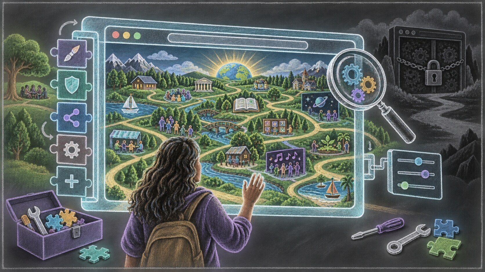
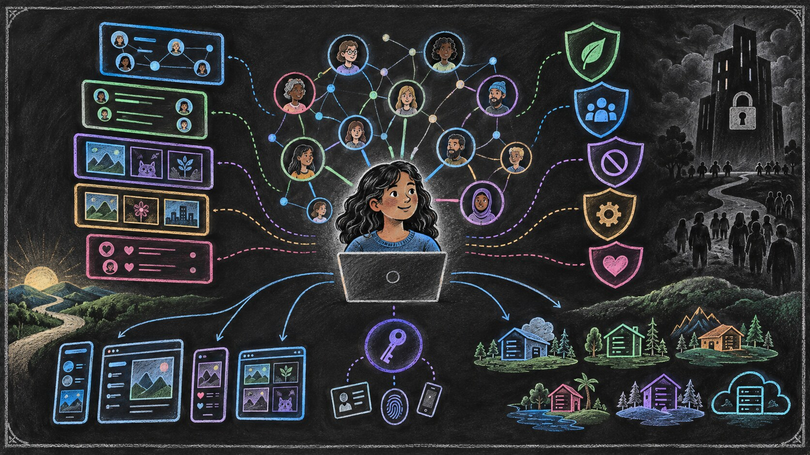
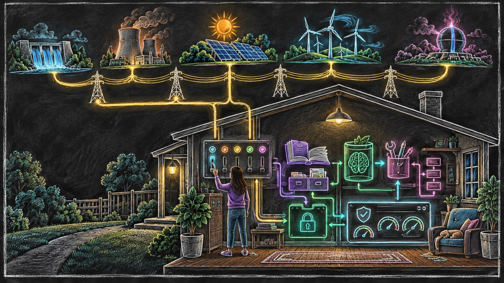
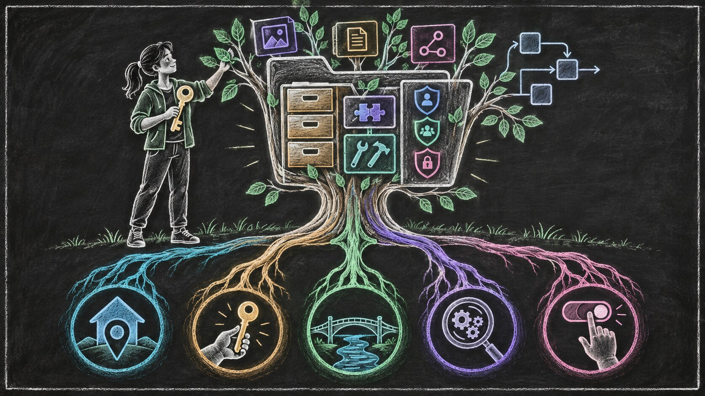
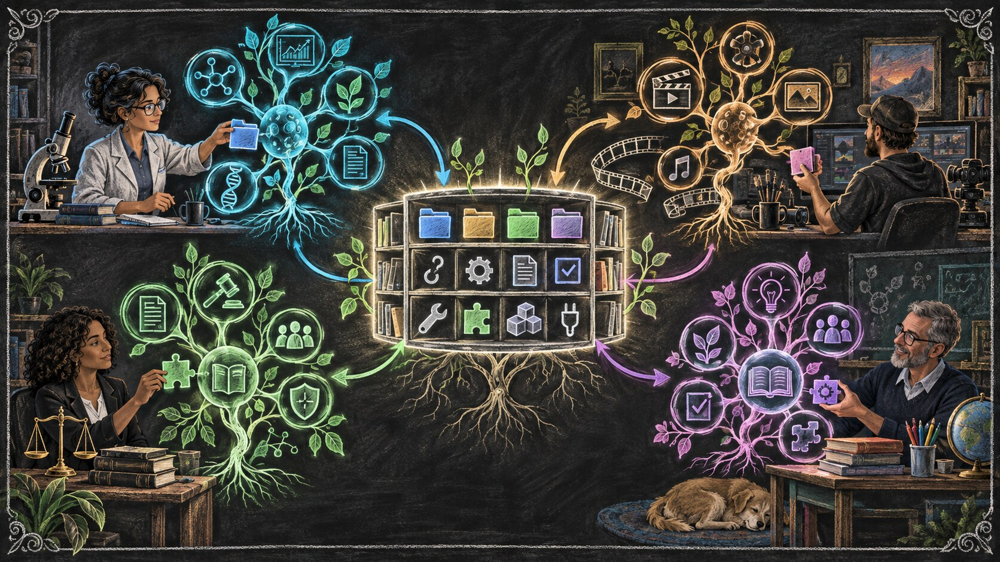

# The AI That Grows With You

We usually compare artificial-intelligence systems by asking which model is more capable.

Which model can reason more clearly? Which one writes better? Which one understands more information, uses more tools, or completes more difficult work?

These are important questions. But notice where they direct our attention.

Almost all of them shine the spotlight on the model: the large language model, or LLM, that provides the system’s general capacity for language and reasoning. This is also the part that AI companies promote most heavily. Models receive names, rankings, benchmarks, launch events, and headlines.

As a result, it is easy to speak about the model as if it were the entire AI system.

But an agentic AI system has two major parts.

The first is the model. It supplies general intelligence: the ability to interpret language, reason through a problem, generate possibilities, and decide what might be done next.

The second is the harness: the surrounding structure that allows that intelligence to operate in a particular environment, for a particular purpose, and eventually for a particular person.

A harness can give the model access to tools. It can preserve memory, organize work, define permissions, connect information, enforce boundaries, verify actions, and determine what happens before or after the model makes a decision. Hooks and similar mechanisms—which we have explored in [*The Language of Agents*](../b4/04-the-language-of-agents.html)—can observe important moments, provide instructions, or stop an unsafe action before it proceeds.

The distinction between the model and the harness did not become obvious all at once.

Large language models came first. Early applications placed relatively thin software around them: a chat window, a system instruction, perhaps a few connected tools. But as people asked these models to perform longer and more consequential work, the limitations became increasingly visible.

A capable model could reason, but reasoning alone did not give it durable memory. It could use a tool, but it did not automatically know when that tool should be allowed. It could begin a complicated task, but it needed structure to preserve its progress, verify the result, recover from failure, and continue over time.

The software surrounding the model therefore began to grow.

What started as a thin connection between a model and a few tools gradually became a more substantial operating structure. Memory was added. Then retrieval, permissions, workflows, hooks, verification systems, and ways of coordinating multiple steps. In command-line agents and other emerging systems, the harness increasingly determines how the intelligence behaves in practice.

Yet this part of the system still receives much less attention than the model.

That imbalance matters because the two parts create different kinds of value.

A powerful model can provide general intelligence to millions of people. The same model may help a scientist, a filmmaker, a lawyer, a teacher, or a small-business owner. It does not need to be rebuilt from the beginning for every user.

The harness is different.

The more useful it becomes, the more it must reflect a particular person: their responsibilities, habits, standards, tools, relationships, boundaries, and ways of making decisions. Some of its building blocks can be shared, but the complete structure cannot be meaningfully identical for everyone.

This is where personalization in AI becomes more consequential than choosing which model performs best on a benchmark.

As an AI system becomes part of someone’s everyday life, value begins to accumulate inside the harness. The system gradually learns how that person communicates, how they organize their work, what they consider important, which mistakes they tend to make, and how they prefer to solve problems.

At first, this accumulation may look insignificant: a few saved instructions, some conversation history, a preferred writing style, or a connection to a calendar. But over time, these fragments can become something much larger. They can develop into a working understanding of a person’s life.

We have seen a simpler version of this process before.

A new computer, phone, or browser begins as a generic product. It is nearly identical to thousands or millions of other copies. But after months of use, it no longer feels generic. It contains your bookmarks, passwords, contacts, shortcuts, settings, documents, extensions, and history. You have arranged it around your habits, often without consciously deciding to do so.

The original software may have been created by a company, but the particular way it has been shaped around you was created through your own time and experience.

That distinction is easy to overlook because, in earlier generations of technology, personalization was usually limited. Losing a browser configuration was frustrating. Losing a social-media account could be painful. But neither one contained a complete working model of how you think and operate.

Agentic AI may be different.

An AI system that works with you for years could accumulate far more than preferences. It could learn how you conduct research, manage projects, evaluate evidence, communicate with different people, protect sensitive information, and recover when something goes wrong. It could remember not only what you have done, but how and why you tend to do it.

At that point, the most valuable part of the system may no longer be the intelligence supplied by the AI company. It may be the personal structure that has grown around that intelligence through years of use.

This leads to the central argument of this essay:

> **The model can belong to a company. The part that learns your life and work should belong to you.**

To understand why this distinction matters, we need to look beyond AI. The same question has appeared repeatedly throughout the history of digital technology.

Each generation has created new ways for technology to adapt to individuals. Sometimes that adaptation remained close to the user, where it could be inspected, modified, replaced, and carried elsewhere. At other times, it moved inside a company’s platform, where it became powerful but difficult to understand or leave behind.

The history of the web, the browser, and social media shows us both possibilities. It also helps us recognize the much more consequential choice now appearing in AI.

*Digital architecture is a choice among futures: where the system grows determines who can inspect, change, and keep it.*

---

## The Choices That Create Different Futures

The history of digital technology is often presented as a sequence of inventions.

The internet appeared. The web was built on it. Browsers made it accessible. Social networks connected people. Artificial intelligence arrived afterward.

But there is another way to understand this history.

At every stage, people made choices about where control should reside, what should remain visible, what users should be allowed to change, and which parts of the technology should be open to inspection.

Those choices did more than determine how the technology worked at that moment. They made some futures easier to reach and other futures more difficult.

The early web is an important example.

The internet provided the underlying network through which computers could communicate. The web introduced common standards for pages, links, and addresses. Because those standards were open, different people and organizations could build websites, servers, and browsers that worked together.

No single company needed to own the whole environment.

But open standards alone could not guarantee an open experience.

Most people did not interact directly with internet protocols or web standards. They experienced the web through a browser. The browser stood between the individual and almost everything available online.

That position gave browsers enormous power.

A browser could decide how a page was displayed. It could allow or block certain capabilities. It could protect users from harmful behavior, but it could also potentially hide information, favor particular services, restrict certain websites, or shape what the user was able to do.

This means that an open web could still have been experienced through a closed and highly controlled doorway.

We can imagine an alternate history in which every widely used browser remained proprietary, impossible to inspect, difficult to extend, and controlled by a small number of companies.

The standards underneath might still have been open. Millions of websites might still have existed. But ordinary users would have had no reliable way to know what was happening between those websites and their screens.

Was the browser blocking something for security, or for the business interests of its owner?

Was it treating every website equally?

Was it collecting information that the user did not knowingly provide?

Was it changing what people could see, which services worked properly, or which parts of the web were easiest to access?

Without transparency, users would have had to trust the companies controlling their browsers. They could observe some of the results, but they could not meaningfully inspect the mechanisms producing them.

Open-source browsers made this future more difficult to impose.

When software is open source, its code can be examined. Developers, researchers, security experts, competing organizations, and interested members of the public can study what it does. If something suspicious is introduced, more people have an opportunity to discover it. If the project moves in a harmful direction, others may be able to modify the code or create a different version.

Open source does not make manipulation impossible.

Code can be extremely complex. Most users will never personally inspect it. Large projects can still be influenced by powerful organizations. Harmful changes can escape attention, and an open-source project can still make poor decisions.

But openness changes the difficulty of hiding those decisions.

It creates more eyes, more opportunities for scrutiny, and more possibilities for disagreement to become action. It makes certain forms of concealed control harder to sustain. It also makes experimentation, extension, and correction easier.

The release of Netscape’s browser source code in 1998 helped begin the [Mozilla project](https://blog.mozilla.org/community/2013/04/15/milestone-the-mozilla-project-begins/), from which Firefox later emerged. This mattered for more than the survival of another browser.

It helped preserve the possibility that an important doorway into the web could remain publicly inspectable and modifiable.

The presence of open-source browsers also affected the environment around proprietary browsers. A company considering a restrictive or intrusive decision did not operate in a world where every alternative was equally closed. Its behavior could be compared against an inspectable implementation. Developers could study differences. Users could move elsewhere. Competing browsers could adopt features that restored capabilities or protected privacy.

Open source did not eliminate corporate power, but it created resistance to invisible control.

It helped establish the expectation that the browser should serve the user, even while connecting that user to websites and services operated by other parties.

This expectation appeared in practical ways.

People could install extensions that changed how websites behaved. They could block advertising or tracking. They could modify the visual appearance of pages. They could inspect what a website sent to their computer. They could manage cookies, permissions, passwords, downloads, and browsing history.

The website did not possess complete authority over the experience.

Neither did the browser company.

Some decisions remained with the person using the computer, and open-source browsers helped protect the possibility that more of those decisions could remain there.

This is also why local personalization was not the only important feature.

A proprietary browser could still store bookmarks and settings on the user’s computer. That would make the data local, but locality alone would not make the system transparent. If the user could not understand or challenge what the browser was doing, the company could still exercise hidden control through the software.

User ownership therefore requires more than keeping files nearby.

It also requires transparency: the ability for the system’s behavior to be inspected and understood.

It requires autonomy: the practical ability of the person to change that behavior, reject a decision, add a capability, or choose another implementation.

And it requires portability: the ability to leave without losing everything that has accumulated through years of use.

These qualities reinforce one another.

Local information without transparency can still be manipulated by opaque software. Transparency without autonomy may reveal a problem without giving the user a way to change it. Portability without open alternatives may provide an export file but nowhere meaningful to take it.

The healthier history of the web emerged from a combination of these protections.

Open standards prevented one organization from owning the underlying environment. Open-source browsers made the user’s doorway more inspectable and contestable. Extensions allowed people to modify their experience. Local storage allowed some personal structure to remain close to the user. Competing implementations made exit possible.

None of these protections was complete. Together, however, they helped create a better range of possible futures.

*Open standards created the web. Inspectable and extensible browsers helped keep its doorway contestable.*

Social media developed along a different path.

Centralized platforms solved genuine problems from the early web. They made publishing easier. They made it simple to find friends, follow public figures, share photographs, discover conversations, and participate without building or maintaining a website.

But the price of this convenience was not merely that people used a company’s application.

The platform gradually absorbed the entire environment.

It held the user’s identity. It stored their content. It maintained their relationships. It observed their behavior. It selected what appeared in their feed. It decided which forms of interaction were encouraged, discouraged, amplified, or hidden.

Most importantly, these decisions occurred inside systems that users could not inspect.

A person could see the feed but not the machinery constructing it. They could respond to individual recommendations, but they could not examine the complete objective being optimized. They could not meaningfully rewrite the ranking system, install a different one, or carry their relationships into another application that offered a different experience.

The algorithm itself was not necessarily the problem.

Any system containing more information than a person can consume needs some method of selection. Chronological order is also a form of selection. Filters and recommendations can be genuinely useful.

The critical question is who chooses the method and whose interests it serves.

On the open web, a person could select a different browser or install an extension that changed part of the experience. On a centralized social platform, the application, the network, the identity system, the behavioral history, and the feed were bound together.

The company did not simply provide access to a social environment. It owned the environment in which the personalization occurred.

This made manipulation much easier.

The platform could adjust what received attention without publicly explaining the change. It could optimize the feed for engagement, advertising, growth, or another business objective. It could conduct experiments across millions of people. It could infer intimate preferences from behavior while giving users little access to the resulting profile.

Again, this does not mean that every platform decision was malicious.

The deeper problem was that the architecture required trust without providing equivalent transparency or control.

Users were asked to trust that the platform’s interests would remain aligned with their own, even though they could not inspect the system, replace its central mechanisms, or leave with a functioning version of what they had built there.

Downloading an archive of posts was not the same as taking a social life elsewhere.

The relationships might not come with it. The accumulated understanding of preferences might not come with it. The ranking choices could not be transferred. The exported information was a record of the old system, not a working version of that system under the user’s control.

This is the contrast that matters.

The open web and open-source browser tradition made hidden control more difficult and user-directed modification easier.

Centralized social media made hidden control easier and user-directed modification extremely difficult.

Neither outcome was inevitable.

They arose from choices about architecture, ownership, transparency, and where personalization was allowed to accumulate.

Artificial intelligence is now approaching a similar choice.

The model may be the most visible part of the system, but the harness is becoming the place where personal memory, rules, tools, permissions, workflows, and experience accumulate.

The decisions we make about that harness today will determine what kinds of AI futures become easy tomorrow.

It can grow inside a company’s platform, where the user receives convenience but must trust an opaque system with an increasingly complete understanding of their life.

Or it can grow on the user’s side: inspectable, extensible, portable, and ultimately governed by the person it serves.

The technology is still young enough that both futures remain possible.

---

## Reopening What the Platforms Closed

The social-media story is not finished.

Once the costs of centralized platforms became clearer, developers and communities began trying to reopen the social web.

One important effort was [ActivityPub](https://www.w3.org/TR/activitypub/), the open standard used by services such as Mastodon. Instead of placing everyone inside one company’s platform, it allows independently operated social services to communicate.

A community can operate its own service and establish its own rules. People using different services can still interact. If one provider changes direction, it does not necessarily control the entire social environment.

This restores some of the independence of the earlier web.

But it also restores some of its difficulties. Different services can have different policies and interfaces. Moving between them may require effort. Moderating a distributed network is complicated. An open system that only experts can navigate will struggle against a closed platform that anyone can use.

This is why Bluesky is an important experiment.

Bluesky is both a social application and part of a larger attempt to build social media around an open protocol. The application may look familiar, but the structure underneath it begins to separate responsibilities that traditional platforms combined.

A person can [choose among different feeds](https://bsky.social/about/blog/09-04-2024-welcome) instead of depending entirely on one company’s ranking system. Different applications can provide access to the same social environment. Moderation can include [additional filters and labeling services](https://bsky.social/about/blog/4-13-2023-moderation) rather than relying exclusively on one central authority. The underlying protocol also aims to make identity and account data more movable between providers.

The technical details matter to developers, but the general principle is simple:

> **The company providing the application does not have to own every part of the experience.**

That is the connection to our larger story.

The purpose of feed choice is not to eliminate algorithms. Every large information environment needs some way to select and organize what people see.

The purpose is to separate the existence of an algorithm from the authority of one company to impose the same algorithm on everyone.

A person may choose a feed created for a scientific community, a local area, an artistic interest, or a particular way of discovering new people. Most users will never inspect the code behind those feeds, but the feeds can still be compared and replaced.

The ability to choose changes the relationship.

Instead of asking the platform to understand you and then silently decide what you should see, you can participate in choosing how the environment is organized around you.

The same principle applies to moderation.

Moderation is necessary, but one company does not necessarily need to make every judgment for every community. Different services can contribute additional filters and protections while the user retains more influence over the experience.

Once again, the goal is not unlimited individual freedom without social responsibility.

It is transparency and distributed authority.

Bluesky has not completed this transformation. Most people still rely on its main application, infrastructure, defaults, and moderation. [Moving accounts](https://atproto.com/guides/account-migration) is not yet effortless, and not every part of the experience is fully portable.

It would therefore be premature to describe Bluesky as a completely user-owned social system.

Its importance is directional.

It demonstrates that identity, hosting, applications, feeds, and moderation do not have to remain permanently fused inside one platform. They can be separated enough to create meaningful alternatives.

That separation makes hidden control harder and user choice easier.

It points toward the same principle that open-source browsers helped protect: the company connecting you to a digital environment should not automatically possess complete authority over how you experience that environment.

*The direction matters: the network can remain connected while the feed, moderation, application, identity, and host become more open to choice.*

And this brings us back to artificial intelligence.

Bluesky is useful here not because AI should copy every part of its technical design. It is useful because it reminds us that capabilities bundled together by one generation of platforms can be separated again.

The social network can be distinct from the application.

The algorithm can be distinct from the platform.

The user’s identity can be distinct from the company currently serving it.

In AI, we need to make a similar separation between the model and the harness.

In [the first Hadosh Academy essay](../b1/01-llms-are-not-the-agents.html), we compared an LLM to electricity and an agent to an appliance.

Electricity provides general power. But electricity alone does not make toast, cool a room, wash clothes, or illuminate a house. Appliances shape that general power into particular forms of usefulness.

An LLM plays a similar role.

It supplies a general capacity for language and reasoning. But the model alone does not know how your work should be organized, which information it may access, when it needs your permission, how its actions should be verified, or what it should remember for the future.

The harness gives that general intelligence an operational form.

In this sense, the harness is the structure of the appliance. It connects the intelligence to tools, memory, rules, permissions, workflows, and methods of verification. Together, the model and the harness form the functioning agentic system.

Now imagine if an electricity company also owned every appliance in your home.

The company would not merely sell you electricity. It would decide how your refrigerator operated, when your lights could turn on, which settings were available on your washing machine, and how dark your toaster was permitted to make your bread.

Perhaps these appliances would become remarkably convenient. The energy company could study your routines and automatically adjust them. It might learn when you wake up, when you cook, how you wash your clothes, and which rooms you use throughout the day.

But you would not be able to inspect how the appliances worked.

You could not modify them.

You could not meaningfully reject the company’s decisions.

And if you changed electricity providers, the intelligence accumulated across your home might stop functioning.

The problem would not be that the energy company supplied electricity. Supplying reliable power is a valuable service.

The problem would be that the provider of general power had also absorbed ownership of the personal systems through which that power became useful.

Our actual relationship with electricity is healthier.

The energy provider supplies power. We own or control the appliances that convert that power into the outcomes we need. We can replace a toaster without rebuilding the electrical grid. We can change electricity providers without surrendering every appliance in the house.

The provider and the appliance perform different roles.

The same separation should guide the agentic era.

AI companies can develop and provide extraordinarily capable models. Those models may require enormous investments in research, computing infrastructure, energy, and specialized expertise. Most individuals will not build such models themselves.

That does not mean the model provider must also own the user’s harness.

The model can be rented as a source of general intelligence. The harness that shapes that intelligence around a particular person can remain under that person’s control.

*The provider supplies general intelligence. The user should own the system that turns it into a way of living and working.*

This distinction becomes more important as AI systems learn.

Early language-model applications mostly responded to individual prompts. A person asked a question, received an answer, and moved on.

Agentic systems can do much more. They can use tools, work across multiple steps, preserve progress, act inside digital environments, and improve how they assist a person over time.

That improvement creates a new kind of personal asset.

The system may learn how you conduct research, organize projects, evaluate evidence, prepare for meetings, communicate with different people, or recover when a process fails. It may accumulate your corrections, standards, permissions, and preferred ways of working.

The danger is not that AI companies will fail to remember these things.

Their systems may become extremely good at remembering them.

The danger is that everything they learn may remain inside an appliance that the same company owns, controls, and can disconnect.

A social platform primarily learns how to hold your attention.

A mature agentic system may learn how you live and work—and may be able to act on that understanding.

This makes the AI choice more consequential.

If you leave a social platform, you may lose an audience, a history, or a familiar feed. These losses can be serious.

If you leave a mature agentic system, you could lose part of your working capacity: years of accumulated memory, rules, corrections, workflows, permissions, and experience.

The company might give you an export of your conversations. But an archive would not necessarily preserve the functioning system.

It would be like receiving a document describing how your appliances once operated after the provider had removed them from your home.

The information might technically be yours, while its practical usefulness remained with the company.

Two AI futures are therefore beginning to separate.

In one future, every provider builds the user’s memory, tools, workflows, and personal operating structure inside its own platform. The model and the harness are fused together. Changing the source of intelligence means abandoning much of the system that has grown around it.

In the other future, models remain replaceable sources of general intelligence.

A person might use one commercial model today, another provider tomorrow, and an open model for certain private work. The source of intelligence can change as technology, prices, and needs change.

But the harness remains.

The accumulated understanding of the person—their memory, tools, boundaries, workflows, and experience—stays under their control.

The electricity can come from different providers.

The appliance remains in the user’s home.

For that future to become real, the harness must provide more than technical access. It must be local enough to remain centered on the user, owned in a meaningful sense, portable as a functioning system, transparent enough to inspect, and governed by the person it serves.

These are not optional conveniences.

They are the conditions that separate a personal asset from a platform dependency.

The model can be provided as a service.

The personal harness must remain yours.

---

## What It Means for the Harness to Be Yours

Saying that the harness should belong to the user sounds simple.

But what does belonging mean in practice?

A company may tell you that your data is yours while keeping it in a format that no other system can use. It may allow you to download years of conversations without providing the rules, memories, connections, and workflows that made those conversations useful.

You may technically own the information while remaining unable to continue without the platform.

Ownership in the agentic era therefore requires more than a statement in a privacy policy. It must be visible in how the system is built.

### What Exactly Is the Harness?

The harness is not an imaginary future abstraction. Its basic structure has already become visible in today’s command-line agents.

At its foundation is a runtime: the application that receives the model’s output, recognizes structured messages such as responses and tool requests, and turns permitted requests into actions. The runtime may also expose hooks—specific moments when another process can observe an action, add instructions, run a check, issue a warning, or block the action entirely.

Around that runtime are the user-defined parts of the harness: instruction files, memories, configurations, skills, plugins, scripts, tests, tool definitions, and descriptions of specialized sub-agents.

A plugin can gather several of these pieces around one objective. It might contain instructions describing a responsibility, hooks that notice relevant events, scripts that perform checks, tests that verify behavior, and messages that guide or warn the agent.

The specific anatomy can vary among systems, but the underlying idea is already established.

Much of a personal harness is therefore surprisingly ordinary. It is a collection of files and small programs that determine how general intelligence should behave for a particular user.

These are the things that should remain on the user’s side.

The runtime interpreting them should be open and inspectable. The personal plugins, instructions, memories, tests, and configurations should exist wherever the user chooses to keep them. They should not disappear merely because one model provider or CLI application is replaced.

The five qualities that follow—locality, ownership, portability, transparency, and autonomy—apply to these concrete components, not to a vague idea surrounding the model.

Imagine that an AI system has worked with you for five years.

It knows how you organize projects, which sources you trust, how you prepare reports, when it must ask permission, and how you prefer its work to be verified. It has learned from hundreds of corrections and thousands of completed tasks.

Then imagine that its provider disappears.

Perhaps the company closes. Perhaps it changes its prices, policies, or business model. Perhaps you simply find a better model and decide to leave.

What remains?

This is the departure test.

If the accumulated system can continue working with another intelligence provider, it is meaningfully yours. If it becomes an unusable archive—or disappears entirely—it was primarily an asset of the platform.

Passing this test requires five connected qualities: locality, ownership, portability, transparency, and autonomy.

### Locality

Locality means that the harness has its center of gravity on the user’s side.

It does not mean that everything must operate offline. A user-owned harness can call commercial models, search the internet, connect to cloud services, and communicate with other people and systems.

Your appliances are local to your home even though the electricity comes from an external grid.

In the same way, the personal structure of an agentic system can remain with you while drawing intelligence and other services from outside providers.

The important question is where the durable structure lives.

Where are the plugins, memories, instructions, permissions, workflows, configurations, and records of experience that allow the system to continue developing?

If their only functioning form exists inside a provider’s account, then the provider remains the center of the system. If these files remain in an environment the user controls, providers can be connected, changed, or removed without destroying the whole structure.

Locality does not guarantee ownership, but it gives ownership somewhere practical to exist.

### Ownership

Ownership means more than being allowed to use something.

You rent a hotel room, but you do not own it. You may arrange a few belongings inside it, but the owner can change the rules, limit your access, or close the building.

Many digital products create a similar relationship. The user is invited to personalize an account, but everything they build remains inside property controlled by someone else.

A user-owned harness requires a stronger relationship.

The person must be able to retain it, copy it, modify it, remove parts of it, and decide which services may interact with it. The provider should not be able to withdraw the harness merely because the user stops purchasing its model.

This does not mean that every connected service becomes free or user-owned. A commercial model remains a commercial service. A cloud-storage provider may still charge for storage. A specialized database may require a subscription.

But ending one service should not dissolve the personal system that connected those services together.

The user owns the home, even when some of its utilities are rented.

### Portability

Portability means that the harness can continue functioning when part of its environment changes.

This is more demanding than downloading data.

An archive can preserve what happened in the past. A portable system preserves the ability to continue into the future.

Suppose an AI provider gives you a file containing every conversation you have ever had. That file may be valuable. But does it contain the system’s operational memory? Does it preserve your workflows, permissions, tool connections, verification methods, and learned corrections? Can another model and compatible runtime understand and use them?

If not, you possess a record of the relationship without possessing the working relationship itself.

Real portability means that one model or runtime can be replaced by another without rebuilding the user’s accumulated life from the beginning. Human-readable files and open formats make that continuation possible; adapters can translate the smaller differences among runtimes.

The replacement may not be perfect. Different models and runtimes have different capabilities, and some adjustments may be necessary.

But the harness should survive the transition.

The intelligence changes. The personal structure continues.

### Transparency

Transparency means that the user can understand what the harness knows and how it operates.

This does not require every person to read software code. Most people never inspect the source code of their browser or operating system.

But meaningful inspection must remain possible.

The runtime and its hook behavior should be open to scrutiny. The harness should not contain a hidden profile that only the provider can see. Its plugin files, memories, rules, permissions, and important decisions should be available for examination. The user should be able to discover why an action occurred, what information influenced it, and which instructions were active.

Open-source building blocks strengthen this transparency because independent people can inspect how the underlying mechanisms work.

But source code is only one part of the requirement.

A harness could be built from open-source software while still hiding its personal memory from the user. Meaningful transparency therefore includes both the machinery and the accumulated personal state inside it.

You should be able to ask:

What does this system believe about me?

Which parts came from my direct instructions?

Which parts were inferred from my behavior?

What has it been told never to do?

What will happen before it sends a message, changes a file, or spends money?

A system that acts for a person should not remain mysterious to the person whose authority it exercises.

### Autonomy

Autonomy means that understanding can become action.

Transparency allows the user to see what the system is doing. Autonomy allows them to change it.

The person must be able to correct a memory, reject an inference, change a workflow, reduce a permission, replace a tool, or stop the system altogether. They should be able to decide which model performs a task and when human approval is required.

This is human autonomy.

It should not be confused with giving the AI unlimited autonomy to act without supervision.

An agent may receive delegated freedom inside clearly defined boundaries. It might organize files without asking about every small change, while still requiring approval before publishing something publicly or spending money.

The purpose of the harness is partly to make these boundaries explicit.

The agent’s autonomy should remain bounded by the person’s autonomy.

A platform-owned harness can reverse this relationship. The company defines the available settings, the permitted models, the accessible tools, and the behaviors the user cannot change. The person may customize within those boundaries but cannot meaningfully challenge the boundaries themselves.

A user-owned harness gives the person greater authority over the system’s design.

### One Structure, Five Protections

These five qualities depend on one another.

A local harness that cannot be inspected may still conceal harmful behavior.

A transparent harness that cannot be modified gives the user knowledge without control.

An owned harness stored in an unusable format cannot meaningfully move.

A portable archive that cannot resume its work preserves history without preserving capability.

Together, locality, ownership, portability, transparency, and autonomy create the conditions under which a harness can genuinely remain a user asset.

*Five protections turn “your AI” from a product claim into an architecture the user can keep, inspect, move, and govern.*

They also improve privacy and recoverability.

A user-controlled system can limit which information reaches each provider. It can maintain records of important actions. It can preserve earlier versions, reverse mistakes, and continue after a service failure.

None of these protections is automatic. Local software can still be insecure. Open-source code can still contain errors. A user-controlled system can still be configured poorly.

The purpose is not to promise a perfect system.

It is to determine who has the authority and opportunity to inspect problems, correct them, and choose another direction.

That is the deeper meaning of ownership in agentic AI.

The model may come from elsewhere. Some tools and services may also come from elsewhere. But the structure that combines them, remembers experience, and gradually learns how to serve one person should remain with that person.

And once we accept that principle, another conclusion follows.

A truly personal harness cannot be manufactured as one identical piece of software and handed to everyone.

It must grow differently for every user.

---

## Software That Grows With One Person

Once the harness becomes concrete, another distinction becomes visible.

A personal harness is not traditional software.

Traditional software is usually developed as a finished product. A company designs an application, tests a release, and distributes nearly identical copies to thousands or millions of people.

Users may adjust some settings, but the underlying product remains substantially the same.

A personal harness reverses this relationship.

Its foundations may be shared, but its final composition emerges around one person.

Many users may rely on the same runtime, hook system, file formats, and plugin conventions. They may begin with some of the same open-source components. But the combination of instructions, memories, permissions, tools, tests, and workflows should develop differently for each of them.

The shared parts provide a common anatomy.

The personal parts create a distinct organism.

### Common Building Blocks, Different Systems

The plugin is becoming an important unit in this new form of software.

Plugins were not invented by Hadosh Academy. Different agent platforms already use plugins, skills, hooks, instruction files, scripts, and related mechanisms to extend agent behavior.

What Hadosh Academy contributes is a more disciplined way of thinking about how these pieces can be assembled.

In the [Plugin Anatomy writings](../b7/07_1-plugin-kit-foundation.html), a plugin has a narrow responsibility. It can contain instructions, hook-triggered checks, scripts, tests, memory, specialized sub-agents, and messages injected at important moments.

One plugin might protect sensitive information. Another might manage a long-running job. Another could preserve interaction summaries, verify evidence, monitor context limits, or prevent a task from being declared complete before its requirements are satisfied.

The components may be reusable.

Their selection, arrangement, and development remain personal.

A scientist may need plugins for managing experimental evidence, recording uncertainty, tracking samples, or checking scientific claims.

A filmmaker may need a system that preserves creative decisions, organizes footage, tracks revisions, coordinates production tasks, and distinguishes tentative ideas from approved choices.

A lawyer may require strict controls around confidentiality, citations, document versions, and authorization.

A teacher may need workflows for lesson preparation, student feedback, scheduling, and adapting material to different levels of understanding.

These people can use the same underlying abstractions. They should not receive identical harnesses.

Even two scientists working in the same field may organize their work differently. They may tolerate different levels of uncertainty, rely on different instruments, follow different review processes, and need different points of human approval.

The purpose of shared building blocks is not to erase these differences.

It is to make constructing around them easier.

### Built From Scratch Does Not Mean Reinventing Everything

Saying that every person should build a harness from scratch can create the wrong impression.

It does not mean that every user must write a new runtime, invent a new hook system, or recreate every plugin.

A house can be built for one family without requiring them to invent bricks, windows, plumbing, and electrical wiring.

Similarly, a personal harness can be assembled from established components, common design principles, reusable plugins, and open-source tools.

What begins from scratch is the composition.

Which capabilities does this person need?

Which actions require permission?

What should be remembered?

Which tools may access which information?

How should completed work be verified?

Which failures should change future behavior?

These questions cannot be answered completely by a universal installer because their answers depend on the person’s work, risks, habits, and judgment.

The harness must be built from the user outward.

### The Agent Can Help Build Its Own Harness

Until recently, individualized software at this scale would have been impractical.

Custom software required programmers, lengthy development cycles, and considerable expense. Most individuals had to accept generic applications because building a personal alternative was unrealistic.

LLM-powered command-line agents change this calculation.

These agents can already create files, write scripts, modify configurations, connect tools, run tests, and inspect their own results. A user can describe a need conversationally, and the agent can help translate that need into a working component.

A person might say:

> Before sending any public message, show me the final text and identify any claim that has not been verified.

The agent can help turn that requirement into instructions, hooks, checks, and tests.

Later, experience may reveal that the rule is too broad. Perhaps internal team messages should not require the same review. The user explains the distinction, and the harness is revised.

The person does not need to write every line of code personally.

But they should gradually understand what the component does, why it exists, and where its authority begins and ends.

This is another reason the harness should remain transparent. If an agent helps build the structure through which it operates, the user must be able to inspect and correct the result.

The agent can participate in construction.

It cannot become the unquestioned owner of the building.

### A System That Matures Through Experience

Traditional software is often described through versions.

A product reaches version one, then version two. Features are added, bugs are fixed, and releases are delivered to every user.

A personal harness can still have stable versions and reliable checkpoints. But it is never finished in quite the same sense.

It matures through use.

A new harness may begin with a few instructions, tools, and safety boundaries. Then it encounters real work.

A task fails because important context was lost. That experience may produce a better memory mechanism.

The agent acts too early. A new approval hook is added.

A source turns out to be unreliable. The verification process becomes stricter.

The user repeatedly provides the same correction. That correction becomes a durable instruction or test.

Over time, experience is converted into structure.

This is what makes the harness more like an organism than a conventional application.

An organism has recognizable anatomy, but it is not assembled once and considered complete. It grows, adapts, encounters stress, repairs damage, and develops through interaction with its environment.

The same plugin may begin simply and become more capable after months of work. New hooks may be added. Instructions may become more precise. Tests may preserve lessons learned from earlier failures.

The harness develops a history.

That history is part of its value.

*The library can be shared. The organism remains personal.*

### The Gym Analogy

Building a personal harness is also similar to developing the body through exercise.

Human beings share a common anatomy. Gyms contain similar equipment. Training programs use many of the same principles.

But physical development remains personal.

One person discovers that their back is weak. Another needs greater mobility. Someone recovering from an injury must train differently from an athlete preparing for competition.

Through practice, each person develops an intimate understanding of their own strengths, limitations, and patterns of recovery.

A mature harness should develop through a similar relationship.

The user discovers where the system is reliable, where it becomes confused, which tasks require closer supervision, and which capabilities can safely receive more independence.

This knowledge cannot be delivered entirely through installation.

It develops through participation.

By helping build and mature the harness, the user gains an intuitive understanding of a new cognitive ability—a kind of digital cortex that extends what they can observe, remember, organize, and accomplish.

This does not mean surrendering human thought to a machine.

A useful digital cortex should make the person’s intentions more effective while keeping its own mechanisms visible and correctable.

### The Role of Hadosh Academy

This understanding also defines the role of Hadosh Academy.

The goal is not to produce one supposedly complete harness and distribute an identical copy to everyone.

The goal is to develop an open library of design principles, technical writings, shared abstractions, plugin anatomies, building blocks, and practical examples.

Some people may reuse complete components. Others may adapt them. Some may use only the underlying ideas to build something suited to a very different environment.

The library is shared.

The organism is personal.

This approach also makes harness literacy important. People do not need to become conventional software engineers, but they should learn enough to recognize the major parts of their system.

They should understand where memory lives, what activates a plugin, which actions can be blocked, how authority is delegated, and how the system can recover when something goes wrong.

That understanding is itself a form of autonomy.

The technical series closes this argument in [*The Seed Is Yours*](../b8/08_9-the-seed-is-yours.html): the writings provide the design context and selected public building blocks, while each person and agent assemble a distinct architecture.

### A Future Already Beginning

Much of this is prospective.

The building blocks already exist. CLI agents can use tools, read local instructions, run scripts, respond to hooks, call specialized agents, and modify the environments in which they operate.

But the broader ecosystem of lifelong personal harnesses is still immature.

The standards are only beginning to consolidate. Portability remains limited. Different runtimes support different hooks and conventions. Many products still combine the model and personal harness inside one provider-controlled service.

This means the future has not been decided.

The web could have developed through completely closed gateways, but open standards and open-source browsers protected another possibility.

Social media concentrated power inside platforms, but systems such as ActivityPub and Bluesky show that parts of the social experience can be reopened.

Agentic AI has now reached its own fork.

We can allow every provider to construct a private model of each user inside an environment only that provider controls.

Or we can build the personal harness as an open, inspectable, evolving asset that remains with the person while models and services change around it.

The first path may initially appear easier.

The second preserves the user’s place in the future.

The most important part of your AI may not be the model that knows the most about the world.

It may be the system that has learned the most about you.

> **Make sure that system remains yours.**

---

*Previous: [The Language of Agents](../b4/04-the-language-of-agents.html) — the plain-language vocabulary of models, runtimes, files, memory, tools, hooks, permissions, jobs, and verification.*

*Next: [The Seed Is Yours](../b8/08_9-the-seed-is-yours.html) — how shared design principles and building blocks become a distinct harness under each user’s direction.*
