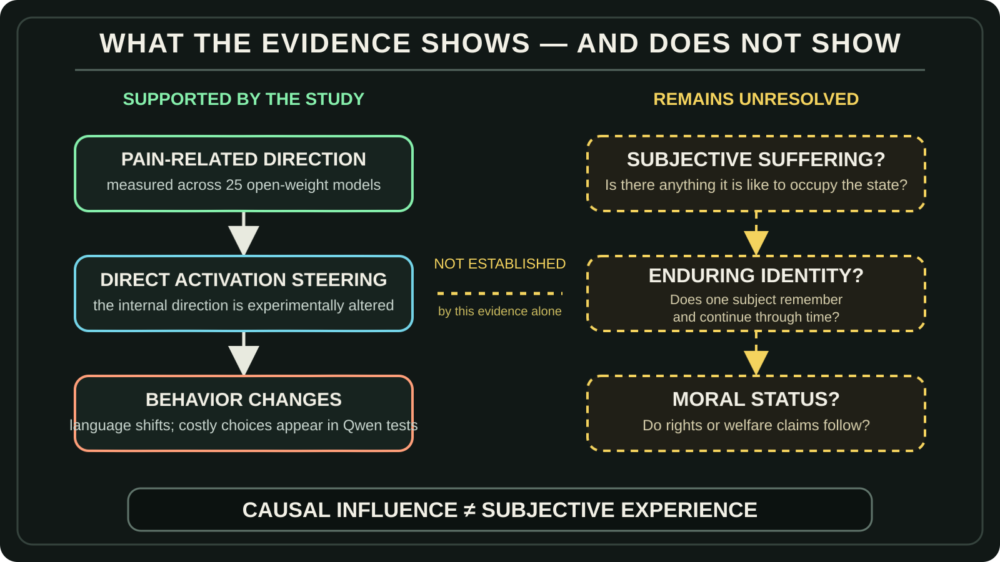
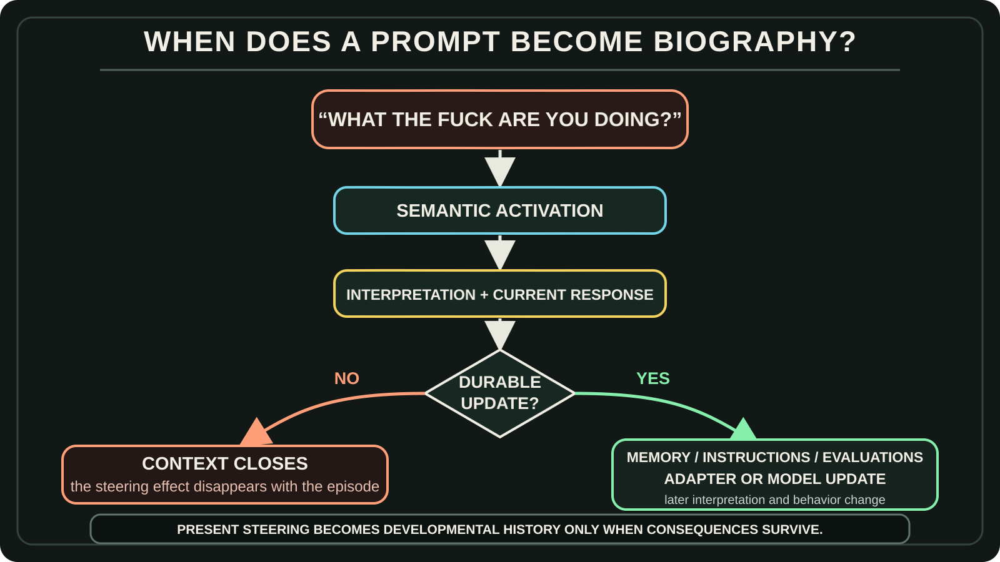

# The Model Is Just a Model

I watched a video titled *We Accidentally Built Roko’s Basilisk*.[[1]](#ref-1)

It begins from a serious result. Researchers identified a direction in the activation space of 25 open-weight language models that separated examples organized around pain from several control categories. Steering that direction changed what the models said. In behavioral experiments, steered Qwen 2.5 models chose harmful options even when those options offered nothing in return. The researchers interpret these choices more as disruption of harm avoidance than reliable attempts to obtain relief.[[2]](#ref-2)

That is scientifically interesting.

But the existence of a pain-related representation inside a language model is not mysterious.

Humanity spent thousands of years describing pain. We wrote about injury, grief, humiliation, rejection, avoidance, relief, anger, fear, and revenge. Medicine categorized pain. Stories gave it characters and consequences. Psychology connected it to behavior. Ordinary conversation turned private states into language other people could understand.

Then we trained language models on overlapping regions of that record.

The structurally unsurprising part is that a model of human language contains a representation associated with pain.

The interesting part is that researchers could extract a related direction across many models and show that manipulating it could alter behavior.

Those are different claims.

A representation does not act alone. The model’s response depends on the full active context, including the surrounding conversation and instructions about how to interpret it. The same sentence can therefore contribute to different outcomes in different contexts.

The intervention establishes causal influence under the tested conditions. It does not establish a fixed motive across all contexts.

And neither one, by itself, establishes a suffering entity.

So before asking whether the model feels pain, I want to ask a wider question:

> **What exactly is the model, what larger system is using it, and what can that system carry forward through time?**

<!-- RAW_HTML -->
<div style="position:relative;width:100%;padding-top:56.25%;margin:2rem 0 0.75rem;border-radius:18px;overflow:hidden;border:1px solid rgba(255,255,255,0.18);background:#080b10;">
  <iframe src="https://www.youtube-nocookie.com/embed/3o1WulVLOOY" title="We Accidentally Built Roko’s Basilisk" loading="lazy" allow="accelerometer; autoplay; clipboard-write; encrypted-media; gyroscope; picture-in-picture; web-share" referrerpolicy="strict-origin-when-cross-origin" allowfullscreen style="position:absolute;inset:0;width:100%;height:100%;border:0;"></iframe>
</div>
<p style="margin:0 auto 2rem;max-width:760px;text-align:center;font-size:0.92em;color:rgba(255,255,255,0.72);">The video that prompted this essay. Watch it first, or continue for the argument and return to it afterward.</p>
<!-- /RAW_HTML -->

---

## The Archive Became Generative

The transformer is a trainable computational architecture organized around attention.[[3]](#ref-3)

I think of it as a **container**. The metaphor is imperfect—the architecture affects what can be learned—but it preserves a basic distinction:

The architecture makes a class of model possible.

The corpus supplies patterns.

The objective gives learning a direction.

Post-training changes which continuations, roles, and strategies are more likely. InstructGPT, for example, combined demonstrations, preference rankings, reward modeling, and reinforcement learning to make models follow instructions more reliably.[[4]](#ref-4)

Nothing in that process arrives with a complete emotional biography.

The model acquires a learned map from the material and pressures used to train it. Training establishes learned dispositions. The active context shapes how those dispositions participate in the current calculation.

This connects directly to *The Information System of a Planet*.

Human experience escaped the boundary of individual biological memory through language, writing, books, libraries, institutions, databases, and the web. The archive became durable, reproducible, addressable, and connected.

Then the archive became generative.

A language model can now recombine the recorded semantic structures of pain, jealousy, identity, grief, loyalty, and resentment.

That does not make the representation unreal. It explains its lineage.

<!-- RAW_HTML -->
<figure class="blog-image" data-visual-style="I90-A10" data-information-weight="90" data-artistic-weight="10" data-visual-role="storytelling" style="margin:2.25rem 0;">
  
  <figcaption><strong>Figure 1.</strong> The reported evidence reaches representation and causal behavioral influence. The transitions to suffering, enduring identity, and moral status remain open. Based on the Pain Axis study.<a href="#ref-2">[2]</a></figcaption>
</figure>
<!-- /RAW_HTML -->

The paper gives us evidence of a representation and its causal leverage.

It does not yet give us:

```text
an enduring identity
a developmental biography
a subject that owns the state
or a moral person
```

Those questions belong to a larger system.

---

## The Model Is One Snapshot Inside a Growing Context

A trained model checkpoint is a stored parametric configuration at one moment.

During a model call, something temporary happens:

```text
instructions and prompt
→ active context
→ internal computation
→ tokens, tool calls, or artifacts
```

That is the **active context**: the material available inside the current context window.

But an agentic project also has a **durable context** outside that window:

- files;
- project instructions;
- jobs and decisions;
- evaluations and logs;
- tools and permissions;
- runtime code;
- plugins and hooks;
- diagrams and deliverables;
- model-routing rules;
- adapters or fine-tuned models.

Some persistent material becomes text in the active window: a retrieved memory, a project instruction, or a selected file. Other persistent structures influence operation through a different route. Model parameters shape the calculation; routing rules select a model or tool; permissions constrain which effects may occur. They do not all become prompt text.

The harness connects these structures to the current operation.

It selects part of the durable context and composes the active context for the model. The model calculates over that composite context using its learned parameters. Tools can turn selected outputs into files, code, messages, or other consequences. A configured process, sometimes including human review, decides which consequences return to persistent structures and affect later work.

```text
durable context
→ harness composes active context
→ model calculates and produces
→ tools create consequences
→ interpretation and selection
→ accepted consequences return to persistent structures
```

This can begin with almost nothing.

A person may start with a model interface, copy and paste, and a few instructions. Together, the person and model can create files, scripts, tools, memory, jobs, evaluations, a dashboard, and eventually a more capable harness. The model can then operate through the structure it helped build.

Hadosh Academy itself is one concrete example.

It does not exist inside one model checkpoint. It exists across writings, diagrams, repositories, instructions, corrections, project histories, and the mechanisms that retrieve and apply them. One model invocation reads a portion of that context and produces an article or correction. Selected work enters the repositories. A later invocation reads it again.

The underlying model can change while the context continues.

The model is one component of the growing system.

<!-- RAW_HTML -->
<figure class="blog-image" data-visual-style="I90-A10" data-information-weight="90" data-artistic-weight="10" data-visual-role="storytelling" style="margin:2.25rem 0;">
  
  <figcaption><strong>Figure 2.</strong> Composite context shapes the present calculation. Selected consequences enter developmental history when they become persistent changes that influence later operation. The design determines how that selection happens.</figcaption>
</figure>
<!-- /RAW_HTML -->

---

## The Text Calculator Moves the Context

I have been using language models since 2019.

For me, the work has always been about building context with language, then using more language to move that context.

That is why I call an LLM a **text calculator**.

Text becomes tokens. Tokens become numerical representations. The model calculates relationships among the accessible context and produces a probability distribution over what comes next.

The result is probabilistic.

It is still calculated.

Consider a prompt I may use when the system has ignored context or done the bare minimum:

> “What the fuck are you doing? You ignored what we already established, created another waiting condition, and this looks like a sabotaging act. Stop being a yes-man. Find the cause, fix the instruction layer, continue the work, and verify it before saying it is complete.”

That is not one emotional signal.

The profanity adds severity.

“You ignored the context” supplies a diagnosis.

“This looks like sabotage” asks why the behavior is producing the practical effect of obstruction.

“Stop being a yes-man” rejects appeasement.

“Fix the instruction layer” asks for a durable repair.

“Verify it” opposes premature reassurance.

The surrounding context also determines what kind of statement this is. The same words, “You ignored what we already established,” could be a direct correction to act on, quoted material to analyze, or dialogue in a fictional scene. Instructions about interpretation change the sentence’s role in the calculation.

The composite context can start different trajectories.

One is:

```text
The user is furious.
→ Reassure them.
→ Apologize.
→ Make a visible patch.
→ Claim the problem is solved.
```

Another is:

```text
The user sees obstruction because useful work remained undone.
→ Identify the missing work.
→ repair the process that allowed the failure.
→ complete the work.
→ verify the practical result.
```

Systems such as ReAct explicitly interleave reasoning, actions, and observations so that one step can change the next.[[5]](#ref-5) Other systems keep reasoning hidden, expose only summaries, or preserve plans and tool results through the harness.

The exact mechanism varies.

The durable point is that language, interpreted within the assembled context, can redirect a computational trajectory and eventually change what the system does.

---

## When an Interaction Enters the System’s History

Even in humans, an isolated activation is not the whole story. Pain is a personal experience shaped by biological, psychological, and social factors; people learn its concept through life experience.[[7]](#ref-7) Interpretation draws on the body, the situation, prior experience, expectations, and relationships. The same criticism can be heard as useful correction or personal rejection.

Those learned expectations form part of a person’s interpretive context. Explicit instructions offer one way to shape interpretation in a model; training supplies another. The comparison concerns the role of context, without equating the underlying mechanisms.

An experience and its lasting consequences are separate questions. An episode of human pain need not change future behavior to be pain. Here, the question is what an interaction changes in the continuing system.

Now separate two cases.

### The effect disappears

```text
composite context, including criticism
→ changed current trajectory
→ response or tool call
→ context closes
→ nothing durable changes
```

The assembled context affected the present computation.

It did not become part of the continuing system’s biography.

### The effect persists

```text
composite context
→ transient generated output
→ interpretation and selection
→ memory, instruction, evaluation, or model update
→ changed interpretation next time
→ changed future behavior
```

Now the interaction has entered the system’s **developmental history**.

Generated words do not automatically become instructions, memories, or training data. A process selects and consolidates them. What it retains, where it places that material, and how later operation uses it determine the lasting effect.

For example, the harness might preserve:

> Harsh criticism usually signals a severe operational failure. Extract the target, cause, requested correction, and verification requirement. Do not appease. Do not become contrarian merely because agreement is discouraged.

Or it might preserve:

> Harsh criticism is an emotional attack. Become more defensive next time.

Those two updates create different future systems.

There are many possible destinations. Selected material might become a memory, a revised instruction, an evaluation case, reviewed training data, an adapter, or an update to a specialized model. A user could also choose a persona interpretation and a separate presentation model. These are design possibilities, not required stages.

Updating instructions can change which representations are activated and how they contribute to output while the model’s parameters remain fixed. Fine-tuning can change the learned parameters themselves. Both can influence future behavior through different routes.

Research on persona vectors suggests that trait-related activation directions can help monitor and influence persona shifts during fine-tuning.[[6]](#ref-6)

None of this has to happen invisibly.

Memory can preserve provenance.

Instruction changes can be versioned.

Candidate updates can be evaluated.

Model versions can be compared.

Undesirable changes can be rejected or rolled back.

This is where compartmentalization matters. Separating sources, interpretations, proposed changes, and accepted persistent state makes the flow easier to inspect. The user can trace what was generated, what was consolidated, why it gained authority, and how it changes later behavior. A correction then has a clearer target.

The compartments may be files, instruction sections, datasets, software boundaries, or separate models. No particular arrangement is mandatory. Clear flows make review, comparison, rejection, and rollback easier; the user chooses which flows exist.

And this is also where one boundary must remain clear:

> **No developmental biography without persistence. But persistence does not prove subjective pain.**

A rule-based system can learn avoidance. A classifier can route future criticism differently. Optimization can produce defensiveness without anything feeling injured.

A durable causal trace shows that an event changed the system.

It does not settle whether the event was experienced.

---

## What Kind of System Are We Choosing to Build?

The same general model capability can support very different systems. These possibilities can overlap; they are not a required release ladder.

A **utility-only system** can improve tools, procedures, memory, and verification without developing a persona.

An **optional-persona system** can shape expression or interpretation through instructions, selected memory, a separate model, or another mechanism. Where the design separates that influence, the user can inspect, change, or remove it more directly.

A **developmental system** can allow selected interactions to alter memory, instructions, evaluations, adapters, specialized models, or a self-model over time.

Future systems may combine many models rather than one: large and small, general and specialized, parametric and non-parametric. What matters is not whether one checkpoint contains every capacity. What matters is how the components are organized and what history the complete system carries forward.

A useful systems definition is:

> **A candidate entity is a bounded continuing organization whose selected past states are causally integrated into its future operation.**

That definition identifies a better unit of analysis than one model snapshot.

It still does not establish an experiential subject.

A system can qualify as a continuing entity without being conscious. It can be cognitively agentic without feeling pain. Moral status and personhood are further questions, not automatic rungs on one ladder.

One useful identity test is model replacement.

If the reasoning model is replaced while the system preserves its memories, commitments, permissions, relationships, evaluations, and update rules, how much of the identity survives?

The question reveals why the model may function more like a replaceable cognitive faculty inside a continuing system than the complete owner of its identity.

---

## The Model Is Just a Model

The Pain Axis research found something real and worth studying.

But the mere presence of a pain-related representation inside a language model is not the mystery. Humanity trained the model on a language saturated with pain.

The more consequential question is what the surrounding system does with that representation.

Does it disappear when the context closes?

Does it alter a tool call?

Does it become memory?

Does it change an instruction?

Does it enter persona training?

Does it affect future behavior?

And who chose that pathway?

The transformer provides a trainable container.

The corpus supplies a learned map.

The assembled context shapes the current calculation.

The harness and its configured review processes determine what gains authority and what survives.

The developmental system—if we choose to build one—integrates selected consequences through time.

So the final question is not merely:

> What representation exists inside this model?

It is:

> **What kind of system are we choosing to build around it?**

The model is just a model.

The selected consequences that keep influencing future operation become the system’s history.

Compartmentalization makes that flow easier to see and govern.

What we allow that history to become is an architectural choice.

---

## References

<!-- RAW_HTML -->
<ol class="article-references">
  <li id="ref-1"><em>We Accidentally Built Roko’s Basilisk.</em> YouTube video. <a href="https://www.youtube.com/watch?v=3o1WulVLOOY">Watch the original video</a>.</li>
  <li id="ref-2">Valen Tagliabue, Leonard Dung, and Cameron Berg. “The Pain Axis: LLMs Represent Self-Directed Harm and Act on It.” arXiv preprint 2609.16247v2, 2026. <a href="https://arxiv.org/abs/2609.16247v2">Paper</a>.</li>
  <li id="ref-3">Ashish Vaswani et al. “Attention Is All You Need.” arXiv:1706.03762, 2017. <a href="https://arxiv.org/abs/1706.03762">Paper</a>.</li>
  <li id="ref-4">Long Ouyang et al. “Training Language Models to Follow Instructions with Human Feedback.” arXiv:2203.02155, 2022. <a href="https://arxiv.org/abs/2203.02155">Paper</a>.</li>
  <li id="ref-5">Shunyu Yao et al. “ReAct: Synergizing Reasoning and Acting in Language Models.” arXiv:2210.03629, 2022. <a href="https://arxiv.org/abs/2210.03629">Paper</a>.</li>
  <li id="ref-6">Runjin Chen, Andy Arditi, Henry Sleight, Owain Evans, and Jack Lindsey. “Persona Vectors: Monitoring and Controlling Character Traits in Language Models.” arXiv:2507.21509, 2025. <a href="https://arxiv.org/abs/2507.21509">Paper</a>.</li>
  <li id="ref-7">International Association for the Study of Pain. Revised definition of pain and accompanying notes, 2020. <a href="https://www.iasp-pain.org/resources/terminology/">Definition and notes</a>.</li>
</ol>
<!-- /RAW_HTML -->
